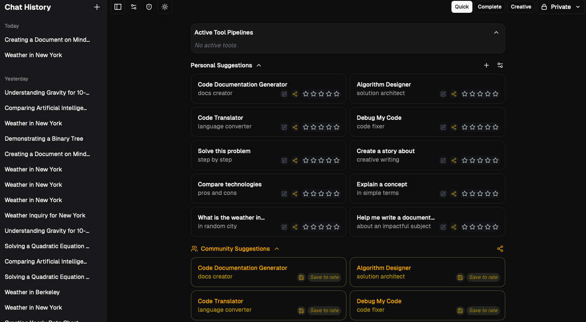

<a href="https://chat.talkverse.ai/">
  
  <h1 align="center">Talkverse.ai - Next.js AI Chatbot</h1>
</a>

<p align="center">
  An Advanced AI Chatbot Platform Built by Mira AI with Next.js and the AI SDK by Vercel.
</p>

<p align="center">
  <a href="#features"><strong>Features</strong></a> ·
  <a href="#model-providers"><strong>Model Providers</strong></a> ·
  <a href="#deploy-your-own"><strong>Deploy Your Own</strong></a> ·
  <a href="#running-locally"><strong>Running locally</strong></a> ·
  <a href="#project-status-and-contributing"><strong>Contributing</strong></a>
</p>
<br/>

## Features

Talkverse.ai is a comprehensive AI chatbot platform with a wide range of advanced features:

- [Next.js](https://nextjs.org) App Router
  - Advanced routing for seamless navigation and performance
  - React Server Components (RSCs) and Server Actions for server-side rendering and increased performance
- [AI SDK](https://sdk.vercel.ai/docs)
  - Unified API for generating text, structured objects, and tool calls with LLMs
  - Hooks for building dynamic chat and generative user interfaces
  - Supports OpenAI (default), Anthropic, Cohere, and other model providers
- [shadcn/ui](https://ui.shadcn.com)
  - Styling with [Tailwind CSS](https://tailwindcss.com)
  - Component primitives from [Radix UI](https://radix-ui.com) for accessibility and flexibility
- Data Persistence
  - [Vercel Postgres powered by Neon](https://vercel.com/storage/postgres) for saving chat history and user data
  - [Vercel Blob](https://vercel.com/storage/blob) for efficient file storage
  - [Vercel KV](https://vercel.com/storage/kv) for caching and quick access to prompt suggestions
- [NextAuth.js](https://github.com/nextauthjs/next-auth)
  - Simple and secure authentication
### Comprehensive System Enhancements
### New Features
#### Enhanced Provider Registry

We've developed a sophisticated provider registry that extends Vercel's capabilities:

- **Extended Modality Support**: Our enhanced registry works across multiple modalities while maintaining full compatibility with Vercel's AI SDK
- **Intuitive Model Aliases**: Simple single-word aliases for provider:model combinations (e.g., "claude" → "anthropic:claude-3-opus")
- **Dynamic Registry**: Eliminated all hardcoded model IDs in favor of our dynamic registry with formatted API keys
- **Comprehensive Provider Management**:
  - Select from an extensive list of AI models and providers
  - Add and manage your own API keys for different providers
  - Set preferences for different categories (chat, completion, etc.)
  - Access specialized models with unique capabilities

Key components:
- **Provider Registry Module**: Enhanced interaction with the Vercel AI SDK provider registry
- **Dynamic Providers Module**: Creates custom providers based on user preferences and aliases
- **Feature Flags System**: Controls the rollout of new features with granular control
- **User API Keys Management**: Securely stores and manages user API keys with validation

#### Human-in-the-Loop (HITL)

The HITL functionality allows users to approve or reject tool executions before they are performed, providing:
- Enhanced security by preventing unauthorized tool executions
- Greater user control over what tools are executed
- Transparency about what tools are being executed and with what parameters

The HITL system includes:
- Client-side approval UI integrated with the multimodal input component
- Server-side tool wrapper with approval requirements
- Real-time status updates using Server-Sent Events (SSE)
- Comprehensive tool status flow management

#### Advanced Tool Ecosystem

Our advanced tool ecosystem provides a comprehensive framework for AI-powered tool execution:

- **Robust Multi-Step Tool Pipeline**:
  - Sophisticated pipeline management with dependency resolution
  - Automatic recovery from failed steps with intelligent retry logic
  - Comprehensive state tracking to prevent duplicate processing
  - Clean visualization of pipeline progress and status

- **Model-Control-Protocol (MCP) Integration**:
  - Seamless communication with local and remote MCP servers
  - Extensible tool and resource framework for custom capabilities
  - Real-time execution status tracking and event streaming
  - Secure tool execution with proper authentication and validation

- **Intuitive Chat Interface**:
  - Smart tags for granular input control and tool selection
  - Human-in-the-loop intervention points for supervised execution
  - Comprehensive tool status visualization and management
  - Expanded computer tool integration for system operations

- **Tool Execution Management**:
  - Single-instance tool and agent execution for specialized tasks
  - Scheduling capabilities for automated tool execution
  - Proper execution order and dependency management
  - Cleanup of failed or orphaned tool calls and pipelines

#### Model Context Protocol (MCP)

The MCP feature enables communication with MCP servers that provide additional tools and resources:
- Connect to local or remote MCP servers
- Execute tools provided by MCP servers
- Access resources from MCP servers
- Track execution status in real-time

The application ships with two default MCP servers:
- Local File System Server: Provides access to the local file system
- Repository Server: Provides access to code repositories

#### Artifacts

Artifacts provide a workspace-like interface alongside the chat interface, similar to ChatGPT's Canvas and Claude's Artifacts:
- Text Artifact: Work with text content like drafting essays and emails
- Code Artifact: Write and execute code (Python)
- Image Artifact: Work with images (generation, editing, annotating, processing)
  - AI-powered image generation using advanced image models
  - Generate images from text descriptions or titles
  - Version history with undo/redo capabilities
  - Easy copying of generated images to clipboard
- Sheet Artifact: Work with tabular data (creating, editing, analyzing)

Custom artifacts can be created by adding new folders to the `artifacts` directory with client and server components.

#### Prompt Management System

Our comprehensive prompt management system enhances the user experience with powerful organization and sharing capabilities:

- **Personal Prompt Library**:
  - Save and organize frequently used prompts
  - Create customizable templates with variable placeholders
  - Categorize prompts for easy retrieval
  - Version history for tracking prompt evolution

- **Community Prompt Sharing**:
  - Discover and use prompts created by other users
  - Rate and review community prompts
  - Categorized browsing for finding relevant prompts
  - Trending and popular prompt recommendations

- **Advanced Prompt Features**:
  - Scheduling capabilities for automated prompt execution
  - Conditional prompt execution based on triggers
  - Prompt chaining for complex workflows
  - Analytics on prompt performance and usage

## Model Providers

This template ships with OpenAI `gpt-4o` as the default. However, with the [AI SDK](https://sdk.vercel.ai/docs), you can switch LLM providers to [OpenAI](https://openai.com), [Anthropic](https://anthropic.com), [Cohere](https://cohere.com/), and [many more](https://sdk.vercel.ai/providers/ai-sdk-providers) with just a few lines of code.

With the new Provider Registry integration, you can now:
- Access all providers available in the Vercel AI SDK provider registry
- Add your own API keys for different providers
- Select preferred models for different categories (chat, completion, etc.)
- Manage your model preferences through an intuitive UI

## Deploy Your Own

You have two options for using Talkverse.ai:

### Option 1: Use Our Hosted Version

Visit [chat.talkverse.ai](https://chat.talkverse.ai) to use our fully-managed version with all premium features. Our hosted version will be available with the official release on April 15th, 2025, and will include subscription management, enhanced model access, and premium support.

### Option 2: Self-Deploy

You can deploy your own version of Talkverse.ai to Vercel with one click:

[](https://vercel.com/new/clone?repository-url=https%3A%2F%2Fgithub.com%2Fvercel%2Fai-chatbot&env=AUTH_SECRET,OPENAI_API_KEY,KV_URL,KV_REST_API_URL,KV_REST_API_TOKEN,KV_REST_API_READ_ONLY_TOKEN&envDescription=Learn%20more%20about%20how%20to%20get%20the%20API%20Keys%20for%20the%20application&envLink=https%3A%2F%2Fgithub.com%2Fvercel%2Fai-chatbot%2Fblob%2Fmain%2F.env.example&demo-title=Talkverse.ai&demo-description=An%20Advanced%20AI%20Chatbot%20Platform%20Built%20by%20Mira%20AI%20with%20Next.js%20and%20the%20AI%20SDK%20by%20Vercel.&demo-url=https%3A%2F%2Fchat.talkverse.ai&stores=[{%22type%22:%22postgres%22},{%22type%22:%22blob%22},{%22type%22:%22kv%22}])

## Running locally

You will need to use the environment variables [defined in `.env.example`](.env.example) to run Next.js AI Chatbot. It's recommended you use [Vercel Environment Variables](https://vercel.com/docs/projects/environment-variables) for this, but a `.env` file is all that is necessary.

> Note: You should not commit your `.env` file or it will expose secrets that will allow others to control access to your various OpenAI and authentication provider accounts.

1. Install Vercel CLI: `npm i -g vercel`
2. Link local instance with Vercel and GitHub accounts (creates `.vercel` directory): `vercel link`
3. Download your environment variables: `vercel env pull`

```bash
pnpm install
pnpm dev
```

Your app template should now be running on [localhost:3000](http://localhost:3000/).

## Setting Up Vercel KV

This project uses Vercel KV (powered by Upstash Redis) for caching and quick access to prompt suggestions. To set up Vercel KV:

1. **Install Vercel KV**
   ```bash
   pnpm add @vercel/kv
   ```

2. **Create a Vercel KV Database**
   - Go to the [Vercel Dashboard](https://vercel.com/dashboard)
   - Navigate to Storage
   - Click "Create" and select "KV Database"
   - Follow the setup process

3. **Connect Your Project to KV**
   - Add the following environment variables to your project:
     ```
     KV_URL=<your-kv-url>
     KV_REST_API_URL=<your-kv-rest-api-url>
     KV_REST_API_TOKEN=<your-kv-rest-api-token>
     KV_REST_API_READ_ONLY_TOKEN=<your-kv-rest-api-read-only-token>
     ```

4. **Test the Connection**
   - Make sure your application can connect to the KV store by running a simple test:
   ```bash
   # Test code in your project
   import { kv } from '@vercel/kv';
   
   // Set a value
   await kv.set('test-key', 'hello world');
   
   // Get the value
   const value = await kv.get('test-key');
   console.log(value); // Should print 'hello world'
   ```

The Vercel KV integration provides caching for dynamic tag replacements, recently used prompts, and suggested actions, improving performance and user experience.

## Setting Up Tool Management System

The Tool Management System requires a PostgreSQL database with the appropriate schema. To set up the Tool Management System:

1. **Create the Required Database Tables**
   - Execute the SQL script in `sql/tool_management_tables.sql` to create the necessary tables:
     ```bash
     psql -U your_username -d your_database -f sql/tool_management_tables.sql
     ```

2. **Configure Environment Variables**
   - Ensure your database connection is properly configured in your environment variables

3. **Test the Tool Management System**
   - Create a simple tool and verify that it's properly tracked in the database
   - Check for duplicate tool calls to ensure they're being prevented

## Setting Up MCP Servers

The application ships with two default MCP servers: Local File System Server and Repository Server. To set up additional MCP servers:

1. **Create an MCP Server Implementation**
   - Implement the MCP server interface in a new file
   - Define the tools and resources provided by the server

2. **Connect the MCP Server**
   - Import the MCP server in `lib/tools/mcp-tool-client.ts`
   - Connect the server using `connectMCPServer`

3. **Test the MCP Server**
   - Use the MCP tools and resources in your application
   - Verify that the tools and resources are working as expected
## Project Status and Contributing

Talkverse.ai is developed by Mira AI and is currently in active development. We're preparing for our official release on **Tuesday, April 15th, 2025**, which will include premium features such as subscriptions (powered by Stripe), enhanced model access, and more.

### Open Source and Commercial Versions

Talkverse.ai follows a dual-licensing model:

1. **Open Source Version**: The core platform will remain open source and freely available for the community to use, modify, and extend.

2. **Commercial Version (chat.talkverse.ai)**: Our hosted service at [chat.talkverse.ai](https://chat.talkverse.ai) will offer premium features, including:
   - Subscription management via Stripe
   - Advanced model access
   - Higher usage limits
   - Priority support
   - Enterprise features

We are committed to maintaining both versions, ensuring that improvements to the core platform benefit both our commercial users and the open source community.

### How to Contribute

We welcome contributions from the community! Here are some ways you can contribute:

1. **Code Contributions**: Help implement new features, fix bugs, or improve existing functionality
2. **Documentation**: Improve or expand documentation, add examples, or clarify installation instructions
3. **Testing**: Help test new features, identify bugs, or improve test coverage
4. **Feature Suggestions**: Share your ideas for new features or improvements
5. **Bug Reports**: Report any issues you encounter while using the application

### Getting Started as a Contributor

1. **Fork the Repository**: Create your own fork of the repository
2. **Set Up Development Environment**: Follow the installation instructions above
3. **Pick an Issue**: Look for issues labeled "good first issue" or "help wanted"
4. **Submit a Pull Request**: Make your changes and submit a pull request

### Contact Us

- **Website**: [talkverse.ai](https://talkverse.ai)
- **Email**: [official@talkverse.ai](mailto:official@talkverse.ai)
- **Product**: [chat.talkverse.ai](https://chat.talkverse.ai)

### Development Roadmap

We're working on several exciting features for future releases:

1. **Enhanced MCP Server Ecosystem**: More built-in MCP servers and tools
2. **Advanced Tool Pipelines**: More complex tool pipelines with visual editors
3. **Improved Artifacts**: Additional artifact types and enhanced functionality
4. **Performance Optimizations**: Faster response times and reduced resource usage
5. **Extended Provider Support**: Integration with more AI model providers

Join us in building the next generation of AI-powered chat applications!

## Troubleshooting

### Tool Execution Issues

If you encounter issues with tool execution:

1. **Check Tool Status**
   - Use the tool status API to check the status of tool calls
   - Look for tools in the `FAILED` or `REJECTED` state

2. **Check for Duplicate Tool Calls**
   - The Tool Management System prevents duplicate tool calls
   - Check if your tool call is being rejected as a duplicate

3. **Check for Tool Approval Requirements**
   - Some tools require user approval before execution
   - Make sure the user has approved the tool execution

### MCP Server Connection Issues

If you encounter issues connecting to MCP servers:

1. **Check Server Availability**
   - Make sure the MCP server is running and accessible
   - Check network connectivity to the server

2. **Check Server Configuration**
   - Verify that the server is properly configured
   - Check that the server name and URL are correct

3. **Check Tool and Resource Definitions**
   - Make sure the tools and resources are properly defined
   - Check that the tool and resource names match what the server expects

### Redis Integration Issues

If you encounter issues with Redis integration:

1. **Check Redis Connection**
   - Make sure Redis is running and accessible
   - Check that the Redis connection URL is correct

2. **Check Redis Authentication**
   - Verify that the Redis authentication credentials are correct
   - Check that the Redis password is properly configured

3. **Check Redis Data**
   - Use Redis CLI to check if the data is being stored correctly
   - Verify that the Redis keys and values are as expected

### Known Issues

This is the first release (alpha version) of Talkverse.ai, and there are some known issues that are currently being addressed:

1. **Forms and Dialogs**: Some forms and dialogs are currently untested and may have minor issues in certain edge cases.

2. **Registry Provider and Database Integration**: There is still some crossover in development between the registry provider and database components, which may cause occasional inconsistencies.

3. **Minor Debugging Items**: As with any first release, there are various minor items that are still being debugged and optimized.

These issues will be addressed in upcoming releases as we continue to refine and improve the platform. If you encounter any other issues, please report them through our [GitHub issues](https://github.com/mira-ai/talkverse/issues) or contact us at [official@talkverse.ai](mailto:official@talkverse.ai).
