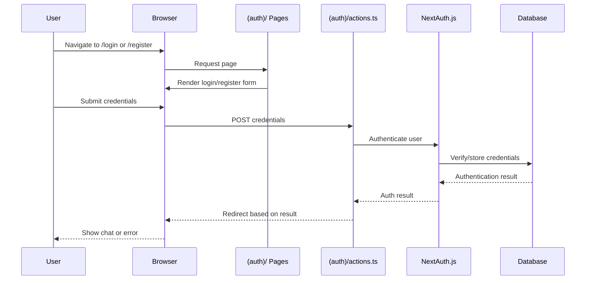
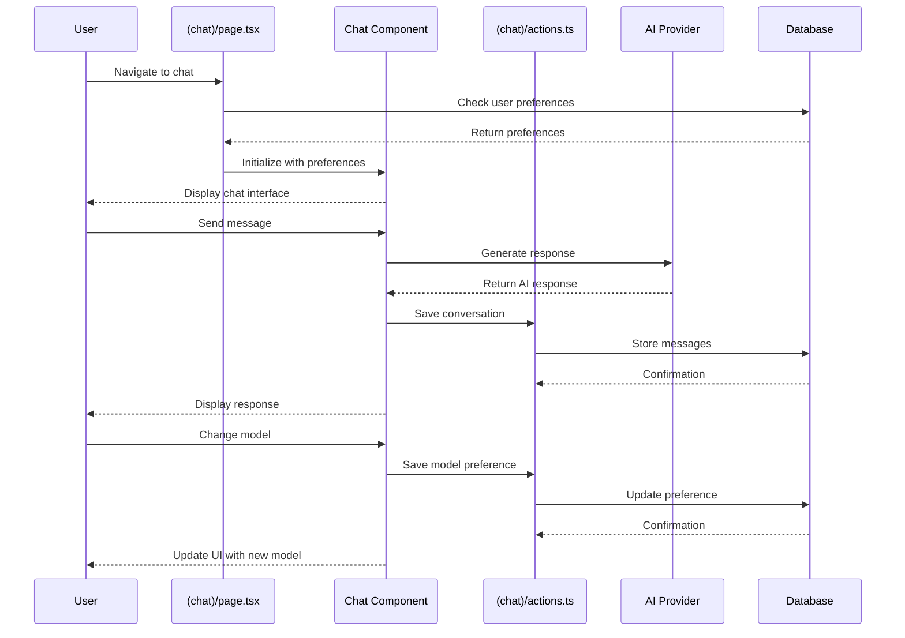
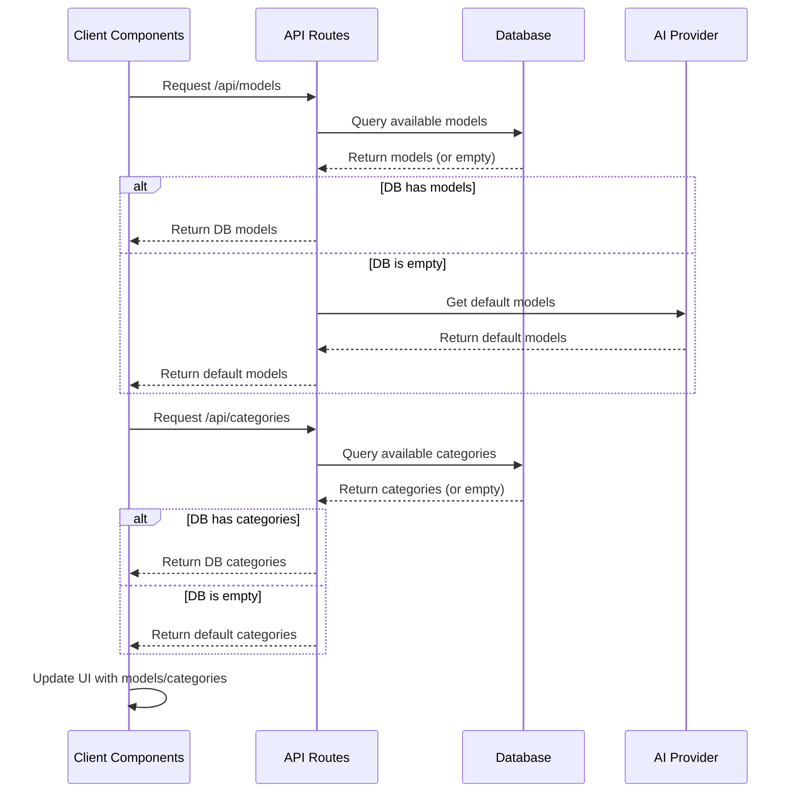

# App Directory Documentation

## Introduction

This document provides a comprehensive overview of the `app/` directory in the chat.talkverse.ai application. It includes both high-level overviews and technical implementation details to serve as a reference during the redesign process. The application appears to be a Next.js-based chatbot interface that leverages various AI models for text, image, video, and audio generation.

## Directory Structure Overview

The `app/` directory follows Next.js App Router structure, organizing the application into route segments and special files.

```mermaid
graph TD
    A[app/] --> B[layout.tsx]
    A --> C[globals.css]
    A --> D[favicon.ico]
    A --> E[(auth)/]
    A --> F[(chat)/]
    A --> G[api/]
    
    E --> E1[actions.ts]
    E --> E2[auth.config.ts]
    E --> E3[auth.ts]
    E --> E4[api/]
    E --> E5[login/]
    E --> E6[register/]
    
    F --> F1[actions.ts]
    F --> F2[layout.tsx]
    F --> F3[page.tsx]
    F --> F4[opengraph-image.png]
    F --> F5[twitter-image.png]
    F --> F6[api/]
    F --> F7[chat/]
    
    G --> G1[categories/]
    G --> G2[models/]
    
    G1 --> G1A[route.ts]
    G2 --> G2A[route.ts]
    
    classDef rootFiles fill:#f9f,stroke:#333,stroke-width:2px;
    classDef authDir fill:#bbf,stroke:#333,stroke-width:2px;
    classDef chatDir fill:#bfb,stroke:#333,stroke-width:2px;
    classDef apiDir fill:#fbb,stroke:#333,stroke-width:2px;
    
    class B,C,D rootFiles;
    class E,E1,E2,E3,E4,E5,E6 authDir;
    class F,F1,F2,F3,F4,F5,F6,F7 chatDir;
    class G,G1,G1A,G2,G2A apiDir;
```

### High-Level Directory Purposes

- **Root Files**: Core application files that define the global layout and styling
- **`(auth)/`**: Authentication-related routes and functionality (note: parentheses indicate route grouping)
- **`(chat)/`**: Main chat interface and functionality
- **`api/`**: API routes for server-side functionality

## Detailed Directory and File Analysis

### Root Files

#### `layout.tsx`

**Purpose**: Defines the root layout that wraps all pages in the application.

**Technical Implementation**:
- Implements the main HTML structure with `<html>` and `<body>` tags
- Sets up theme handling with ThemeProvider from `@/components/theme-provider`
- Includes a script for dynamic theme color adjustment
- Integrates Toaster component for notifications
- Uses Next.js metadata API to set page metadata

**Dependencies**:
- `next/metadata`
- `sonner` (for toast notifications)
- `@/components/theme-provider`

**Key Features**:
- Theme color script that dynamically updates the theme-color meta tag based on dark/light mode
- Hydration warning suppression for theme handling
- Mobile Safari zoom prevention with viewport settings

#### `globals.css`

**Purpose**: Provides global CSS styling for the entire application.

**Technical Implementation**:
- Uses Tailwind CSS with its directive layers (`@tailwind base`, `@tailwind components`, `@tailwind utilities`)
- Defines CSS variables for theming in both light and dark modes
- Includes custom utility classes and component styling

**Key Features**:
- Comprehensive color theming system with CSS variables
- Dark mode support via media queries and class-based toggling
- Custom font loading for "geist" and "geist-mono" fonts
- Special styling for components like skeletons, ProseMirror editor, and CodeMirror editor
- Suggestion highlighting styles

#### `favicon.ico`

**Purpose**: Application favicon displayed in browser tabs and bookmarks.

### `(auth)/` Directory

**Purpose**: Handles user authentication, including login, registration, and auth state management.

#### `actions.ts`

**Purpose**: Server actions for authentication-related functionality.

#### `auth.config.ts`

**Purpose**: Configuration for NextAuth.js authentication.

**Technical Implementation**:
- Defines authentication pages routes
- Sets up authorization logic for protected routes
- Handles redirects based on authentication state

**Key Features**:
- Route protection for authenticated and unauthenticated users
- Custom sign-in and new user pages
- Conditional redirects based on authentication state and requested URL

#### `auth.ts`

**Purpose**: Main authentication implementation.

#### `api/`, `login/`, `register/`

**Purpose**: Subdirectories containing authentication-related API endpoints and page components.

### `(chat)/` Directory

**Purpose**: Contains the main chat interface and functionality.

#### `actions.ts`

**Purpose**: Server actions for chat-related functionality.

**Technical Implementation**:
- Implements server-side actions for chat operations
- Uses the AI SDK for text generation
- Interacts with the database for message management

**Key Features**:
- Chat model preference storage in cookies
- Title generation from user messages
- Message deletion functionality
- Chat visibility management

#### `layout.tsx`

**Purpose**: Layout component specific to the chat section.

#### `page.tsx`

**Purpose**: Main chat page component.

**Technical Implementation**:
- Server component that initializes the chat interface
- Handles chat model selection from cookies
- Renders the Chat component with appropriate props

**Key Features**:
- UUID generation for chat identification
- Model selection from cookies with fallback to default
- Integration with DataStreamHandler for real-time updates

#### `opengraph-image.png` and `twitter-image.png`

**Purpose**: Social media preview images for sharing links to the chat application.

### `api/` Directory

**Purpose**: Contains API routes for server-side functionality.

#### `categories/route.ts`

**Purpose**: API endpoint for retrieving model categories.

**Technical Implementation**:
- Implements a GET handler for fetching all categories
- Provides fallback to default categories when database is empty
- Includes error handling with fallback to defaults

**Key Features**:
- Default categories for various model types (text, image, video, audio)
- Database integration with fallback mechanism
- Structured category data with IDs, names, types, and descriptions

#### `models/route.ts`

**Purpose**: API endpoint for retrieving AI models.

**Technical Implementation**:
- Implements a GET handler for fetching models, optionally filtered by category
- Maps internal model identifiers to actual provider model IDs
- Provides fallback to default models when database is empty

**Key Features**:
- Model type mapping for different capabilities (text, image, video, audio)
- Actual model identifier mapping to provider-specific IDs
- Default categories and models for fallback
- Cache control headers for performance optimization

## Application Flow

### Authentication Flow



### Chat Interaction Flow



### Model Management Flow



## Key Components and Their Interactions

### Authentication and Chat Integration

The authentication system (`(auth)/` directory) controls access to the chat functionality (`(chat)/` directory). The auth configuration determines which routes require authentication and handles redirects accordingly. When a user successfully authenticates, they are directed to the chat interface where their preferences (like selected model) are retrieved from cookies or database.

### Model Selection and API Integration

The chat interface interacts with the API routes to fetch available models and categories. These are then presented to the user for selection. When a user selects a model, their preference is saved via server actions and stored in cookies for persistence across sessions.

### Server and Client Component Separation

Following Next.js App Router patterns, the application separates server and client components:
- Server components (like `page.tsx`) handle data fetching and initial rendering
- Client components (imported from `/components`) handle interactivity and state

## Redesign Considerations

### Potential Pain Points

1. **Model Management**: The current implementation has hardcoded fallbacks for models and categories, which might limit flexibility when adding new models.

2. **Authentication Flow**: The authentication implementation is split across multiple files, which might make it harder to modify or extend.

3. **Theme Handling**: The theme implementation includes custom script injection, which might be simplified with newer Next.js features.

### Scalability Considerations

1. **Model Categories**: As more AI models are added, the category system might need to be more dynamic and hierarchical.

2. **API Response Caching**: The current caching strategy is basic and might need enhancement for higher traffic.

3. **Server Actions**: As the application grows, server actions might need more structured organization and error handling.

### Integration Points for New Features

1. **Model Configuration**: The `/api/models` endpoint is a key integration point for adding new AI models.

2. **Chat Interface**: The Chat component in `(chat)/page.tsx` is the main entry point for enhancing the chat experience.

3. **Authentication**: The auth configuration in `(auth)/auth.config.ts` is where access control for new features would be implemented.