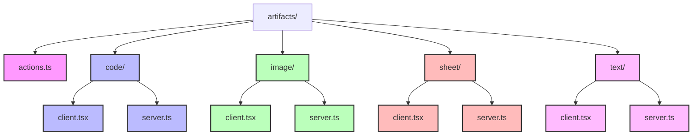
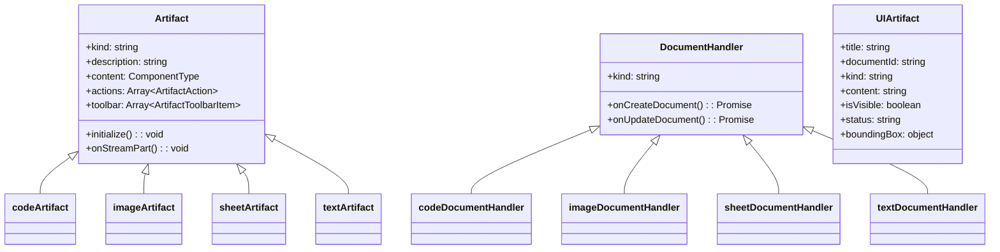
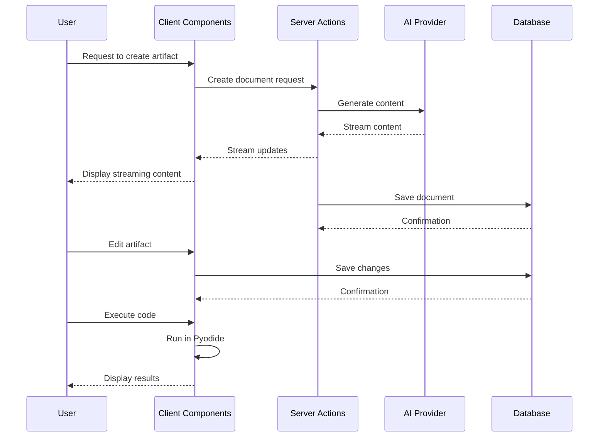
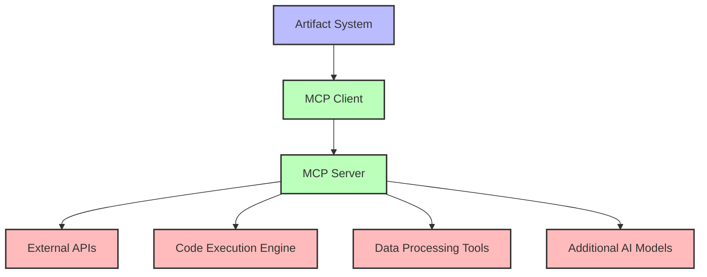

# Artifacts Directory Documentation

## Introduction

This document provides a comprehensive overview of the `artifacts/` directory in the chat.talkverse.ai application. It includes both high-level overviews and technical implementation details to serve as a reference during the redesign process. The artifacts system is a key feature of the application, allowing users to create and interact with different types of AI-generated content such as text, code, images, and spreadsheets.

## Directory Structure Overview

The `artifacts/` directory is organized by artifact type, with each type having both client and server implementations.



### High-Level Directory Purposes

- **Root File**: `actions.ts` - Server actions for artifact-related functionality
- **`code/`**: Implementation for code artifacts (code generation and execution)
- **`image/`**: Implementation for image artifacts (image generation)
- **`sheet/`**: Implementation for spreadsheet artifacts
- **`text/`**: Implementation for text artifacts (document generation)

## Detailed Directory and File Analysis

### Root File

#### `actions.ts`

**Purpose**: Provides server actions for retrieving suggestions related to artifacts.

**Technical Implementation**:
- Uses the 'use server' directive to define server-side functions
- Implements a function to retrieve suggestions by document ID

**Dependencies**:
- `@/lib/db/queries` for database interactions

**Key Features**:
- Retrieves suggestions for a specific document from the database
- Returns an empty array if no suggestions are found

### `code/` Directory

**Purpose**: Implements code artifact functionality, allowing users to generate, edit, and execute code.

#### `client.tsx`

**Purpose**: Client-side implementation of the code artifact.

**Technical Implementation**:
- Defines a new `Artifact` instance for code
- Implements UI components and interactions for code editing and execution
- Handles code execution using Pyodide (Python in the browser)

**Dependencies**:
- `@/components/code-editor` for code editing
- `@/components/console` for displaying execution output
- Pyodide for in-browser Python execution

**Key Features**:
- Code generation and editing
- Python code execution in the browser
- Support for matplotlib visualizations
- Version history management
- Copy to clipboard functionality
- Toolbar actions for adding comments and logs

#### `server.ts`

**Purpose**: Server-side implementation for code artifact generation.

**Technical Implementation**:
- Uses the `createDocumentHandler` factory to create a document handler for code
- Implements callbacks for creating and updating code documents
- Uses AI models to generate code based on user input

**Dependencies**:
- `@/lib/ai/providers` for AI model access
- `@/lib/ai/prompts` for prompt templates
- `ai` package for streaming responses

**Key Features**:
- Streams code generation results to the client
- Handles document creation and updates
- Uses structured output with Zod schema validation

### `image/` Directory

**Purpose**: Implements image artifact functionality, allowing users to generate and edit images.

#### `client.tsx`

**Purpose**: Client-side implementation of the image artifact.

**Technical Implementation**:
- Defines a new `Artifact` instance for images
- Implements UI components for image display and editing
- Handles image copying to clipboard

**Dependencies**:
- `@/components/image-editor` for image editing
- Browser APIs for clipboard operations

**Key Features**:
- Image display and editing
- Version history management
- Copy to clipboard functionality

#### `server.ts`

**Purpose**: Server-side implementation for image artifact generation.

**Technical Implementation**:
- Uses the `createDocumentHandler` factory to create a document handler for images
- Implements callbacks for creating and updating image documents
- Uses AI models to generate images based on user input

**Dependencies**:
- `@/lib/ai/providers` for AI model access
- `ai` package for image generation

**Key Features**:
- Generates images using AI models
- Streams image generation results to the client
- Handles document creation and updates

### `sheet/` and `text/` Directories

These directories follow the same pattern as `code/` and `image/`, implementing artifact functionality for spreadsheets and text documents respectively.

## Artifact System Architecture

### Class Hierarchy and Component Structure



### Data Flow



## Technical Implementation Details

### Artifact Class

The `Artifact` class is the core of the artifact system, providing a consistent interface for different types of artifacts. It is defined in `components/create-artifact.tsx` and is used to create instances for each artifact type.

```typescript
export class Artifact<T extends string, M = any> {
  readonly kind: T;
  readonly description: string;
  readonly content: ComponentType<ArtifactContent<M>>;
  readonly actions: Array<ArtifactAction<M>>;
  readonly toolbar: ArtifactToolbarItem[];
  readonly initialize?: (parameters: InitializeParameters) => void;
  readonly onStreamPart: (args: {
    setMetadata: Dispatch<SetStateAction<M>>;
    setArtifact: Dispatch<SetStateAction<UIArtifact>>;
    streamPart: DataStreamDelta;
  }) => void;

  constructor(config: ArtifactConfig<T, M>) {
    this.kind = config.kind;
    this.description = config.description;
    this.content = config.content;
    this.actions = config.actions || [];
    this.toolbar = config.toolbar || [];
    this.initialize = config.initialize || (async () => ({}));
    this.onStreamPart = config.onStreamPart;
  }
}
```

### Document Handler Factory

The `createDocumentHandler` factory function creates document handlers for each artifact type, providing a consistent interface for document creation and updates. It is defined in `lib/artifacts/server.ts`.

```typescript
export function createDocumentHandler<T extends ArtifactKind>(config: {
  kind: T;
  onCreateDocument: (params: CreateDocumentCallbackProps) => Promise<string>;
  onUpdateDocument: (params: UpdateDocumentCallbackProps) => Promise<string>;
}): DocumentHandler<T> {
  return {
    kind: config.kind,
    onCreateDocument: async (args: CreateDocumentCallbackProps) => {
      const draftContent = await config.onCreateDocument(args);
      if (args.session?.user?.id) {
        await saveDocument({
          id: args.id,
          title: args.title,
          content: draftContent,
          kind: config.kind,
          userId: args.session.user.id,
        });
      }
      return;
    },
    onUpdateDocument: async (args: UpdateDocumentCallbackProps) => {
      const draftContent = await config.onUpdateDocument(args);
      if (args.session?.user?.id) {
        await saveDocument({
          id: args.document.id,
          title: args.document.title,
          content: draftContent,
          kind: config.kind,
          userId: args.session.user.id,
        });
      }
      return;
    },
  };
}
```

### Code Execution

The code artifact implements in-browser Python execution using Pyodide. This allows users to run Python code directly in the browser without requiring a server-side execution environment.

```typescript
// From artifacts/code/client.tsx
const OUTPUT_HANDLERS = {
  matplotlib: `
    import io
    import base64
    from matplotlib import pyplot as plt

    # Clear any existing plots
    plt.clf()
    plt.close('all')

    # Switch to agg backend
    plt.switch_backend('agg')

    def setup_matplotlib_output():
        def custom_show():
            if plt.gcf().get_size_inches().prod() * plt.gcf().dpi ** 2 > 25_000_000:
                print("Warning: Plot size too large, reducing quality")
                plt.gcf().set_dpi(100)

            png_buf = io.BytesIO()
            plt.savefig(png_buf, format='png')
            png_buf.seek(0)
            png_base64 = base64.b64encode(png_buf.read()).decode('utf-8')
            print(f'data:image/png;base64,{png_base64}')
            png_buf.close()

            plt.clf()
            plt.close('all')

        plt.show = custom_show
  `,
  basic: `
    # Basic output capture setup
  `,
};
```

### Image Generation

The image artifact uses the AI SDK's experimental_generateImage function to generate images based on user prompts.

```typescript
// From artifacts/image/server.ts
const { image } = await experimental_generateImage({
  model: myProvider.imageModel('small-model'),
  prompt: title,
  n: 1,
});

draftContent = image.base64;

dataStream.writeData({
  type: 'image-delta',
  content: image.base64,
});
```

## Key Components and Their Interactions

### Artifact Component

The `Artifact` component (`components/artifact.tsx`) is the main UI component for displaying and interacting with artifacts. It handles:

1. Displaying the artifact content
2. Managing artifact versions
3. Providing actions for artifact manipulation
4. Handling artifact state (streaming, idle)
5. Managing the artifact toolbar

### Artifact Creation

Artifacts are created through a multi-step process:

1. User requests an artifact creation
2. Server generates the initial content using AI models
3. Content is streamed to the client
4. Document is saved to the database
5. User can edit and interact with the artifact

### Artifact Updates

Artifacts can be updated through:

1. Direct user edits
2. AI-assisted updates via the toolbar
3. Version management

## Integration with AI Models

The artifact system integrates with AI models through the `myProvider` object from `@/lib/ai/providers`. This provides access to:

1. Language models for text and code generation
2. Image models for image generation

## Redesign Considerations

### Potential Pain Points

1. **Code Execution**: The current implementation uses Pyodide for in-browser Python execution, which has limitations in terms of available packages and performance.

2. **Image Generation**: The image generation is limited to the capabilities of the underlying AI models.

3. **Artifact Types**: Adding new artifact types requires implementing both client and server components.

### Scalability Considerations

1. **Model Integration**: As new AI models become available, the artifact system should be able to integrate them easily.

2. **Performance**: Large artifacts (especially code with complex execution) might impact browser performance.

3. **Storage**: As users create more artifacts, database storage and retrieval efficiency becomes important.

### Integration Points for MCP

The Model Context Protocol (MCP) could be integrated with the artifacts system to extend its capabilities:

1. **New Artifact Types**: MCP could provide tools for new types of artifacts beyond the current text, code, image, and sheet types.

2. **Enhanced Code Execution**: MCP could provide server-side code execution capabilities for languages and packages not supported by Pyodide.

3. **External API Integration**: MCP could connect artifacts to external APIs for enhanced functionality.

4. **Data Processing**: MCP could provide tools for processing and analyzing data within artifacts.

## Potential MCP Integration Architecture



### MCP Integration Points

1. **Artifact Creation**: MCP tools could be used to generate artifact content using specialized models or APIs.

2. **Artifact Actions**: MCP tools could be added as actions to existing artifact types.

3. **Artifact Toolbar**: MCP tools could be added to the artifact toolbar for enhanced functionality.

4. **Code Execution**: MCP could provide a server-side code execution environment for languages and packages not supported by Pyodide.

5. **Data Processing**: MCP could provide tools for processing and analyzing data within artifacts.