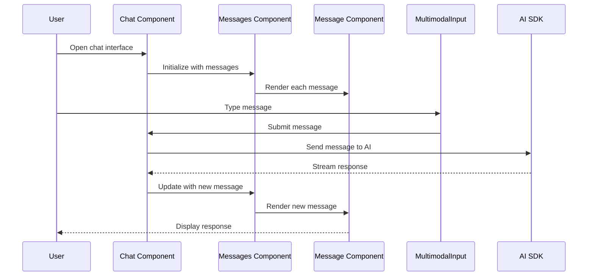
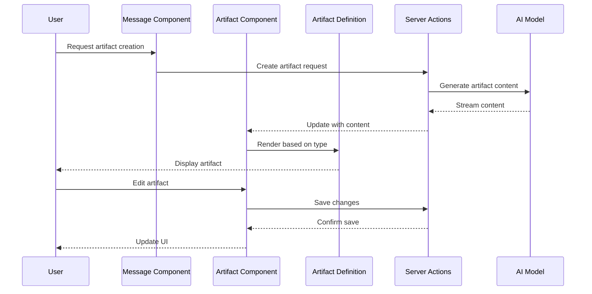
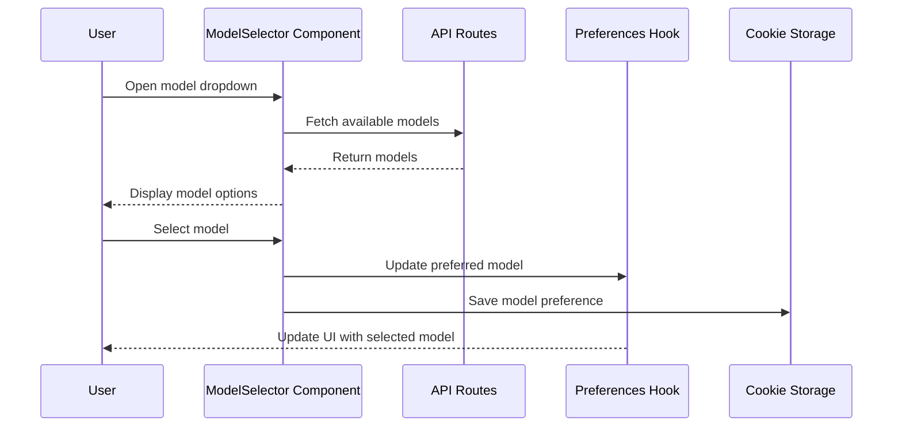
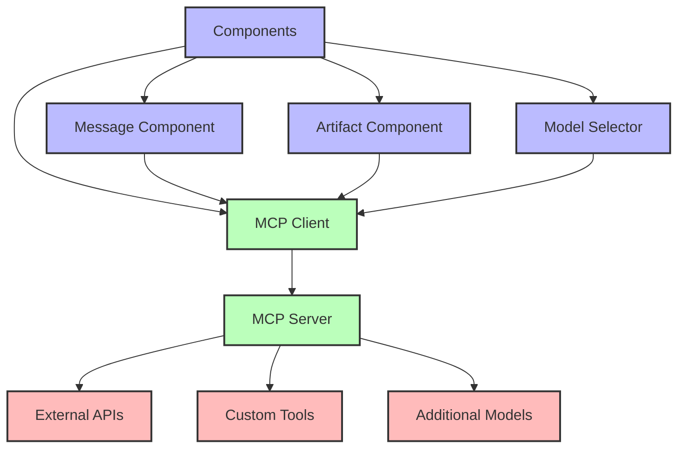

# Components Directory Documentation

## Introduction

This document provides a comprehensive overview of the `components/` directory in the chat.talkverse.ai application. It includes both high-level overviews and technical implementation details to serve as a reference during the redesign process. The components directory contains all the React components used throughout the application, from UI elements to complex interactive features.

## Directory Structure Overview

The `components/` directory is organized into functional groups, with UI components separated into their own subdirectory.

```mermaid
graph TD
    A[components/] --> B[ui/]
    A --> C[admin/]
    A --> D[Root Components]
    
    B --> B1[UI Components]
    C --> C1[model-manager.tsx]
    
    D --> D1[Chat Components]
    D --> D2[Message Components]
    D --> D3[Artifact Components]
    D --> D4[Document Components]
    D --> D5[Editor Components]
    D --> D6[Utility Components]
    
    D1 --> D1A[chat.tsx]
    D1 --> D1B[chat-header.tsx]
    D1 --> D1C[multimodal-input.tsx]
    
    D2 --> D2A[message.tsx]
    D2 --> D2B[messages.tsx]
    D2 --> D2C[message-actions.tsx]
    D2 --> D2D[message-editor.tsx]
    D2 --> D2E[message-reasoning.tsx]
    
    D3 --> D3A[artifact.tsx]
    D3 --> D3B[artifact-actions.tsx]
    D3 --> D3C[artifact-close-button.tsx]
    D3 --> D3D[artifact-messages.tsx]
    D3 --> D3E[create-artifact.tsx]
    
    D4 --> D4A[document.tsx]
    D4 --> D4B[document-preview.tsx]
    D4 --> D4C[document-skeleton.tsx]
    
    D5 --> D5A[code-editor.tsx]
    D5 --> D5B[text-editor.tsx]
    D5 --> D5C[image-editor.tsx]
    D5 --> D5D[sheet-editor.tsx]
    
    D6 --> D6A[icons.tsx]
    D6 --> D6B[theme-provider.tsx]
    D6 --> D6C[theme-toggle.tsx]
    D6 --> D6D[markdown.tsx]
    
    classDef uiDir fill:#bbf,stroke:#333,stroke-width:2px;
    classDef adminDir fill:#bfb,stroke:#333,stroke-width:2px;
    classDef chatComps fill:#fbb,stroke:#333,stroke-width:2px;
    classDef messageComps fill:#fbf,stroke:#333,stroke-width:2px;
    classDef artifactComps fill:#bff,stroke:#333,stroke-width:2px;
    classDef docComps fill:#ffb,stroke:#333,stroke-width:2px;
    classDef editorComps fill:#fdb,stroke:#333,stroke-width:2px;
    classDef utilComps fill:#ddd,stroke:#333,stroke-width:2px;
    
    class B,B1 uiDir;
    class C,C1 adminDir;
    class D1,D1A,D1B,D1C chatComps;
    class D2,D2A,D2B,D2C,D2D,D2E messageComps;
    class D3,D3A,D3B,D3C,D3D,D3E artifactComps;
    class D4,D4A,D4B,D4C docComps;
    class D5,D5A,D5B,D5C,D5D editorComps;
    class D6,D6A,D6B,D6C,D6D utilComps;
```



### High-Level Directory Purposes

- **`ui/`**: Shadcn UI components (button, dialog, dropdown, etc.)
- **`admin/`**: Admin-specific components for managing the application
- **Root Components**: Functional components organized by feature

## Detailed Directory and File Analysis

### UI Components (`ui/`)

The `ui/` directory contains Shadcn UI components that provide the basic building blocks for the application's interface. These components are added via `npx` and don't require deep introspection as they follow the Shadcn component library patterns.

Key components include:
- `button.tsx`: Button component with various styles and variants
- `dialog.tsx`: Modal dialog component
- `dropdown-menu.tsx`: Dropdown menu component
- `sidebar.tsx`: Sidebar navigation component
- And other UI primitives

### Admin Components (`admin/`)

#### `model-manager.tsx`

**Purpose**: Provides an interface for administrators to manage AI models in the application.

**Technical Implementation**:
- Allows adding, editing, and removing models
- Manages model categories and capabilities
- Controls model visibility and availability

### Chat Components

#### `chat.tsx`

**Purpose**: The main chat interface component that orchestrates the chat experience.

**Technical Implementation**:
- Uses the AI SDK's `useChat` hook to manage chat state and interactions
- Integrates with the chat header, messages, and input components
- Handles error states and artifact visibility

**Dependencies**:
- `@ai-sdk/react` for chat functionality
- `@/components/chat-header` for the chat header
- `@/components/messages` for message display
- `@/components/multimodal-input` for user input
- `@/components/artifact` for artifact display

**Key Features**:
- Chat message management
- Model selection integration
- Error handling
- Artifact integration
- Read-only mode support

#### `chat-header.tsx`

**Purpose**: Displays the chat header with model selection and visibility controls.

#### `multimodal-input.tsx`

**Purpose**: Provides an input interface for text and attachments.

### Message Components

#### `message.tsx`

**Purpose**: Renders individual chat messages with support for different content types.

**Technical Implementation**:
- Handles different message roles (user, assistant)
- Supports various content types (text, attachments, tool calls)
- Provides message editing functionality
- Implements message actions

**Dependencies**:
- `framer-motion` for animations
- `@/components/markdown` for rendering markdown content
- `@/components/message-actions` for message actions
- `@/components/message-editor` for message editing

**Key Features**:
- Message role styling (user vs. assistant)
- Markdown rendering
- Attachment preview
- Tool call visualization
- Message editing
- Loading state visualization

#### `messages.tsx`

**Purpose**: Container component that renders all messages in a chat.

**Technical Implementation**:
- Maps through message array and renders individual messages
- Handles scroll behavior
- Displays thinking state when waiting for a response

**Dependencies**:
- `@/components/message` for rendering individual messages
- `@/components/use-scroll-to-bottom` for scroll behavior

**Key Features**:
- Auto-scrolling to the latest message
- Empty state handling with Overview component
- Thinking state visualization
- Vote integration

### Artifact Components

#### `artifact.tsx`

**Purpose**: Renders artifacts (code, images, text, sheets) in a modal-like interface.

**Technical Implementation**:
- Manages artifact state and visibility
- Handles artifact versions and content changes
- Provides actions for artifact manipulation

**Dependencies**:
- `framer-motion` for animations
- `@/hooks/use-artifact` for artifact state management
- Artifact type definitions from various artifact client files

**Key Features**:
- Artifact rendering based on type
- Version history management
- Content editing and saving
- Toolbar integration
- Mobile responsiveness

#### `create-artifact.tsx`

**Purpose**: Defines the Artifact class and interfaces for creating new artifacts.

**Technical Implementation**:
- Provides a class-based approach to artifact definition
- Defines interfaces for artifact actions and content

**Key Features**:
- Artifact type definition
- Action and toolbar configuration
- Stream handling for real-time updates

### Model Selection Components

#### `model-selector.tsx`

**Purpose**: Provides a dropdown interface for selecting AI models.

**Technical Implementation**:
- Fetches available models from the API
- Filters models by type (text, image, video, audio)
- Handles model selection and preference saving

**Dependencies**:
- `@/app/(chat)/actions` for saving model preferences
- `@/hooks/use-preferences` for user preferences
- `swr` for data fetching

**Key Features**:
- Model categorization by type
- Visual selection with checkmarks
- Model description display
- Preference persistence via cookies
- Optimistic UI updates

#### `current-model-display.tsx`

**Purpose**: Displays the currently selected model in the chat header.

### Editor Components

#### `code-editor.tsx`

**Purpose**: Provides a code editing interface for code artifacts.

#### `text-editor.tsx`

**Purpose**: Provides a text editing interface for text artifacts.

#### `image-editor.tsx`

**Purpose**: Provides an image editing interface for image artifacts.

#### `sheet-editor.tsx`

**Purpose**: Provides a spreadsheet editing interface for sheet artifacts.

### Utility Components

#### `markdown.tsx`

**Purpose**: Renders markdown content with syntax highlighting.

#### `icons.tsx`

**Purpose**: Provides a collection of SVG icons used throughout the application.

#### `theme-provider.tsx`

**Purpose**: Provides theme context and switching functionality.

#### `theme-toggle.tsx`

**Purpose**: Renders a button for toggling between light and dark themes.

## Component Interaction Patterns

### Chat Flow



### Artifact Creation Flow



### Model Selection Flow



## Technical Implementation Details

### Component Memoization

Many components use React's `memo` to prevent unnecessary re-renders:

```typescript
export const Messages = memo(PureMessages, (prevProps, nextProps) => {
  if (prevProps.isArtifactVisible && nextProps.isArtifactVisible) return true;

  if (prevProps.status !== nextProps.status) return false;
  if (prevProps.status && nextProps.status) return false;
  if (prevProps.messages.length !== nextProps.messages.length) return false;
  if (!equal(prevProps.messages, nextProps.messages)) return false;
  if (!equal(prevProps.votes, nextProps.votes)) return false;

  return true;
});
```

### Optimistic Updates

The application uses optimistic updates for a better user experience:

```typescript
const [optimisticModelId, setOptimisticModelId] = useOptimistic(selectedModelId);

// Later in the code
startTransition(() => {
  setOptimisticModelId(model.id);
  saveChatModelAsCookie(model.id);
});
```

### Animation with Framer Motion

The application uses Framer Motion for smooth animations:

```typescript
<motion.div
  data-testid="message-assistant-loading"
  className="w-full mx-auto max-w-3xl px-4 group/message "
  initial={{ y: 5, opacity: 0 }}
  animate={{ y: 0, opacity: 1, transition: { delay: 1 } }}
  data-role={role}
>
  {/* Component content */}
</motion.div>
```

### Data Fetching with SWR

The application uses SWR for data fetching with automatic revalidation:

```typescript
const { data: models } = useSWR<AIModel[]>('/api/models', fetcher);
const { data: categories } = useSWR<ModelCategory[]>('/api/categories', fetcher);
```

## Key Components and Their Interactions

### Chat and Messages

The Chat component is the main orchestrator of the chat experience. It uses the AI SDK's `useChat` hook to manage the chat state and interactions. The Messages component renders the chat messages and handles scrolling behavior. The Message component renders individual messages with support for different content types.

### Artifacts and Editors

The Artifact component is responsible for rendering artifacts in a modal-like interface. It uses the artifact definitions from the artifacts directory to determine how to render each artifact type. The editor components provide specialized editing interfaces for different artifact types.

### Model Selection

The ModelSelector component provides a dropdown interface for selecting AI models. It fetches available models from the API and filters them by type. The CurrentModelDisplay component shows the currently selected model in the chat header.

## Redesign Considerations

### Potential Pain Points

1. **Component Complexity**: Some components like `message.tsx` handle multiple responsibilities and content types, which could make maintenance challenging.

2. **Memoization Logic**: The memoization logic in components like `Messages` and `PreviewMessage` is complex and might be difficult to maintain.

3. **Tight Coupling**: Some components are tightly coupled with specific implementations, which might make it difficult to change or extend functionality.

### Scalability Considerations

1. **New Message Types**: Adding new message types or content formats might require changes to multiple components.

2. **New Artifact Types**: Adding new artifact types requires implementing both client and server components.

3. **Mobile Responsiveness**: Some components have specific mobile adaptations that might need to be updated for new features.

### Integration Points for MCP

The Model Context Protocol (MCP) could be integrated with the components system to extend its capabilities:

1. **New Tool Types**: MCP could provide new tool types for the message component to visualize.

2. **Enhanced Artifacts**: MCP could enable new types of artifacts or enhance existing ones with additional capabilities.

3. **Model Integration**: MCP could provide a more flexible way to integrate with different AI models.

## Potential MCP Integration Architecture



### MCP Integration Points

1. **Message Component**: MCP tools could be integrated as new tool types in the message component.

2. **Artifact Component**: MCP could provide new artifact types or enhance existing ones.

3. **Model Selector**: MCP could provide a more flexible way to integrate with different AI models.

4. **Custom Tools**: MCP could enable custom tools that can be used in the chat interface.

5. **External APIs**: MCP could connect to external APIs for enhanced functionality.