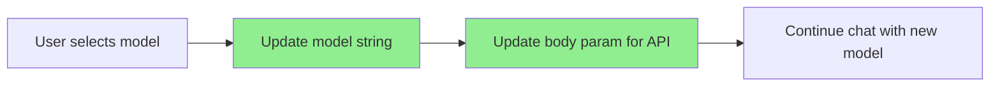

# Chat Model Switching Simplification Plan (IMPLEMENTED)

## Implementation Status

✅ **COMPLETE** - All changes have been successfully implemented as of April 2025.

## Current System Understanding

1. **Vercel AI SDK Registry**
   - Registry created via `createProviderRegistry(providers)` in provider-registry.ts
   - Models and aliases are already defined in the registry
   - Model IDs use string format `provider:modelid` (e.g., "openai:gpt-4o") 
   - Aliases like 'quick', 'complete', etc. map directly to these strings

2. **Current Issue**
   - Changing models causes a complete UI reset of the chat
   - This is unnecessary - only the model string needs to change
   - Page refreshes interrupt the user experience

## The Solution



### Simple Implementation Plan

1. **Remove the Page Reset**
   - We don't need to rebuild anything - just prevent the reset
   - Keep the model as a react state at the chat.tsx level
   - Update the model without reinitializing the chat

2. **Use Registry Directly**
   - No additional layers needed
   - The registry already has all models and aliases
   - The type assertion (`as \`${string}:${string}\``) is the only technical requirement

3. **Implementation Changes**

   **a. In chat.tsx:**
   ```typescript
   // Add model state instead of just using prop
   const [currentModel, setCurrentModel] = useState(selectedChatModel);
   
   // Pass update function to child components
   const updateModelString = (newModelString) => {
     setCurrentModel(newModelString);
     // Optionally save to cookie if needed
     saveChatModelAsCookie(newModelString);
   };
   
   // Use current model in useChat
   const { messages, input, ... } = useChat({
     id,
     body: {
       id,
       selectedChatModel: currentModel, // Use state not prop
       desiredOutput: 'text'
     },
     // Other parameters unchanged
   });
   ```

   **b. In model selector components:**
   ```typescript
   // Pass the update function
   <ModelSelector 
     selectedModelId={currentModel}
     onModelChange={updateModelString} 
   />
   ```

   **c. Update ModelSelector.tsx to use this pattern:**
   ```typescript
   export function ModelSelector({
     selectedModelId,
     onModelChange, // New prop
     className,
   }) {
     // When category/model is selected:
     const handleCategorySelect = (category) => {
       // Find model for category
       const primaryModel = models.find(m => 
         m.categoryIds.includes(category.id) && m.isPrimary
       );
       
       if (primaryModel) {
         // Update the model using the function prop
         onModelChange(primaryModel.id);
       }
     };
   }
   ```

## Benefits

1. **Simplicity**
   - No new abstractions
   - Use what's already there
   - Just state updates instead of page refreshes

2. **Better User Experience**
   - No chat reset when changing models
   - Seamless model switching
   - Chat history and context maintained

3. **Less Code**
   - Removing unnecessary complexity
   - Using the registry as intended

## Testing Considerations

1. ✅ Verify model switch updates API calls correctly
2. ✅ Confirm chat history is maintained when changing models
3. ✅ Test different model categories and ensure they work correctly

## Next Steps

- Run `pnpm build` to verify the implementation builds successfully
- Test in development environment to confirm the user experience improvements
- Monitor for any unexpected behavior during model switching