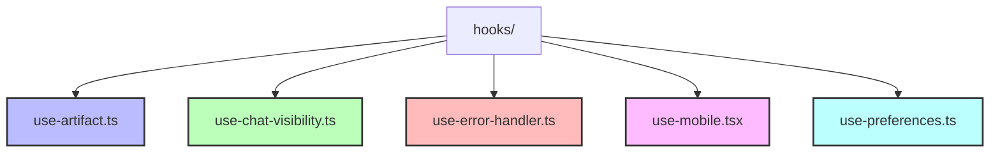
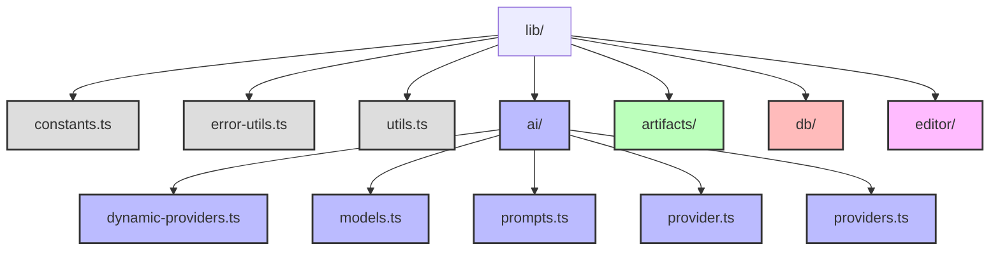
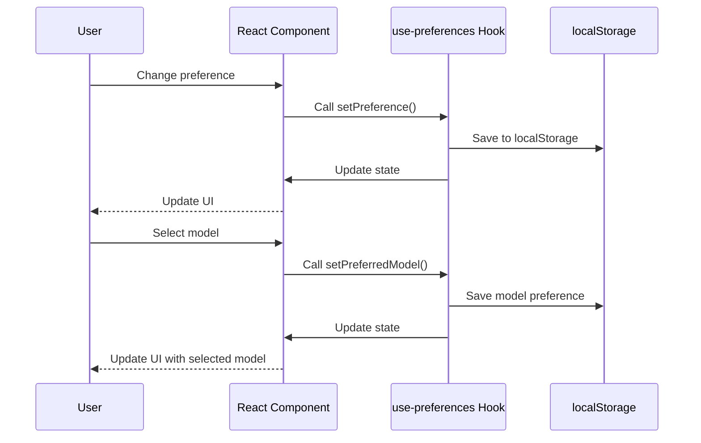
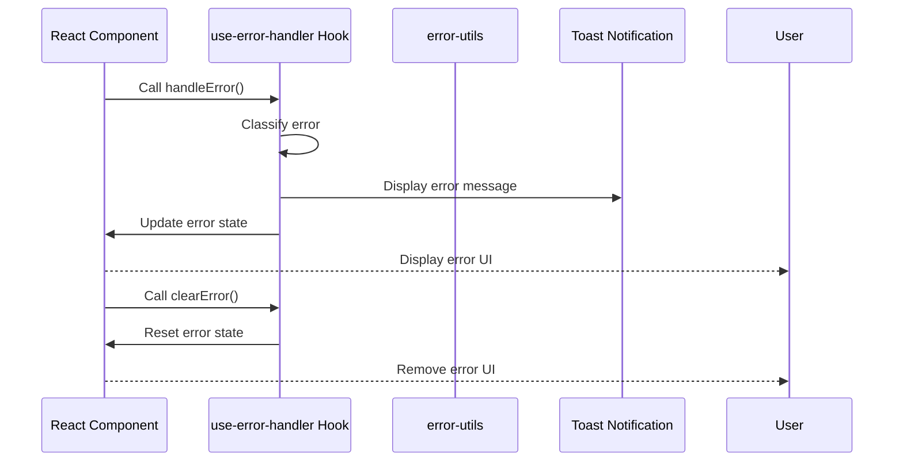
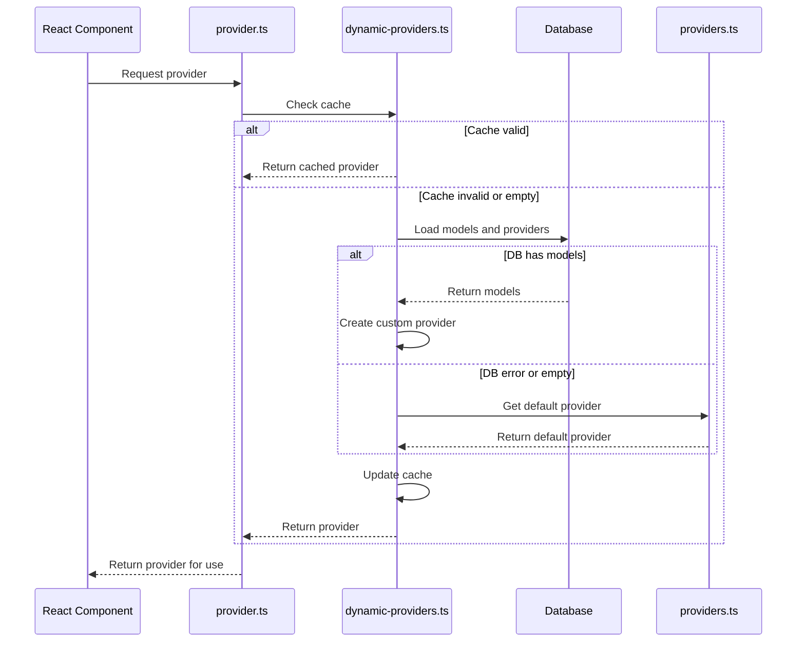
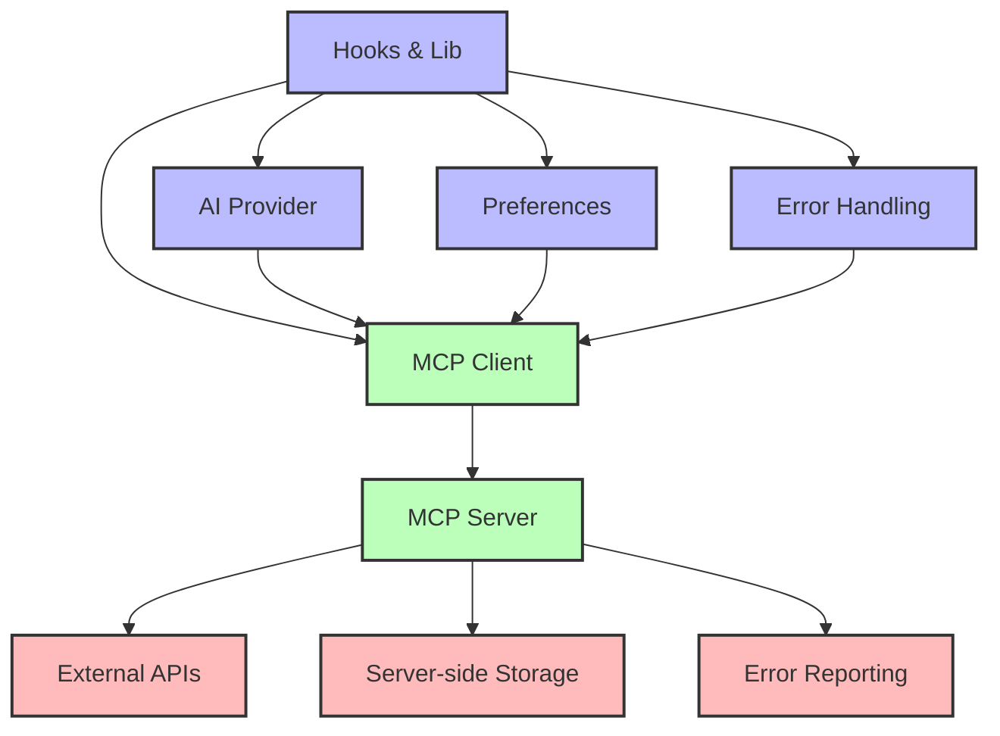

# Hooks and Lib Directories Documentation

## Introduction

This document provides a comprehensive overview of the `hooks/` and `lib/` directories in the chat.talkverse.ai application. It includes both high-level overviews and technical implementation details to serve as a reference during the redesign process. These directories contain critical functionality that powers the application's core features, from state management to AI model integration.

## Hooks Directory Overview

The `hooks/` directory contains custom React hooks that encapsulate reusable stateful logic across the application.



### High-Level Hook Purposes

- **`use-artifact.ts`**: Manages artifact state and metadata
- **`use-chat-visibility.ts`**: Controls chat visibility settings
- **`use-error-handler.ts`**: Provides error handling functionality
- **`use-mobile.tsx`**: Detects mobile devices for responsive design
- **`use-preferences.ts`**: Manages user preferences and settings

## Lib Directory Overview

The `lib/` directory contains utility functions, constants, and core functionality that powers the application.



### High-Level Directory Purposes

- **Root Files**: Utility functions and constants
- **`ai/`**: AI model integration and configuration
- **`artifacts/`**: Artifact management functionality
- **`db/`**: Database interactions
- **`editor/`**: Editor functionality for artifacts

## Detailed Directory and File Analysis

### Hooks Directory

#### `use-artifact.ts`

**Purpose**: Manages the state and metadata of artifacts in the application.

**Technical Implementation**:
- Uses SWR for state management
- Provides functions to get and set artifact data
- Includes a selector pattern for optimized component rendering

**Key Features**:
- Initial artifact state definition
- Artifact selector for component optimization
- Metadata management for artifacts
- Memoized return values for performance

```typescript
export function useArtifact() {
  const { data: localArtifact, mutate: setLocalArtifact } = useSWR<UIArtifact>(
    'artifact',
    null,
    {
      fallbackData: initialArtifactData,
    },
  );

  // ... implementation details ...

  return useMemo(
    () => ({
      artifact,
      setArtifact,
      metadata: localArtifactMetadata,
      setMetadata: setLocalArtifactMetadata,
    }),
    [artifact, setArtifact, localArtifactMetadata, setLocalArtifactMetadata],
  );
}
```

#### `use-chat-visibility.ts`

**Purpose**: Manages the visibility settings of chats.

**Technical Implementation**:
- Uses SWR for state management
- Integrates with server actions for persistence
- Provides optimistic UI updates

**Key Features**:
- Chat visibility type management
- Integration with server actions
- Optimistic updates for better UX

```typescript
export function useChatVisibility({
  chatId,
  initialVisibility,
}: {
  chatId: string;
  initialVisibility: VisibilityType;
}) {
  // ... implementation details ...

  const setVisibilityType = (updatedVisibilityType: VisibilityType) => {
    setLocalVisibility(updatedVisibilityType);

    // Optimistic update
    mutate<Array<Chat>>(
      '/api/history',
      (history) => {
        // ... update logic ...
      },
      { revalidate: false },
    );

    // Server persistence
    updateChatVisibility({
      chatId: chatId,
      visibility: updatedVisibilityType,
    });
  };

  return { visibilityType, setVisibilityType };
}
```

#### `use-error-handler.ts`

**Purpose**: Provides error handling functionality for the application.

**Technical Implementation**:
- Uses React state for error management
- Includes error classification and user-friendly messages
- Integrates with toast notifications

**Key Features**:
- Error state management
- Error classification by type
- User-friendly error messages
- Toast notification integration

```typescript
export function useErrorHandler() {
  const [errorState, setErrorState] = useState<ErrorState>({
    hasError: false,
    message: "",
  });

  const handleError = useCallback((error: Error) => {
    // ... error classification logic ...

    toast.error(message);
    setErrorState({ hasError: true, message, code });
  }, []);

  const clearError = useCallback(() => {
    setErrorState({ hasError: false, message: "" });
  }, []);

  return {
    errorState,
    handleError,
    clearError,
  };
}
```

#### `use-mobile.tsx`

**Purpose**: Detects mobile devices for responsive design.

**Technical Implementation**:
- Uses media queries for device detection
- Provides a boolean flag for mobile state
- Handles window resize events

**Key Features**:
- Mobile breakpoint definition
- Media query listener
- Window resize handling

```typescript
export function useIsMobile() {
  const [isMobile, setIsMobile] = React.useState<boolean | undefined>(
    undefined,
  );

  React.useEffect(() => {
    const mql = window.matchMedia(`(max-width: ${MOBILE_BREAKPOINT - 1}px)`);
    const onChange = () => {
      setIsMobile(window.innerWidth < MOBILE_BREAKPOINT);
    };
    mql.addEventListener('change', onChange);
    setIsMobile(window.innerWidth < MOBILE_BREAKPOINT);
    return () => mql.removeEventListener('change', onChange);
  }, []);

  return !!isMobile;
}
```

#### `use-preferences.ts`

**Purpose**: Manages user preferences and settings.

**Technical Implementation**:
- Uses localStorage for persistence
- Provides functions to get and set preferences
- Handles user-specific preferences

**Key Features**:
- User preference management
- Model preference tracking
- Theme preference management
- Local storage persistence
- User change detection

```typescript
export function usePreferences() {
  const [preferences, setPreferencesState] = useState<UserPreferences>(defaultPreferences);
  const [isLoaded, setIsLoaded] = useState(false);
  
  // ... implementation details ...

  // Update a specific preference
  const setPreference = <K extends keyof UserPreferences>(key: K, value: UserPreferences[K]) => {
    setPreferencesState(prev => {
      const newPreferences = { ...prev, [key]: value };
      
      // ... additional logic ...
      
      // Save to localStorage
      try {
        localStorage.setItem('userPreferences', JSON.stringify(newPreferences));
      } catch (error) {
        console.error('Failed to save preferences to localStorage', error);
      }
      
      return newPreferences;
    });
  };

  // ... additional functions ...

  return {
    preferences,
    isLoaded,
    setPreference,
    setPreferredModel,
    resetPreferences
  };
}
```

### Lib Directory

#### Root Files

##### `constants.ts`

**Purpose**: Defines application-wide constants.

**Key Features**:
- Environment detection
- Test environment detection

```typescript
export const isProductionEnvironment = process.env.NODE_ENV === 'production';

export const isTestEnvironment = Boolean(
  process.env.PLAYWRIGHT_TEST_BASE_URL ||
    process.env.PLAYWRIGHT ||
    process.env.CI_PLAYWRIGHT,
);
```

##### `error-utils.ts`

**Purpose**: Provides error handling utilities.

**Technical Implementation**:
- Defines error messages for different error types
- Provides a function to handle API responses

**Key Features**:
- Error message mapping
- API response error handling
- Toast notification integration

```typescript
export const ERROR_MESSAGES: Record<string, string> = {
  // Authentication errors
  unauthorized: "You need to be signed in to access this resource",
  // ... other error messages ...
};

export async function handleApiResponse(response: Response) {
  if (!response.ok) {
    // ... error handling logic ...
    
    // Show toast notification
    toast.error(errorMessage);
    
    // Throw error with details
    const error = new Error(errorMessage);
    (error as any).code = errorCode;
    (error as any).status = response.status;
    throw error;
  }

  return response;
}
```

##### `utils.ts`

**Purpose**: Provides utility functions used throughout the application.

**Technical Implementation**:
- Includes functions for class name merging, UUID generation, and more
- Provides helper functions for message handling

**Key Features**:
- Class name utility with Tailwind integration
- UUID generation
- SWR fetcher function
- Message utility functions
- Date formatting

```typescript
export function cn(...inputs: ClassValue[]) {
  return twMerge(clsx(inputs));
}

export function generateUUID(): string {
  return crypto.randomUUID ? 
    crypto.randomUUID() : 
    'xxxxxxxx-xxxx-4xxx-yxxx-xxxxxxxxxxxx'.replace(/[xy]/g, (c) => {
      const r = Math.random() * 16 | 0;
      const v = c === 'x' ? r : (r & 0x3 | 0x8);
      return v.toString(16);
    });
}

// ... other utility functions ...
```

#### `ai/` Directory

##### `models.ts`

**Purpose**: Defines AI models used in the application.

**Technical Implementation**:
- Defines a default chat model
- Provides an interface for chat models
- Lists available chat models

**Key Features**:
- Default model definition
- Model interface definition
- Model list with descriptions

```typescript
export const DEFAULT_CHAT_MODEL: string = 'chat-model-small';

interface ChatModel {
  id: string;
  name: string; 
  displayName: string;
  description: string;
}

export const chatModels: Array<ChatModel> = [
  {
    id: 'chat-model-small',
    name: 'Small model',
    displayName: 'Small model',
    description: 'Small model for fast, lightweight tasks',
  },
  // ... other models ...
];
```

##### `provider.ts`

**Purpose**: Manages AI provider access and caching.

**Technical Implementation**:
- Provides functions to get and reset the provider
- Includes a static provider for immediate use

**Key Features**:
- Provider caching
- Dynamic provider loading
- Static provider fallback
- Test environment handling

```typescript
// Cache for dynamic provider access
let cachedProvider: Provider | null = null;

// Get provider - returns cached provider or initializes one
export async function getProvider(): Promise<Provider> {
  if (!cachedProvider) {
    cachedProvider = await getDynamicProvider();
  }
  return cachedProvider;
}

// ... other functions ...

// Export a immediately available static provider for use when we can't await
export const staticProvider = customProvider({
  languageModels: {
    'chat-model-small': isTestEnvironment 
      ? require('./models.test').chatModel 
      : openai('gpt-4o-mini'),
    // ... other models ...
  }
});
```

##### `providers.ts`

**Purpose**: Defines AI providers and models.

**Technical Implementation**:
- Uses the AI SDK to define providers
- Configures language and image models

**Key Features**:
- Multiple provider integration (OpenAI, Anthropic, TogetherAI)
- Language model configuration
- Image model configuration
- Reasoning middleware integration

```typescript
export const myProvider = customProvider({
  languageModels: {
    'chat-model-small': openai('o3-mini'),
    'chat-model-large': anthropic('claude-3-7-sonnet-20250219'),
    'chat-model-reasoning': wrapLanguageModel({
      model: togetherai('deepseek-ai/DeepSeek-R1'),
      middleware: extractReasoningMiddleware({ tagName: 'think' }),
    }),
    // ... other models ...
  },
  imageModels: {
    'small-model': openai.image('dall-e-2'),
    // ... other models ...
  },
});
```

##### `dynamic-providers.ts`

**Purpose**: Provides dynamic loading of AI providers.

**Technical Implementation**:
- Implements provider caching
- Loads providers from the database
- Falls back to default provider

**Key Features**:
- Provider caching with TTL
- Database integration
- Error handling with fallback
- Cache refresh function

```typescript
// Cache implementation
const MODEL_CACHE_TTL = 60 * 1000; 
let providerCache: Provider | null = null;
let lastCacheUpdate = 0;

// Create custom provider based on database models
async function createDynamicProvider(): Promise<Provider> {
  try {
    // Load all data from database
    const [models, providers, categories] = await Promise.all([
      getAllModels(),
      getAllProviders(),
      getAllCategories()
    ]);

    // ... implementation details ...
    
    // For now, always use the default provider
    console.log('Using default provider');
    return myProvider;
    
  } catch (error) {
    // ... error handling ...
    
    // Return default provider
    return myProvider;
  }
}

// ... other functions ...
```

##### `prompts.ts`

**Purpose**: Defines prompts used for AI interactions.

**Technical Implementation**:
- Defines system prompts for different contexts
- Provides specialized prompts for artifacts

**Key Features**:
- Artifact-specific prompts
- Regular conversation prompts
- Code generation prompts
- Spreadsheet generation prompts
- Document update prompts

```typescript
export const artifactsPrompt = `
Artifacts is a special user interface mode that helps users with writing, editing, and other content creation tasks. When artifact is open, it is on the right side of the screen, while the conversation is on the left side. When creating or updating documents, changes are reflected in real-time on the artifacts and visible to the user.

// ... more prompt text ...
`;

export const regularPrompt =
  'You are a friendly assistant! Keep your responses concise and helpful.';

export const systemPrompt = ({
  selectedChatModel,
}: {
  selectedChatModel: string;
}) => {
  if (selectedChatModel === 'chat-model-reasoning') {
    return regularPrompt;
  } else {
    return `${regularPrompt}\n\n${artifactsPrompt}`;
  }
};

// ... other prompts ...
```

## Hook and Lib Interaction Patterns

### Preference Management Flow



### Error Handling Flow



### AI Provider Flow



## Technical Implementation Details

### SWR for State Management

Many hooks use SWR (stale-while-revalidate) for state management:

```typescript
const { data: localArtifact, mutate: setLocalArtifact } = useSWR<UIArtifact>(
  'artifact',
  null,
  {
    fallbackData: initialArtifactData,
  },
);
```

### Memoization for Performance

Hooks use `useMemo` and `useCallback` for performance optimization:

```typescript
const artifact = useMemo(() => {
  if (!localArtifact) return initialArtifactData;
  return localArtifact;
}, [localArtifact]);

const setArtifact = useCallback(
  (updaterFn: UIArtifact | ((currentArtifact: UIArtifact) => UIArtifact)) => {
    // ... implementation ...
  },
  [setLocalArtifact],
);
```

### LocalStorage for Persistence

User preferences are stored in localStorage for persistence:

```typescript
try {
  localStorage.setItem('userPreferences', JSON.stringify(newPreferences));
} catch (error) {
  console.error('Failed to save preferences to localStorage', error);
}
```

### AI SDK Integration

The application uses the AI SDK for model integration:

```typescript
export const myProvider = customProvider({
  languageModels: {
    'chat-model-small': openai('o3-mini'),
    'chat-model-large': anthropic('claude-3-7-sonnet-20250219'),
    // ... other models ...
  },
  // ... other configurations ...
});
```

## Key Components and Their Interactions

### Hooks and Components

Hooks provide stateful logic that components can use:

- `useArtifact` powers the Artifact component
- `useChatVisibility` controls chat visibility in the ChatHeader component
- `useErrorHandler` provides error handling for the Chat component
- `useIsMobile` enables responsive design across components
- `usePreferences` manages user preferences for ModelSelector and other components

### Lib and Application Features

The lib directory provides core functionality:

- `ai/` directory powers the AI integration
- `utils.ts` provides utility functions used throughout the application
- `error-utils.ts` standardizes error handling
- `constants.ts` provides environment detection

## Redesign Considerations

### Potential Pain Points

1. **Provider Management**: The current implementation has a mix of static and dynamic providers, which might be confusing.

2. **Error Handling**: Error handling is spread across multiple files (`use-error-handler.ts`, `error-utils.ts`), which might lead to inconsistencies.

3. **Preference Management**: Preferences are stored in localStorage, which might not be sufficient for more complex preferences or cross-device synchronization.

### Scalability Considerations

1. **Model Management**: As more AI models are added, the provider management might become more complex.

2. **Preference Synchronization**: As the application grows, preferences might need to be synchronized across devices.

3. **Error Reporting**: A more comprehensive error reporting system might be needed for production use.

### Integration Points for MCP

The Model Context Protocol (MCP) could be integrated with the hooks and lib systems to extend their capabilities:

1. **AI Provider Integration**: MCP could provide a more flexible way to integrate with different AI models.

2. **Preference Management**: MCP could provide server-side preference storage and synchronization.

3. **Error Handling**: MCP could provide more comprehensive error reporting and handling.

## Potential MCP Integration Architecture



### MCP Integration Points

1. **AI Provider**: MCP could provide a more flexible way to integrate with different AI models, potentially allowing for more dynamic model selection and configuration.

2. **Preferences**: MCP could provide server-side preference storage and synchronization, allowing preferences to be shared across devices and persisted beyond localStorage.

3. **Error Handling**: MCP could provide more comprehensive error reporting and handling, potentially integrating with external error tracking services.

4. **External APIs**: MCP could connect to external APIs for enhanced functionality, such as additional AI models or data sources.

5. **Server-side Storage**: MCP could provide server-side storage for artifacts, preferences, and other data that needs to be persisted.