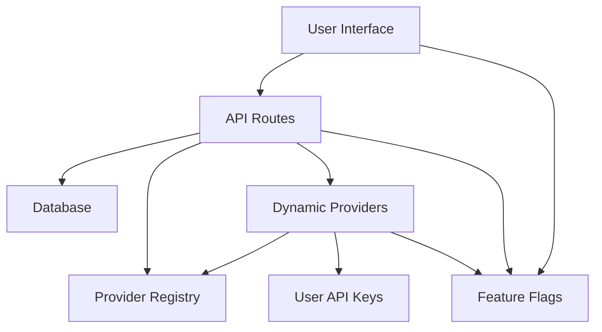

# Vercel AI SDK Provider Integration - Implementation Summary

This document provides a summary of the implementation plan for integrating the Vercel AI SDK provider registry into the chat.talkverse.ai application. It highlights the key components and how they work together to provide a comprehensive solution.

## Overview

The implementation consists of several key components:

1. **Provider Registry Module**: Interacts with the Vercel AI SDK provider registry to fetch and cache available providers and models.
2. **Dynamic Providers Module**: Creates custom providers based on database models, user API keys, and registry data.
3. **Feature Flags Module**: Controls the rollout of new features and provides a system for enabling/disabling features.
4. **User API Keys Module**: Manages user API keys for different providers.
5. **User Model Preferences Component**: Allows users to select their preferred models and manage their API keys.
6. **Database Schema Updates**: Supports API key storage and provider registry integration.
7. **API Routes Enhancement**: Provides endpoints for managing models, categories, API keys, and registry data.

## Component Interactions

The components interact with each other to provide a seamless user experience:



### User Flow

1. User accesses the chat interface
2. User clicks the gear icon to open model preferences
3. User selects preferred models for different categories
4. User adds API keys for providers that require them
5. User returns to chat interface and uses selected models

### Data Flow

1. Provider registry data is fetched and cached
2. User API keys are stored in the database
3. Dynamic providers are created based on registry data and user API keys
4. Models and categories are provided to the UI
5. User preferences are stored and used to select models

## Key Features

### Provider Registry Integration

The provider registry module interacts with the Vercel AI SDK provider registry to fetch and cache available providers and models. It provides functions for:

- Fetching providers from the registry
- Caching registry data in the database
- Creating provider instances with API keys
- Testing API keys for validity

### Dynamic Provider Creation

The dynamic providers module creates custom providers based on database models, user API keys, and registry data. It provides functions for:

- Creating custom providers with models from multiple sources
- Caching providers for performance
- Refreshing the provider cache when needed
- Getting available models from providers

### Feature Flag System

The feature flags module provides a system for controlling the rollout of new features. It includes:

- Global enabling/disabling of features
- User-specific feature flags
- Group-specific feature flags
- Percentage-based rollout
- Admin interface for managing flags

### User API Key Management

The user API keys module provides functions for managing user API keys for different providers. It includes:

- Getting all API keys for a user
- Getting API keys for specific providers
- Setting API keys for providers
- Deleting API keys
- Testing API keys for validity

### User Model Preferences

The user model preferences component allows users to select their preferred models and manage their API keys. It includes:

- Model selection for different categories
- API key management for different providers
- Provider registry integration
- Feature flag integration
- Accessibility and performance optimizations

## Implementation Details

### Database Schema Updates

The database schema is updated to support API key storage and provider registry integration:

```sql
-- Add userApiKeys table
CREATE TABLE "UserApiKey" (
  "id" UUID PRIMARY KEY DEFAULT gen_random_uuid(),
  "userId" UUID NOT NULL,
  "providerId" UUID NOT NULL,
  "apiKey" TEXT NOT NULL,
  "isEnabled" BOOLEAN DEFAULT true,
  "createdAt" TIMESTAMP DEFAULT now(),
  "updatedAt" TIMESTAMP DEFAULT now(),
  FOREIGN KEY ("providerId") REFERENCES "ModelProvider" ("id") ON DELETE CASCADE,
  UNIQUE ("userId", "providerId")
);

-- Add providerRegistry table
CREATE TABLE "ProviderRegistry" (
  "id" UUID PRIMARY KEY DEFAULT gen_random_uuid(),
  "name" TEXT NOT NULL UNIQUE,
  "displayName" TEXT NOT NULL,
  "description" TEXT,
  "logoUrl" TEXT,
  "authType" TEXT NOT NULL,
  "modelTypes" TEXT[] NOT NULL,
  "isEnabled" BOOLEAN DEFAULT true,
  "requiresApiKey" BOOLEAN DEFAULT true,
  "registryData" JSONB,
  "createdAt" TIMESTAMP DEFAULT now(),
  "updatedAt" TIMESTAMP DEFAULT now()
);

-- Update modelProvider table
ALTER TABLE "ModelProvider" 
ADD COLUMN "registryId" TEXT,
ADD COLUMN "registryData" JSONB;
```

### API Routes Enhancement

The API routes are enhanced to support the new functionality:

- `/api/models` - Updated to include registry models
- `/api/categories` - Updated to support registry model categories
- `/api/user/api-keys` - GET, POST, DELETE for managing user API keys
- `/api/providers/registry` - GET for fetching available providers from the registry

### User Interface Improvements

The user interface is enhanced to support the new functionality:

- `user-model-preferences.tsx` - Updated to support API key management
- `chat-header.tsx` - Updated to include a gear icon for accessing model preferences
- `model-selector.tsx` - Updated to display registry models
- Admin component for managing available providers and models

## Security Considerations

The implementation includes several security considerations:

1. **API Key Storage**: API keys are stored securely in the database.
2. **API Key Masking**: API keys are masked when returned to the client.
3. **Authentication**: All API routes require authentication.
4. **Feature Flags**: Sensitive features can be disabled through feature flags.
5. **Validation**: API keys are validated before being saved.

## Performance Considerations

The implementation includes several performance optimizations:

1. **Caching**: Provider registry data and providers are cached.
2. **Lazy Loading**: Models are loaded only when needed.
3. **Conditional Fetching**: Data is fetched only when needed based on feature flags.
4. **Optimistic UI Updates**: UI is updated optimistically for better user experience.

## Testing Considerations

The implementation includes several testing considerations:

1. **Unit Tests**: Each module should have unit tests.
2. **Integration Tests**: The interaction between modules should be tested.
3. **UI Tests**: The user interface should be tested with different configurations.
4. **Feature Flag Tests**: Different feature flag configurations should be tested.
5. **API Key Tests**: API key management should be tested with valid and invalid keys.

## Deployment Considerations

The implementation includes several deployment considerations:

1. **Database Migrations**: Database schema updates should be deployed first.
2. **Feature Flags**: Features should be deployed with feature flags disabled initially.
3. **Gradual Rollout**: Features should be rolled out gradually to users.
4. **Monitoring**: The system should be monitored for errors and performance issues.
5. **Rollback Plan**: A plan should be in place for rolling back changes if needed.

## Conclusion

The Vercel AI SDK provider integration implementation provides a comprehensive solution for enhancing the chat.talkverse.ai application with a wider range of AI models and providers. By implementing this plan, the application will offer users more flexibility and customization options, while maintaining a seamless user experience.

For detailed implementation information, refer to the following documents:

1. [Implementation Plan](implementation-plan.md)
2. [Provider Registry Implementation](provider-registry-implementation.md)
3. [Dynamic Providers Implementation](dynamic-providers-implementation.md)
4. [Feature Flags Implementation](feature-flags-implementation.md)
5. [User API Keys Implementation](user-api-keys-implementation.md)
6. [User Model Preferences Implementation](user-model-preferences-implementation.md)