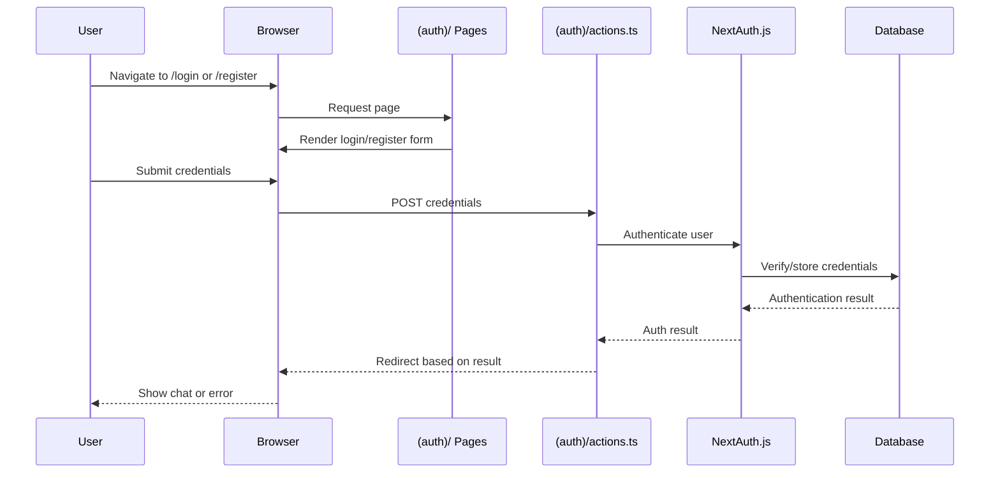
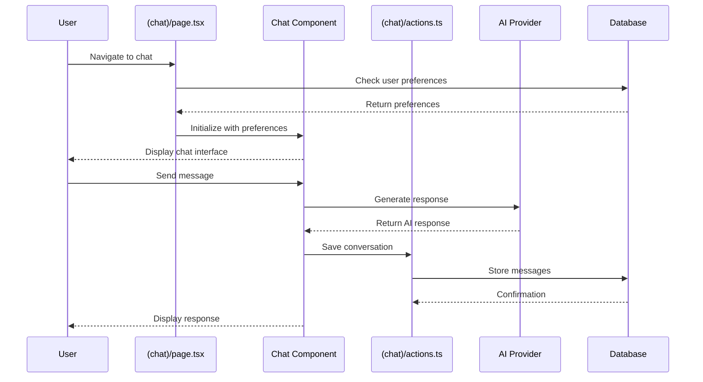
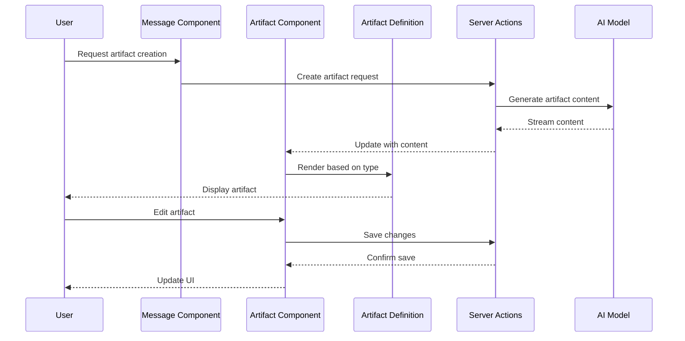
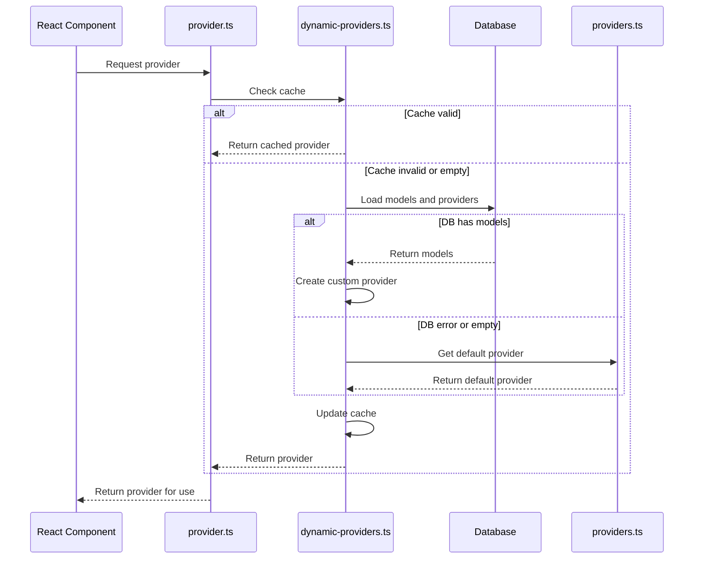
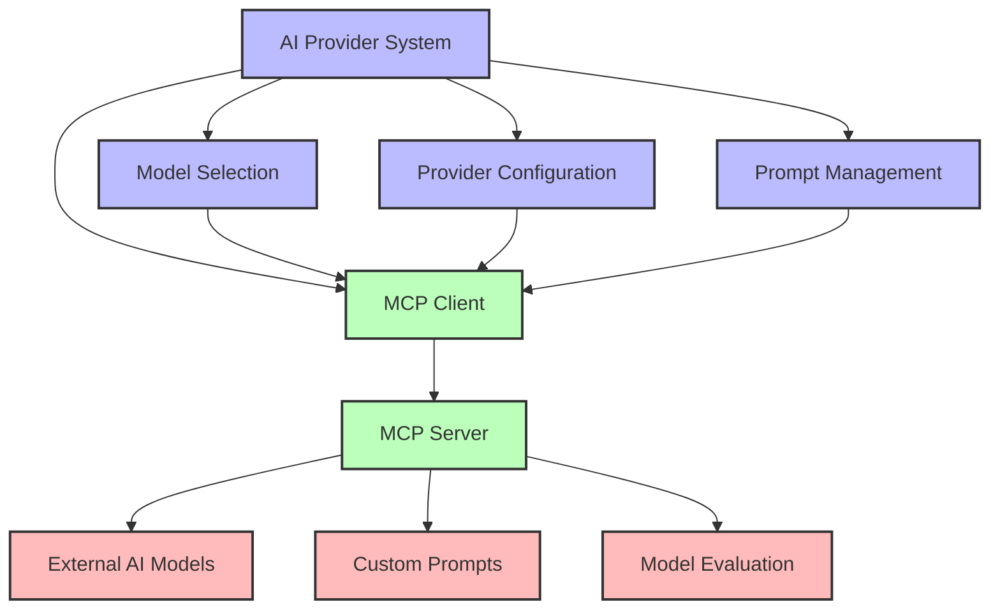
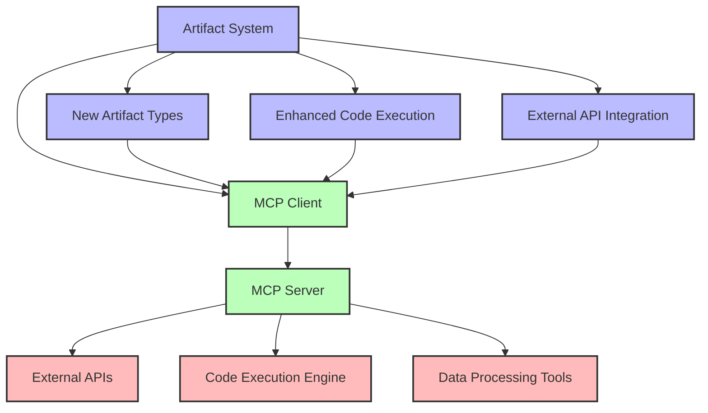
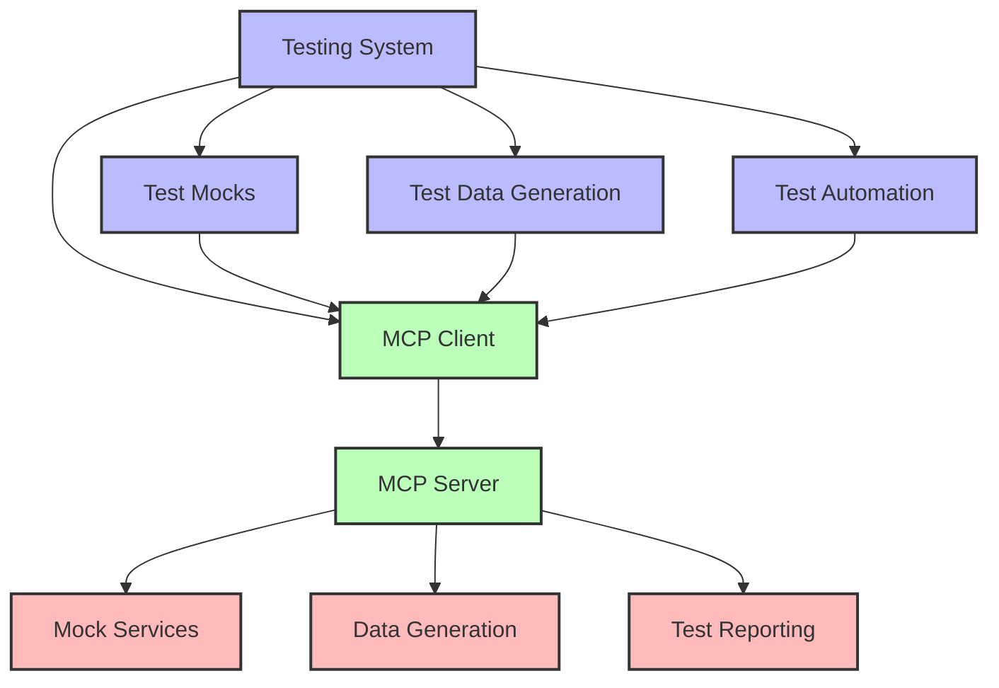

# Chat.Talkverse.ai - Master Project Documentation

## Introduction

This is a Vercel SDK 4.1 project using the latest and canary versions
They use the new experimental provider registry
They use feature flags for easy replacement of information like models
They need to integrate model selection and user preferences better
They need to poll the registry and get more model choices for users and more providers
Users should be able to select any providers and models, providing API keys if needed
They need a better user-model-preferences.tsx component and an easy way to access it
The quick select in chat-header works but only has default options
They need to load all providers and models but only show those that fit the selected category and that the user has API keys for in the chat-header
All models and providers should be shown in the preferences component, indicating which need API keys

This document provides a comprehensive overview of the chat.talkverse.ai application, synthesizing information from detailed documentation of each directory and component. It serves as a central reference for understanding the project's architecture, components, and integration points.

The application is a Next.js-based chatbot interface that leverages various AI models for text, image, and other content generation, with a focus on artifact creation and management.

## Project Structure Overview

```mermaid
graph TD
    A[chat.talkverse.ai] --> B[app/]
    A --> C[artifacts/]
    A --> D[components/]
    A --> E[hooks/]
    A --> F[lib/]
    A --> G[public/]
    A --> H[tests/]
    A --> I[Root Config Files]
    
    B --> B1[(auth)/]
    B --> B2[(chat)/]
    B --> B3[api/]
    B --> B4[Root Files]
    
    C --> C1[actions.ts]
    C --> C2[code/]
    C --> C3[image/]
    C --> C4[sheet/]
    C --> C5[text/]
    
    D --> D1[ui/]
    D --> D2[admin/]
    D --> D3[Feature Components]
    
    E --> E1[use-artifact.ts]
    E --> E2[use-chat-visibility.ts]
    E --> E3[use-error-handler.ts]
    E --> E4[use-mobile.tsx]
    E --> E5[use-preferences.ts]
    
    F --> F1[ai/]
    F --> F2[artifacts/]
    F --> F3[db/]
    F --> F4[editor/]
    F --> F5[Utility Files]
    
    G --> G1[fonts/]
    G --> G2[images/]
    
    H --> H1[Test Files]
    H --> H2[Setup Files]
    H --> H3[pages/]
    H --> H4[prompts/]
    
    I --> I1[package.json]
    I --> I2[next.config.ts]
    I --> I3[tailwind.config.ts]
    I --> I4[drizzle.config.ts]
    I --> I5[Other Config]
    
    classDef appDir fill:#bbf,stroke:#333,stroke-width:2px;
    classDef artifactsDir fill:#bfb,stroke:#333,stroke-width:2px;
    classDef componentsDir fill:#fbb,stroke:#333,stroke-width:2px;
    classDef hooksDir fill:#fbf,stroke:#333,stroke-width:2px;
    classDef libDir fill:#bff,stroke:#333,stroke-width:2px;
    classDef publicDir fill:#ffb,stroke:#333,stroke-width:2px;
    classDef testsDir fill:#fdb,stroke:#333,stroke-width:2px;
    classDef configFiles fill:#ddd,stroke:#333,stroke-width:2px;
    
    class B,B1,B2,B3,B4 appDir;
    class C,C1,C2,C3,C4,C5 artifactsDir;
    class D,D1,D2,D3 componentsDir;
    class E,E1,E2,E3,E4,E5 hooksDir;
    class F,F1,F2,F3,F4,F5 libDir;
    class G,G1,G2 publicDir;
    class H,H1,H2,H3,H4 testsDir;
    class I,I1,I2,I3,I4,I5 configFiles;
```

## Directory Summaries

### App Directory (`app/`)

**Notes from app-directory-documentation.md:**

The `app/` directory follows Next.js App Router structure, organizing the application into route segments and special files.

**Key Components:**
- **Root Files**: Core application files (layout.tsx, globals.css)
- **`(auth)/`**: Authentication-related routes and functionality
- **`(chat)/`**: Main chat interface and functionality
- **`api/`**: API routes for server-side functionality

**Technical Highlights:**
- Uses Next.js App Router with route groups
- Implements server components for data fetching
- Provides API routes for model and category management
- Handles authentication with NextAuth.js

**Integration Points:**
- The `/api/models` endpoint is a key integration point for adding new AI models
- The Chat component in `(chat)/page.tsx` is the main entry point for enhancing the chat experience
- The auth configuration in `(auth)/auth.config.ts` controls access to features

### Artifacts Directory (`artifacts/`)

**Notes from artifacts-directory-documentation.md:**

The `artifacts/` directory implements the artifact system, allowing users to create and interact with different types of AI-generated content.

**Key Components:**
- **`actions.ts`**: Server actions for artifact-related functionality
- **`code/`**: Implementation for code artifacts with in-browser Python execution
- **`image/`**: Implementation for image artifacts
- **`sheet/`**: Implementation for spreadsheet artifacts
- **`text/`**: Implementation for text artifacts

**Technical Highlights:**
- Uses a class-based approach for artifact definition
- Implements in-browser Python execution with Pyodide
- Integrates with AI models for content generation
- Provides streaming updates for real-time feedback

**Integration Points:**
- The Artifact class is the core of the system, providing a consistent interface
- The document handler factory creates handlers for each artifact type
- AI model integration through the `myProvider` object

### Components Directory (`components/`)

**Notes from components-directory-documentation.md:**

The `components/` directory contains all React components used throughout the application, from UI elements to complex interactive features.

**Key Components:**
- **`ui/`**: Shadcn UI components (button, dialog, dropdown, etc.)
- **`admin/`**: Admin-specific components
- **Feature Components**: Chat, Message, Artifact, and other functional components

**Technical Highlights:**
- Uses React's `memo` for performance optimization
- Implements optimistic updates for better UX
- Uses Framer Motion for animations
- Leverages SWR for data fetching

**Integration Points:**
- The Chat component orchestrates the chat experience
- The Artifact component renders artifacts in a modal-like interface
- The ModelSelector component provides model selection functionality

### Hooks Directory (`hooks/`)

**Notes from hooks-and-lib-directory-documentation.md:**

The `hooks/` directory contains custom React hooks that encapsulate reusable stateful logic across the application.

**Key Components:**
- **`use-artifact.ts`**: Manages artifact state and metadata
- **`use-chat-visibility.ts`**: Controls chat visibility settings
- **`use-error-handler.ts`**: Provides error handling functionality
- **`use-mobile.tsx`**: Detects mobile devices for responsive design
- **`use-preferences.ts`**: Manages user preferences and settings

**Technical Highlights:**
- Uses SWR for state management
- Implements memoization for performance
- Uses localStorage for preference persistence
- Provides optimistic UI updates

**Integration Points:**
- Hooks provide stateful logic that components can use
- `useArtifact` powers the Artifact component
- `usePreferences` manages user preferences for ModelSelector

### Lib Directory (`lib/`)

**Notes from hooks-and-lib-directory-documentation.md:**

The `lib/` directory contains utility functions, constants, and core functionality that powers the application.

**Key Components:**
- **`ai/`**: AI model integration and configuration
- **`artifacts/`**: Artifact management functionality
- **`db/`**: Database interactions
- **`editor/`**: Editor functionality for artifacts
- **Utility Files**: Utility functions and constants

**Technical Highlights:**
- Implements AI provider caching and dynamic loading
- Defines system prompts for different contexts
- Provides error handling utilities
- Implements database schema and queries with Drizzle ORM

**Integration Points:**
- The AI provider system is a key integration point
- The database schema defines the data structure
- The utility functions are used throughout the application

### Public Directory (`public/`)

**Notes from public-tests-and-config-documentation.md:**

The `public/` directory contains static assets that are served directly by the web server without processing by Next.js.

**Key Components:**
- **`fonts/`**: Custom font files (geist.woff2, geist-mono.woff2)
- **`images/`**: Static images for demos and testing

**Technical Highlights:**
- Custom fonts are referenced in globals.css
- Images are used in tests for image attachment functionality

**Integration Points:**
- Fonts are applied via CSS to all text elements
- Images are used in tests and demos

### Tests Directory (`tests/`)

**Notes from public-tests-and-config-documentation.md:**

The `tests/` directory contains end-to-end tests using Playwright to verify the application's functionality.

**Key Components:**
- **Test Files**: End-to-end tests for different features
- **Setup Files**: Configuration for test environments
- **`pages/`**: Page object models for testing
- **`prompts/`**: Test prompts and expected responses

**Technical Highlights:**
- Uses Playwright for end-to-end testing
- Implements the page object model pattern
- Defines test prompts and expected responses
- Provides utility functions for testing

**Integration Points:**
- Tests verify the application's functionality
- Page objects encapsulate page interactions
- Test prompts define test data

### Root Configuration Files

**Notes from public-tests-and-config-documentation.md:**

The root directory contains various configuration files that define the application's behavior, dependencies, and build process.

**Key Components:**
- **`package.json`**: Defines dependencies and scripts
- **`next.config.ts`**: Next.js configuration
- **`tailwind.config.ts`**: Tailwind CSS configuration
- **`drizzle.config.ts`**: Database configuration
- **Other Config Files**: TypeScript, linting, and build configuration

**Technical Highlights:**
- Configures Next.js with experimental features
- Defines a custom Tailwind theme with CSS variables
- Configures Drizzle ORM for PostgreSQL
- Sets up testing with Playwright

**Integration Points:**
- Configuration files define how the application is built and run
- Package.json defines dependencies and scripts
- Database configuration connects to PostgreSQL

## Core Application Flows

### Authentication Flow



### Chat Interaction Flow



### Artifact Creation Flow



### AI Provider Flow



## Technical Implementation Highlights

### Next.js App Router

The application uses Next.js App Router for routing and server components:

- Route groups with parentheses for logical organization
- Server components for data fetching
- API routes for server-side functionality
- Server actions for form handling

### AI Integration

The application integrates with multiple AI providers:

- OpenAI for text and image generation
- Anthropic for text generation
- TogetherAI for text and image generation
- Custom middleware for reasoning extraction

### Artifact System

The artifact system allows users to create and interact with different types of content:

- Code artifacts with in-browser Python execution
- Image artifacts with AI-generated images
- Text artifacts for document creation
- Sheet artifacts for spreadsheet creation

### State Management

The application uses a combination of state management approaches:

- SWR for data fetching and caching
- React state for local component state
- localStorage for preference persistence
- Optimistic updates for better UX

### Testing Strategy

The application uses Playwright for end-to-end testing:

- Page object model pattern for encapsulation
- Test prompts for consistent testing
- Setup files for environment configuration
- Test utilities for common operations

## Redesign Considerations

### Potential Pain Points

1. **Provider Management**: The current implementation has a mix of static and dynamic providers, which might be confusing.

2. **Component Complexity**: Some components like `message.tsx` handle multiple responsibilities and content types, which could make maintenance challenging.

3. **Error Handling**: Error handling is spread across multiple files, which might lead to inconsistencies.

4. **Code Execution**: The current implementation uses Pyodide for in-browser Python execution, which has limitations in terms of available packages and performance.

5. **Test Maintenance**: As the application evolves, tests may need frequent updates to match new UI elements and behaviors.

### Scalability Considerations

1. **Model Management**: As more AI models are added, the provider management might become more complex.

2. **New Artifact Types**: Adding new artifact types requires implementing both client and server components.

3. **Preference Synchronization**: As the application grows, preferences might need to be synchronized across devices.

4. **Test Coverage**: As new features are added, test coverage should be maintained.

5. **Configuration Management**: As the application becomes more complex, configuration files may need to be split or reorganized.

## MCP Integration Opportunities

The Model Context Protocol (MCP) could be integrated with the application to extend its capabilities:

### AI Provider Integration



### Artifact Enhancement



### Testing Enhancement



## Key MCP Integration Points

1. **AI Model Integration**: MCP could provide a more flexible way to integrate with different AI models, potentially allowing for more dynamic model selection and configuration.

2. **Enhanced Artifacts**: MCP could enable new types of artifacts or enhance existing ones with additional capabilities, such as server-side code execution or external API integration.

3. **Test Mocks**: MCP could provide mock responses for tests, making tests more reliable and less dependent on external services.

4. **Preference Management**: MCP could provide server-side preference storage and synchronization, allowing preferences to be shared across devices and persisted beyond localStorage.

5. **Error Handling**: MCP could provide more comprehensive error reporting and handling, potentially integrating with external error tracking services.

6. **External APIs**: MCP could connect to external APIs for enhanced functionality, such as additional AI models, data sources, or services.

7. **Asset Generation**: MCP could generate assets for the public directory, such as images or other media.

## Conclusion

The chat.talkverse.ai application is a sophisticated Next.js-based chatbot interface that leverages various AI models for content generation. The application is well-structured with clear separation of concerns and a modular architecture.

The application's core features include:

1. **Chat Interface**: A real-time chat interface with AI-powered responses
2. **Artifact System**: A system for creating and interacting with different types of AI-generated content
3. **Model Selection**: A flexible system for selecting and configuring AI models
4. **Authentication**: User authentication and authorization

The application is built with modern web technologies and follows best practices for React and Next.js development. It uses a combination of state management approaches, including SWR for data fetching and caching, React state for local component state, and localStorage for preference persistence.

The application's architecture is designed for extensibility, with clear integration points for adding new features and capabilities. The Model Context Protocol (MCP) could be integrated with the application to extend its capabilities, particularly in the areas of AI model integration, artifact enhancement, and testing.