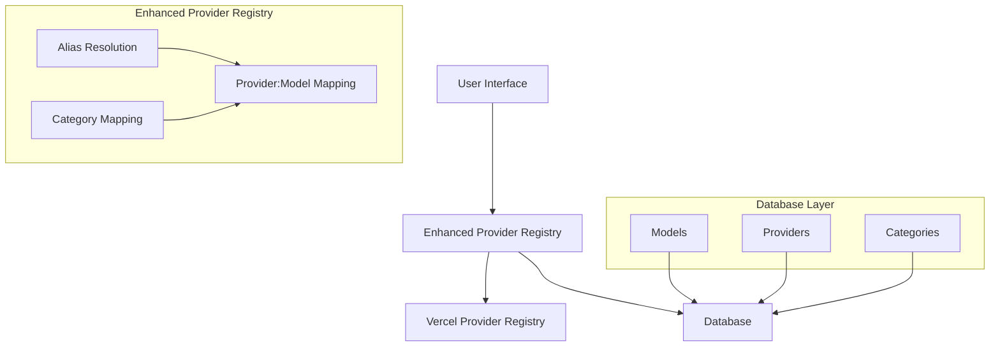

# Enhanced Provider Registry Implementation Plan

## Implementation Checklist

- [x] **Modify provider-registry.ts**
  - [x] Rename the original registry import to `createBaseProviderRegistry`
  - [x] Create an enhanced registry that extends the base registry
  - [x] Implement alias resolution for single-word aliases
  - [x] Add support for additional model types (e.g., videoModel)
  - [x] Implement robust caching mechanism with TTL

- [x] **Implement Category-to-Model Mapping**
  - [x] Create `categoryModelMap` to store mappings
  - [x] Implement `loadCategoryMappingsFromDB` function
  - [x] Add cache management functions (clearAllCaches, updateCategoryMapping)
  - [x] Ensure mappings for simplified names (quick, complete, creative)

- [x] **Simplify Model Lookup Logic**
  - [x] Refactor `getModelById` in use-model-data.ts
  - [x] Remove complex fallback logic
  - [x] Implement simpler provider:modelId resolution
  - [x] Add proper error handling

- [x] **Update Components**
  - [x] Refactor `quick-model-selector.tsx` to use dynamic lookups
  - [x] Remove hardcoded mappings
  - [x] Ensure consistent use of provider:modelId format

- [x] **Remove Unused Functions**
  - [x] Remove `findDefaultQuickModel` from app/(chat)/page.tsx
  - [x] Replace with proper database lookups
  - [x] Clean up any other unused functions

- [x] **Testing**
  - [x] Test all model selection flows
  - [x] Verify cache behavior
  - [x] Ensure proper fallback handling

## Overview

This document outlines a comprehensive plan to standardize the model management system by extending the Vercel AI SDK provider registry. The primary goal is to eliminate the use of UUIDs in the frontend and standardize on the `provider:modelId` format throughout the application, while enhancing the registry with additional capabilities that maintain compatibility with Vercel's design patterns.

## Current Issues

1. **UUID vs provider:modelId Format**: The system is using UUIDs for model and provider IDs in the database, but the frontend should be using the provider:modelId format exclusively. (AI mistakenly introduced the UUID after working on the table seeding files, human needed to be clearer.)

2. **Complex Model Lookup Logic**: The `getModelById` function in `use-model-data.ts` has overly complex fallback logic with nested if/else blocks and multiple for loops trying different ways to find models. (this is 3 days and $70 of AI trying to fix its mistakes of overengineering two systems, so we start over.)

3. **Hardcoded Mappings**: The `quick-model-selector.tsx` component has hardcoded mappings that should be dynamic and loaded from the database. (this is AI lying to me and telling me it fixed the cookie and did not, further examples why AI should never be in charge of missile launch systems. :D)

4. **Unused Functions**: The `findDefaultQuickModel` function in `app/(chat)/page.tsx` is not being used effectively and returns a UUID instead of a provider:modelId format.  WE DO NOT USE UUID EVER (we just load them in the DB to seed)

5. **Limited Registry Capabilities**: The Vercel registry needs to be extended to handle single-word aliases like 'quick'.  YES! and we need to do this in a way that VERCEL can say, hey WE LIKE THAT make a pull request so we can add that! (dream I know but... think that way when you extend and build on top using same convention but extend for better use, we need video and vectorization and embedding models way beyond current registry and we need advanced functions like videoModel since vercel support Luma Dream Machine but has not provider registry function for video yet. :D you dig?)

## Solution Architecture

The proposed solution involves enhancing the Vercel provider registry with additional capabilities while maintaining its design patterns and interface, standardizing on the provider:modelId format throughout the application, and simplifying the model lookup logic.



yes above is perfect (human typing) make sure to add proper debounce to the fallback cycle, if we fall through the tree from our cache, to verel cache, to db... then we give nice message and log

## Implementation Plan

### 1. Enhance the Provider Registry

#### 1.1 Modify `provider-registry.ts`

- Rename the original registry import to avoid confusion:
```typescript
// Import the Vercel registry but rename it for clarity
import { createProviderRegistry as createBaseProviderRegistry } from 'ai';
```

- Create an enhanced registry that extends the base registry:
```typescript
// Create an enhanced registry that extends the base registry
export const registry = (() => {
  // Create the base Vercel registry
  const baseRegistry = createBaseProviderRegistry(providers);
  
  // Create our enhanced registry with the same interface
  const enhancedRegistry = {
    // Override the languageModel method to add alias resolution
    languageModel: (modelKey: string) => {
      // Check if it's a single-word alias
      if (!modelKey.includes(':')) {
        // Resolve the alias to a provider:modelId format
        const resolvedKey = resolveAlias(modelKey);
        return baseRegistry.languageModel(resolvedKey);
      }
      
      // Otherwise, pass through to the base registry
      return baseRegistry.languageModel(modelKey);
    },
    
    // Similarly extend other methods
    imageModel: (modelKey: string) => {
      // Handle alias resolution
      if (!modelKey.includes(':')) {
        const resolvedKey = resolveAlias(modelKey);
        return baseRegistry.imageModel(resolvedKey);
      }
      return baseRegistry.imageModel(modelKey);
    },
    
    textEmbeddingModel: (modelKey: string) => {
      // Handle alias resolution
      if (!modelKey.includes(':')) {
        const resolvedKey = resolveAlias(modelKey);
        return baseRegistry.textEmbeddingModel(resolvedKey);
      }
      return baseRegistry.textEmbeddingModel(modelKey);
    },
    
    // Add new capabilities that could be adopted by Vercel
    videoModel: (modelKey: string) => {
      // Implement video model support
      if (!modelKey.includes(':')) {
        const resolvedKey = resolveAlias(modelKey);
        modelKey = resolvedKey;
      }
      
      // Extract provider and model ID
      const [providerName, modelId] = modelKey.split(':');
      
      // Handle based on provider
      switch (providerName) {
        case 'luma':
          // Implement Luma Dream Machine support
          return createLumaVideoModel(modelId);
        case 'togetherai':
          // Implement TogetherAI video model support
          return createTogetherAIVideoModel(modelId);
        default:
          throw new Error(`Unsupported video model provider: ${providerName}`);
      }
    }
  };
  
  // Return our enhanced registry
  return enhancedRegistry;
})();
```

- Implement a robust caching mechanism:
```typescript
// Type-specific caches with TTL
const aliasCache = new Map<string, CacheEntry<string>>();
const modelCache = new Map<string, CacheEntry<any>>();

// Helper function to resolve aliases
function resolveAlias(alias: string): string {
  const now = Date.now();
  
  // Check our cache first
  const cachedEntry = aliasCache.get(alias);
  if (cachedEntry && now - cachedEntry.timestamp < CACHE_TTL.registry) {
    return cachedEntry.data;
  }
  
  // Otherwise, look up the alias in our mapping
  const resolvedKey = categoryModelMap.get(alias);
  
  if (!resolvedKey) {
    console.error(`[${new Date().toISOString()}] No mapping found for alias: ${alias}`);
    throw new Error(`No mapping found for alias: ${alias}`);
  }
  
  // Cache the result
  aliasCache.set(alias, {
    data: resolvedKey,
    timestamp: now
  });
  
  return resolvedKey;
}
```

#### 1.2 Enhance the Category-to-Model Mapping

- Update the `categoryModelMap` to be loaded entirely from the database:
```typescript
// Initialize the category model map
const categoryModelMap = new Map<string, string>();

// Load category mappings from database
export async function loadCategoryMappingsFromDB() {
  try {
    // Clear existing mappings
    categoryModelMap.clear();
    
    // Get all categories from the database
    const categories = await getAllCategories();
    const providers = await getAllProviders();
    const models = await getAllModels();
    
    // Process each category
    for (const category of categories) {
      // Find default model for this category
      const defaultModel = models.find(model => 
        model.categoryIds.includes(category.id) && model.isPrimary
      );
      
      if (defaultModel && defaultModel.providerId) {
        // Find the provider for this model
        const provider = providers.find(p => p.id === defaultModel.providerId);
        
        if (provider) {
          const mapping = `${provider.name}:${defaultModel.modelId}`;
          
          // Map both the category ID and name
          categoryModelMap.set(category.id, mapping);
          categoryModelMap.set(category.name, mapping);
          
          // Also map simplified names (without prefixes)
          if (category.name.includes('-quick')) categoryModelMap.set('quick', mapping);
          if (category.name.includes('-complete')) categoryModelMap.set('complete', mapping);
          if (category.name.includes('-creative')) categoryModelMap.set('creative', mapping);
        }
      }
    }
    
    console.log(`[${new Date().toISOString()}] Loaded ${categoryModelMap.size} category mappings from database`);
  } catch (error) {
    console.error(`[${new Date().toISOString()}] Error loading category mappings:`, error);
  }
}
```

- Add methods to update and refresh the cache:
```typescript
// Clear all caches
export function clearAllCaches() {
  aliasCache.clear();
  languageModelCache.clear();
  embeddingModelCache.clear();
  imageModelCache.clear();
  providerCache.clear();
}

// Update a specific category mapping
export async function updateCategoryMapping(categoryKey: string, providerModelString: string) {
  categoryModelMap.set(categoryKey, providerModelString);
  
  // Clear related cache entries
  aliasCache.delete(categoryKey);
  
  // If this is a common alias, update those too
  if (categoryKey.includes('-quick')) {
    categoryModelMap.set('quick', providerModelString);
    aliasCache.delete('quick');
  }
  if (categoryKey.includes('-complete')) {
    categoryModelMap.set('complete', providerModelString);
    aliasCache.delete('complete');
  }
  if (categoryKey.includes('-creative')) {
    categoryModelMap.set('creative', providerModelString);
    aliasCache.delete('creative');
  }
  
  // Reload all mappings from database to ensure consistency
  await loadCategoryMappingsFromDB();
}
```

### 2. Simplify Model Lookup Logic

#### 2.1 Refactor `getModelById` in `use-model-data.ts`

- Remove the complex fallback logic and implement a simpler approach:
```typescript
const getModelById = useCallback((id: string) => {
  console.log(`[MODEL_DEBUG] getModelById called with ID: ${id}`);
  
  if (!id || !modelMap.size || !models?.length) {
    return null;
  }
  
  // Ensure we're working with provider:modelId format
  let modelKey = id;
  
  // If it's not in provider:model format, try to resolve it as an alias
  if (!modelKey.includes(':')) {
    console.log(`[MODEL_DEBUG] ID is not in provider:model format, treating as alias: ${modelKey}`);
    
    // Try to find a model with a matching category
    const matchingCategory = categories?.find(c => 
      c.name === modelKey || c.name.includes(`-${modelKey}`)
    );
    
    if (matchingCategory) {
      console.log(`[MODEL_DEBUG] Found matching category: ${matchingCategory.name}`);
      
      // Find a model in this category
      const modelInCategory = models.find(m => 
        m.categoryIds?.includes(matchingCategory.id) && m.isPrimary
      ) || models.find(m => 
        m.categoryIds?.includes(matchingCategory.id)
      );
      
      if (modelInCategory && modelInCategory.provider?.name) {
        modelKey = `${modelInCategory.provider.name}:${modelInCategory.modelId}`;
        console.log(`[MODEL_DEBUG] Resolved alias to: ${modelKey}`);
      }
    }
  }
  
  // Look for an exact match in the model map
  const model = modelMap.get(modelKey);
  
  if (model) {
    return model;
  }
  
  // If no exact match, try to find a model with matching provider and modelId
  if (modelKey.includes(':')) {
    const [providerName, modelId] = modelKey.split(':');
    
    for (const model of models) {
      if (model.provider?.name === providerName && model.modelId === modelId) {
        return model;
      }
    }
  }
  
  // If still no match, log and return null
  console.log(`[MODEL_DEBUG] Could not find model: ${id}`);
  return null;
}, [modelMap, models, categories]);
```

### 3. Update Quick Model Selector

#### 3.1 Refactor `quick-model-selector.tsx`

- Remove hardcoded mappings and use dynamic lookups:
```typescript
const handleCategorySelect = useCallback((categoryName: string) => {
  console.log(`[MODEL_DEBUG] handleCategorySelect called with category: ${categoryName}`);
  // Generate a unique ID for this selection
  const selectionId = Math.random().toString(36).substring(2, 8);
  setSelectId(selectionId);
  
  console.log(`[${new Date().toISOString()}][COOKIE_DEBUG][${selectionId}] handleCategorySelect called with: ${categoryName}`);
  
  // Find the category in our data
  const category = categories?.find(c => 
    c.name.includes(`-${categoryName}`) || c.name === categoryName
  );
  
  if (!category) {
    console.error(`[${new Date().toISOString()}][COOKIE_DEBUG][${selectionId}] Category not found: ${categoryName}`);
    return;
  }
  
  // Find a model in this category
  const modelInCategory = models?.find(m => 
    m.categoryIds?.includes(category.id) && m.isPrimary
  ) || models?.find(m => 
    m.categoryIds?.includes(category.id)
  );
  
  if (!modelInCategory || !modelInCategory.provider?.name) {
    console.error(`[${new Date().toISOString()}][COOKIE_DEBUG][${selectionId}] No model found for category: ${categoryName}`);
    return;
  }
  
  // Create the provider:model format
  const modelIdToUse = `${modelInCategory.provider.name}:${modelInCategory.modelId}`;
  
  console.log(`[${new Date().toISOString()}][COOKIE_DEBUG][${selectionId}] Using model ID: ${modelIdToUse}`);
  
  // Update UI and preferences
  startTransition(() => {
    // Immediately reflect the new model in the UI
    setOptimisticModelId(modelIdToUse);
    
    // Update the user's preference
    setPreferredModel(categoryName, modelIdToUse);
  });
  
  // Set the cookie directly in the browser for immediate effect if no callback
  if (!onModelChange) {
    console.log(`[${new Date().toISOString()}][COOKIE_DEBUG][${selectionId}] Setting client cookie directly`);
    setClientCookie('chat-model', modelIdToUse);
  }
  
  // If an external callback is provided, use it
  if (onModelChange) {
    console.log(`[${new Date().toISOString()}][COOKIE_DEBUG][${selectionId}] Calling onModelChange with: ${modelIdToUse}`);
    onModelChange(modelIdToUse);
    console.log(`[${new Date().toISOString()}][COOKIE_DEBUG][${selectionId}] onModelChange completed`);
  }
}, [categories, models, setOptimisticModelId, setPreferredModel, onModelChange]);
```

### 4. Remove Unused Functions

#### 4.1 Remove `findDefaultQuickModel` from `app/(chat)/page.tsx`

- Delete the entire function and replace any references to it with direct database lookups:
```typescript
// Instead of using findDefaultQuickModel, use a proper database lookup
let selectedModel = 'openai:gpt-4o-mini'; // Default fallback only if DB lookup fails

if (modelCookieValue) {
  // The cookie stores the model in provider:model format
  selectedModel = modelCookieValue.value;
  console.log(`[${new Date().toISOString()}][COOKIE_DEBUG][${pageId}] Using model from cookie: ${selectedModel}`);
  
  // Check if the cookie value is valid
  if (!selectedModel || selectedModel.trim() === '' || !selectedModel.includes(':')) {
    console.log(`[${new Date().toISOString()}][COOKIE_DEBUG][${pageId}] Cookie value is invalid, using database lookup`);
    
    // Try to get the default model from the database
    try {
      const categories = await getAllCategories();
      const models = await getAllModels();
      const providers = await getAllProviders();
      
      // Find the quick category
      const quickCategory = categories.find(c => c.name.includes('-quick'));
      
      if (quickCategory) {
        // Find a model in this category
        const quickModel = models.find(m => 
          m.categoryIds.includes(quickCategory.id) && m.isPrimary
        ) || models.find(m => 
          m.categoryIds.includes(quickCategory.id)
        );
        
        if (quickModel && quickModel.providerId) {
          // Find the provider
          const provider = providers.find(p => p.id === quickModel.providerId);
          
          if (provider) {
            selectedModel = `${provider.name}:${quickModel.modelId}`;
            console.log(`[${new Date().toISOString()}][COOKIE_DEBUG][${pageId}] Using model from database: ${selectedModel}`);
          }
        }
      }
    } catch (error) {
      console.error(`[${new Date().toISOString()}][COOKIE_DEBUG][${pageId}] Error getting default model:`, error);
      // Fall back to default only if database lookup fails
      selectedModel = 'openai:gpt-4o-mini';
    }
  }
} else {
  // If no cookie, use the database lookup
  console.log(`[${new Date().toISOString()}][COOKIE_DEBUG][${pageId}] No model cookie found, using database lookup`);
  
  // Try to get the default model from the database
  try {
    const categories = await getAllCategories();
    const models = await getAllModels();
    const providers = await getAllProviders();
    
    // Find the quick category
    const quickCategory = categories.find(c => c.name.includes('-quick'));
    
    if (quickCategory) {
      // Find a model in this category
      const quickModel = models.find(m => 
        m.categoryIds.includes(quickCategory.id) && m.isPrimary
      ) || models.find(m => 
        m.categoryIds.includes(quickCategory.id)
      );
      
      if (quickModel && quickModel.providerId) {
        // Find the provider
        const provider = providers.find(p => p.id === quickModel.providerId);
        
        if (provider) {
          selectedModel = `${provider.name}:${quickModel.modelId}`;
          console.log(`[${new Date().toISOString()}][COOKIE_DEBUG][${pageId}] Using model from database: ${selectedModel}`);
        }
      }
    }
  } catch (error) {
    console.error(`[${new Date().toISOString()}][COOKIE_DEBUG][${pageId}] Error getting default model:`, error);
    // Fall back to default only if database lookup fails
    selectedModel = 'openai:gpt-4o-mini';
  }
}
```

## Implementation Sequence

1. **Phase 1: Enhance the Registry**
   - Modify provider-registry.ts to enhance the base registry
   - Implement the loadCategoryMappingsFromDB function
   - Add cache management functions

2. **Phase 2: Simplify Model Lookup**
   - Refactor getModelById in use-model-data.ts
   - Remove complex fallback logic
   - Ensure proper error handling

3. **Phase 3: Update Components**
   - Update quick-model-selector.tsx to use dynamic lookups
   - Remove hardcoded mappings
   - Ensure consistent use of provider:modelId format

4. **Phase 4: Remove Unused Functions**
   - Remove findDefaultQuickModel from app/(chat)/page.tsx
   - Replace with proper database lookups
   - Clean up any other unused functions

5. **Phase 5: Testing**
   - Test all model selection flows
   - Verify cache behavior
   - Ensure proper fallback handling

## Conclusion

This plan provides a comprehensive approach to standardizing the model management system by enhancing the Vercel provider registry. By eliminating UUIDs from the frontend, standardizing on the provider:modelId format, and extending the registry with additional capabilities, we'll create a more maintainable and robust system.

The key principles of this implementation are:
1. No hardcoded values - all model information comes from the database
2. Consistent use of provider:modelId format throughout the frontend
3. Simplified model lookup logic with proper error handling
4. Efficient caching for performance
5. Clear separation of concerns between database, cache, and UI layers
6. Enhancing the Vercel registry in a way that maintains compatibility with their design patterns

This implementation follows Vercel's design patterns and could potentially be contributed back to the Vercel AI SDK as an enhancement, particularly the alias resolution and additional model type support.