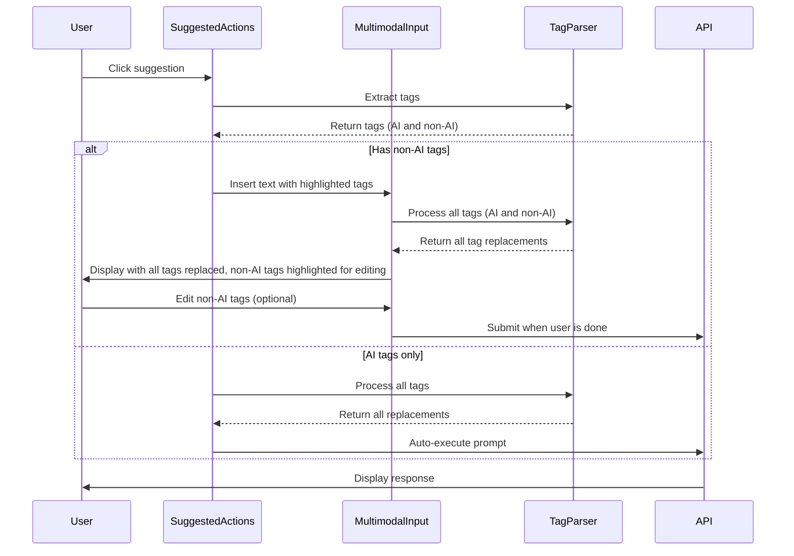
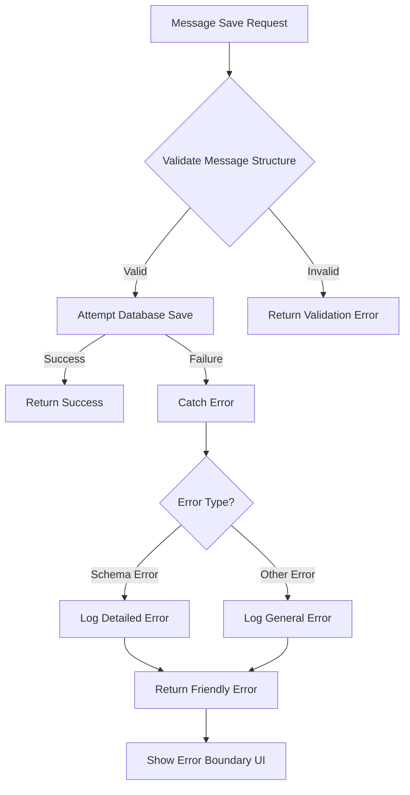

# Enhanced Prompt Suggestions Implementation Update Plan

## Current Understanding

### Issue 1: Intelligent Editor Component Tag Recognition
- The multimodal-input.tsx component has a sophisticated tag tracking system that can identify and highlight tags.
- It distinguishes between AI-generated tags (with `ai:` prefix) and user input tags.
- Currently, when a suggestion with tags is clicked:
  - If there are user input tags, it passes the action with tags to the multimodal input
  - If all tags are auto-fill, it processes them directly and executes the prompt
- The issue is that the suggestion should NOT auto-execute when there are unanswered tags (non-AI tags)
- The system should replace AI tags ({{ai:city}}) automatically but should pause for user input when there are non-AI tags ({{city}})

### Issue 2: Message Saving Problem
- The saveMessages function in queries.ts has extensive debugging and validation for message structure
- There's an issue with the schema and tables structure causing problems when saving messages
- The app crashes on message save, resulting in a blank screen
- Error handling needs improvement to provide a soft fail and message for this error

## Implementation Plan

### 1. Fix Intelligent Editor Component Tag Recognition



#### Implementation Steps:

1. **Update SuggestedActions Component**:
   - Modify `handleSuggestionClick` to check for non-AI tags
   - Always pass the action to multimodal input, but with a flag indicating if it should auto-execute

2. **Enhance MultimodalInput Component**:
   - Update the `append` function to handle the auto-execute flag
   - For suggestions with only AI tags, process them and auto-submit
   - For suggestions with non-AI tags, process all tags (both AI and non-AI) to get AI-generated placeholders for all tags
   - Highlight non-AI tags with a yellow marker background to indicate user input is required
   - Prevent auto-execution when non-AI tags are present

3. **Update Tag Processing Logic**:
   - Process all tags (AI and non-AI) to get AI-generated placeholders
   - Apply visual styling to non-AI tags to indicate they need user attention
   - Implement a system where the cursor automatically moves to the first non-AI tag when a suggestion is selected
   - Ensure the double braces {{}} are never visible in the final rendered text - they should be replaced with either AI-generated content or user input

4. **Visual Styling for Tag Fields**:
   - Use a yellow marker background for non-AI tags that need user input
   - Implement a smooth transition effect when the user clicks on a tag field to edit it
   - Ensure the styling makes it obvious which parts of the text need user attention
   - Add a subtle animation or pulsing effect to draw attention to fields awaiting input
   - When a user hovers over a tag field, show a tooltip indicating they can edit it

### 2. Fix Message Saving Problem



#### Implementation Steps:

1. **Add Error Boundaries**:
   - Create a React Error Boundary component to catch rendering errors
   - Implement a friendly error UI for message save failures

2. **Enhance Error Handling in saveMessages**:
   - Add more specific error type checking
   - Improve error messages to be more descriptive
   - Add recovery mechanisms for common error cases

3. **Schema Validation**:
   - Add pre-save validation to ensure message structure matches schema
   - Implement data normalization to handle edge cases
   - Add schema version checking to handle potential mismatches

4. **Client-Side Error Handling**:
   - Add try/catch blocks around message submission
   - Implement optimistic UI updates with rollback on failure
   - Add retry mechanisms for transient errors

## Detailed Technical Implementation

### 1. Fix Intelligent Editor Component Tag Recognition

#### Update SuggestedActions Component:

```typescript
// In suggested-actions.tsx
const handleSuggestionClick = useCallback(async (action: string) => {
  try {
    window.history.replaceState({}, '', `/chat/${chatId}`);
    
    // Extract tags from the action
    const tags = extractDynamicTags(action);
    
    // Check if there are any non-auto tags that need user input
    const hasUserInputTags = tags.some(tag => !tag.isAutoFill);
    
    // Always pass to multimodal input, but with a flag for auto-execution
    append({
      role: 'user',
      content: action,
      tags: tags,
      autoExecute: !hasUserInputTags // Only auto-execute if all tags are AI tags
    } as any);
  } catch (error) {
    console.error('Error processing suggestion:', error);
    // Fallback to using the original action if parsing fails
    append({
      role: 'user',
      content: action,
    });
  }
}, [append, chatId]);
```

#### Enhance MultimodalInput Component:

```typescript
// In multimodal-input.tsx
const append = useCallback((message: any, options?: any) => {
  // Check if the message has tag information
  if (message && message.tags && Array.isArray(message.tags)) {
    console.log('Message contains tags:', message.tags);
    
    // Process the tag fields - this will get AI replacements for ALL tags
    processTagFields(message.content, message.tags);
    
    // If autoExecute flag is true and all tags are AI tags, submit automatically
    if (message.autoExecute) {
      // Process all AI tags and submit
      setTimeout(() => {
        submitForm();
      }, 500); // Small delay to allow UI to update
      return Promise.resolve(null);
    }
    
    // Otherwise, don't auto-execute - wait for user input
    return Promise.resolve(null);
  }
  
  // Otherwise, use the original append function
  return originalAppend(message, options);
}, [originalAppend, processTagFields, submitForm]);
```

#### Update Tag Processing Logic:

```typescript
// In multimodal-input.tsx
// Add CSS for tag field styling
const tagFieldStyles = `
  @keyframes tagFieldPulse {
    0% { background-color: rgba(255, 255, 0, 0.2); }
    50% { background-color: rgba(255, 255, 0, 0.4); }
    100% { background-color: rgba(255, 255, 0, 0.2); }
  }

  .tag-field-active {
    animation: tagFieldPulse 2s infinite;
    background-color: rgba(255, 255, 0, 0.3);
    border-radius: 4px;
    padding: 0 2px;
    cursor: text;
    position: relative;
  }
  
  .tag-field-active:hover::after {
    content: 'Click to edit';
    position: absolute;
    top: -20px;
    left: 50%;
    transform: translateX(-50%);
    background-color: rgba(0, 0, 0, 0.7);
    color: white;
    padding: 2px 6px;
    border-radius: 4px;
    font-size: 12px;
    white-space: nowrap;
  }
`;

const processTagFields = useCallback(async (text: string, tags: TagInfo[]) => {
  // Clear any existing tag fields
  setTagFields([]);
  setIsTagFieldMode(true);
  setActiveTagFieldIndex(null);
  
  // First, get AI-generated replacements for ALL tags (both AI and non-AI)
  try {
    // Call the API to get replacements for all tags
    const response = await fetch('/api/prompts/parse-tags', {
      method: 'POST',
      headers: {
        'Content-Type': 'application/json',
      },
      body: JSON.stringify({ text }),
    });
    
    if (!response.ok) {
      throw new Error('Failed to parse tags');
    }
    
    const data = await response.json();
    const replacements = data.replacements || {};
    
    // Now process the text with the replacements
    let modifiedText = text;
    let currentPosition = 0;
    const newTagFields: TagField[] = [];
    let offset = 0;
    
    // Process each tag
    for (const tag of tags) {
      // Find the position of this tag in the original text
      const tagPosition = text.indexOf(tag.originalText, currentPosition);
      
      if (tagPosition !== -1) {
        // Get the replacement for this tag
        const replacement = replacements[tag.name] || `[${tag.name}]`;
        
        // For non-AI tags, we'll highlight them for user input
        if (!tag.isAutoFill) {
          // Calculate start and end positions in the modified text
          const start = tagPosition + offset;
          const end = start + replacement.length;
          
          // Add to tag fields for tracking
          newTagFields.push({
            start,
            end,
            value: replacement,
            isAuto: false,
            originalTag: tag,
            currentContent: replacement,
            isModified: false
          });
        }
        
        // Replace the tag in the text
        modifiedText = 
          modifiedText.substring(0, tagPosition + offset) +
          replacement +
          modifiedText.substring(tagPosition + offset + tag.originalText.length);
        
        // Update offset for subsequent replacements
        offset += replacement.length - tag.originalText.length;
        
        // Update current position for next search
        currentPosition = tagPosition + tag.originalText.length;
      }
    }
    
    // Set the input with the modified text
    setInput(modifiedText);
    
    // Set the tag fields
    setTagFields(newTagFields);
    
    // If there are non-AI tag fields, focus the textarea and set the first one as active
    if (newTagFields.length > 0) {
      setActiveTagFieldIndex(0);
      setTimeout(() => {
        textareaRef.current?.focus();
        
        // Position cursor at the start of the first tag field
        if (textareaRef.current) {
          textareaRef.current.selectionStart = newTagFields[0].start;
          textareaRef.current.selectionEnd = newTagFields[0].end;
        }
      }, 0);
    }
    
    // Adjust height for the new content
    setTimeout(adjustHeight, 0);
  } catch (error) {
    console.error('Error processing tag fields:', error);
    // Fallback to just setting the original text
    setInput(text);
  }
}, [setInput]);

// Render function with tag field highlighting
const renderInputWithHighlightedTags = (input: string, tagFields: TagField[], activeTagFieldIndex: number | null) => {
  if (!tagFields.length) {
    return input;
  }
  
  // Sort tag fields by start position (descending) to avoid position shifts
  const sortedFields = [...tagFields].sort((a, b) => b.start - a.start);
  
  let result = input;
  
  // Insert highlighting for each tag field
  for (const [index, field] of sortedFields.entries()) {
    const isActive = index === activeTagFieldIndex;
    const className = isActive ? 'tag-field-active tag-field-pulse' : 'tag-field-active';
    
    const before = result.substring(0, field.start);
    const tagContent = result.substring(field.start, field.end);
    const after = result.substring(field.end);
    
    result = `${before}<span class="${className}">${tagContent}</span>${after}`;
  }
  
  return result;
};
```

### 2. Fix Message Saving Problem

#### Add Error Boundary Component:

```tsx
// In components/error-boundary.tsx
import React, { Component, ErrorInfo, ReactNode } from 'react';

interface Props {
  children: ReactNode;
  fallback?: ReactNode;
}

interface State {
  hasError: boolean;
  error: Error | null;
}

export class ErrorBoundary extends Component<Props, State> {
  constructor(props: Props) {
    super(props);
    this.state = { hasError: false, error: null };
  }

  static getDerivedStateFromError(error: Error): State {
    return { hasError: true, error };
  }

  componentDidCatch(error: Error, errorInfo: ErrorInfo): void {
    console.error('Error caught by boundary:', error, errorInfo);
  }

  render(): ReactNode {
    if (this.state.hasError) {
      if (this.props.fallback) {
        return this.props.fallback;
      }
      
      return (
        <div className="p-4 border border-red-300 bg-red-50 rounded-md">
          <h2 className="text-lg font-semibold text-red-800">Something went wrong</h2>
          <p className="text-red-600">
            {this.state.error?.message || 'An unknown error occurred'}
          </p>
          <button 
            className="mt-2 px-3 py-1 bg-red-100 text-red-800 rounded hover:bg-red-200"
            onClick={() => this.setState({ hasError: false, error: null })}
          >
            Try again
          </button>
        </div>
      );
    }

    return this.props.children;
  }
}
```

#### Enhance Error Handling in saveMessages:

```typescript
// In lib/db/queries.ts
export async function saveMessages({
  messages,
}: {
  messages: Array<DBMessage>;
}) {
  try {
    // Existing validation code...
    
    // Add more specific validation for parts and attachments
    const structureErrors = messages.flatMap(msg => {
      const errors = [];
      
      // Check parts structure
      if (Array.isArray(msg.parts)) {
        // Validate each part has the expected structure
        for (let i = 0; i < msg.parts.length; i++) {
          const part = msg.parts[i];
          if (typeof part !== 'object' || part === null) {
            errors.push(`Message ${msg.id || 'unknown'}: parts[${i}] is not an object`);
          } else if (!('type' in part) || !('text' in part)) {
            errors.push(`Message ${msg.id || 'unknown'}: parts[${i}] missing required fields`);
          }
        }
      }
      
      return errors;
    });
    
    if (structureErrors.length > 0) {
      console.error('Message structure validation failed:', structureErrors);
      throw new Error(`Message structure validation failed: ${structureErrors.join('; ')}`);
    }
    
    // Normalize message structure if needed
    const normalizedMessages = messages.map(msg => {
      // Ensure parts is an array
      const parts = Array.isArray(msg.parts) ? msg.parts : [];
      
      // Ensure attachments is an array
      const attachments = Array.isArray(msg.attachments) ? msg.attachments : [];
      
      return {
        ...msg,
        parts,
        attachments
      };
    });
    
    // Execute the actual insert with normalized data
    try {
      const result = await db.insert(message).values(normalizedMessages);
      console.log('[DB DEBUG] Insert operation returned:', result);
      return result;
    } catch (insertError) {
      // More specific error handling
      if (insertError.code === '23502') { // NOT NULL violation
        console.error('[DB DEBUG] NOT NULL constraint violation:', insertError);
        throw new Error('Message is missing required fields');
      } else if (insertError.code === '22P02') { // Invalid input syntax
        console.error('[DB DEBUG] Invalid input syntax:', insertError);
        throw new Error('Message contains invalid data format');
      } else {
        console.error('[DB DEBUG] Insert operation failed:', insertError);
        throw insertError;
      }
    }
  } catch (error) {
    console.error('Failed to save messages in database', error);
    // Wrap the error with a more user-friendly message
    throw new Error(`Failed to save message: ${error.message || 'Unknown database error'}`);
  }
}
```

#### Add Client-Side Error Handling:

```tsx
// In components/chat.tsx or wherever messages are submitted
const handleSubmit = async (e: React.FormEvent) => {
  e.preventDefault();
  
  // Show optimistic UI update
  setSubmitting(true);
  
  try {
    // Attempt to submit the message
    await submitMessage(message);
    
    // Clear input on success
    setMessage('');
  } catch (error) {
    // Handle error gracefully
    console.error('Failed to submit message:', error);
    
    // Show error toast
    toast.error('Failed to save your message. Please try again.');
    
    // You could implement a retry mechanism here
  } finally {
    setSubmitting(false);
  }
};
```

## Error Boundary Integration

To provide a soft fail for message saving errors, we need to wrap the chat component with our error boundary:

```tsx
// In app/(chat)/page.tsx or similar
import { ErrorBoundary } from '@/components/error-boundary';

export default function ChatPage() {
  return (
    <ErrorBoundary
      fallback={
        <div className="p-4 text-center">
          <h2 className="text-xl font-bold">Something went wrong</h2>
          <p className="text-gray-600 mt-2">
            We encountered an error while saving your message.
          </p>
          <p className="text-gray-600">
            Please try again or refresh the page.
          </p>
          <button
            className="mt-4 px-4 py-2 bg-blue-500 text-white rounded hover:bg-blue-600"
            onClick={() => window.location.reload()}
          >
            Refresh Page
          </button>
        </div>
      }
    >
      <Chat />
    </ErrorBoundary>
  );
}
```

## Summary of Changes

1. **For Intelligent Editor Component**:
   - Update SuggestedActions to always pass tags to MultimodalInput with an autoExecute flag
   - Enhance MultimodalInput to process ALL tags (both AI and non-AI) to get AI-generated placeholders
   - Apply yellow marker background styling to non-AI tags to indicate they need user attention
   - Prevent auto-execution when non-AI tags are present
   - Ensure the double braces {{}} are never visible in the final rendered text

2. **For Message Saving Problem**:
   - Add Error Boundary component to catch and display friendly error messages
   - Enhance error handling in saveMessages with more specific validation and error types
   - Add client-side error handling with optimistic UI updates and recovery mechanisms
   - Implement data normalization to handle edge cases in message structure