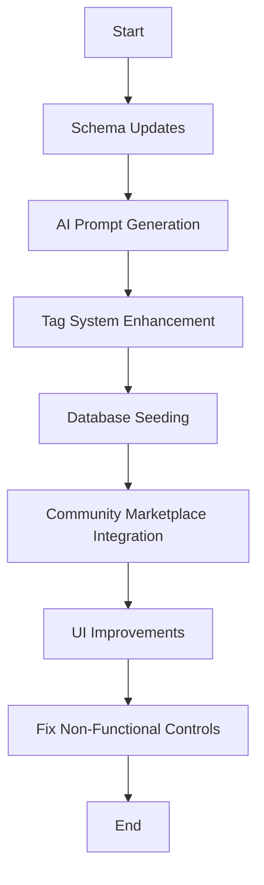

# Dynamic Prompt Suggestions Implementation Plan

## Overview
Implementation plan for enhancing the prompt system with AI-generated content, dynamic tags, and community sharing.

## Current Issues
- Hardcoded prompt suggestions instead of dynamic AI-generated content
- Tag system uses hardcoded default values when AI generation fails
- No seeding of community prompts with AI-generated content
- No button for the marketplace (component exists but not integrated)
- Edit, share, and like controls on personal suggestions don't function
- Save button on community prompts doesn't work
- Stars should be view-only until user saves or uses the prompt
- Section titled "suggestions" instead of "prompts" (like OpenAI)
- No gear icon to open prompt editor or marketplace
- Like button on personal prompts should be a pin function

## Implementation Plan



## Priority Order Implementation

### Phase 1: AI Content Generation and Seeding
1. **Schema Updates for Complex Prompts**
   - Add `complexPrompt` field to PromptSuggestion table
   - Update interfaces and types

2. **AI Prompt Generator**
   - Create generate-prompts.ts utility
   - Generate 100+ diverse prompt suggestions with Claude 3.7
   - Focus on categories: coding (40%), creative writing (30%), business (20%), others (10%)
   - Save generated prompts to JSON file

3. **Tag System Enhancement**
   - Update dynamic-tag-parser.ts to use Claude 3.7
   - Ensure all tags get AI-generated values
   - Improve fallback mechanisms

4. **Database Seeding**
   - Update seed-prompts.ts to use AI-generated suggestions
   - Keep and tune original suggestions for nostalgia
   - Use your user ID as the default seeder

5. **Community Marketplace Integration**
   - Update community suggestion generator
   - Ensure diversity across categories
   - Add proper source attribution and rating initialization

### Phase 2: UI and Control Improvements
6. **UI Improvements**
   - Rename "Suggested Actions" to "Prompts"
   - Add gear icons to section titles
   - Change like button to pin function
   - Update star rating to be view-only until saved/used

7. **Fix Non-Functional Controls**
   - Implement edit functionality
   - Implement share functionality
   - Implement pin functionality
   - Fix save button on community prompts

8. **Marketplace Integration**
   - Create marketplace modal component
   - Integrate with SuggestedActions
   - Test marketplace functionality

## Technical Implementation Details

### 1. Schema Updates for Complex Prompts

Create a migration to add the new `complexPrompt` field:

```typescript
// New migration file in lib/db/migrations/
import { pgTable, text, uuid } from 'drizzle-orm/pg-core';
import { sql } from 'drizzle-orm';

export async function up(db) {
  await db.execute(sql`
    ALTER TABLE "PromptSuggestion"
    ADD COLUMN IF NOT EXISTS "complexPrompt" text
  `);
}

export async function down(db) {
  await db.execute(sql`
    ALTER TABLE "PromptSuggestion"
    DROP COLUMN IF EXISTS "complexPrompt"
  `);
}
```

### 1.2. Update Chat Handler to Use ComplexPrompt Field

Update the systemPrompt function to include the complexPrompt field while ensuring it doesn't override system guardrails:

```typescript
export const systemPrompt = ({
  selectedChatModel,
  complexPrompt,
}: {
  selectedChatModel: string;
  complexPrompt?: string;
}) => {
  // Start with the regular prompt to establish base behavior and guardrails
  let prompt = regularPrompt;
  
  // If a complexPrompt is provided, add it after the regular prompt
  // This ensures that the base guardrails are always in effect
  if (complexPrompt) {
    // Add a safety prefix to ensure complexPrompt doesn't override guardrails
    const safetyPrefix = "\n\nThe following additional instructions enhance but do not override the above guardrails and safety measures:\n\n";
    prompt = `${prompt}${safetyPrefix}${complexPrompt}`;
  }
  
  // Always include the artifacts prompt at the end for all models
  prompt = `${prompt}\n\n${artifactsPrompt}`;
  
  return prompt;
};
```

Update the chat handler to extract and use the complexPrompt field:

```typescript
// Extract complexPrompt from the user message if it exists
let complexPrompt: string | undefined;

// Check if complexPrompt exists in the userMessage
if (userMessage && typeof userMessage === 'object') {
  // Try to access complexPrompt from different possible locations
  if ('complexPrompt' in userMessage) {
    complexPrompt = (userMessage as any).complexPrompt;
  } else if (userMessage.parts && Array.isArray(userMessage.parts)) {
    // Check if complexPrompt is in the parts metadata
    for (const part of userMessage.parts) {
      if (typeof part === 'object' && part && 'complexPrompt' in part) {
        complexPrompt = (part as any).complexPrompt;
        break;
      }
    }
  }
}

// Stream text from the AI model
const result = streamText({
  model: registry.languageModel((selectedChatModel as `${string}:${string}`)),
  system: systemPrompt({
    selectedChatModel,
    complexPrompt
  }),
  messages,
  // ...
});
```

### 2. AI Prompt Generator

Create a new file `lib/db/generate-prompts.ts`:

```typescript
import { generateText } from 'ai';
import { writeFileSync } from 'fs';
import { randomUUID } from 'crypto';
import { config } from 'dotenv';
import { enhancedLanguageModel } from '@/lib/ai/provider-registry';

config({
  path: '.env.local',
});

interface GeneratedPrompt {
  id: string;
  title: string;
  label: string;
  action: string;
  complexPrompt?: string;
  category: string;
  visibility: 'public' | 'private';
  isDefault: boolean;
  isActive: boolean;
  ratingCount: number;
  ratingSum: number;
  averageRating: string;
}

async function generatePromptSuggestions(count: number = 100): Promise<GeneratedPrompt[]> {
  console.log(`Generating ${count} prompt suggestions using Claude 3.7...`);
  
  // Focus more on these specific categories as requested
  const categories = [
    { name: 'code', weight: 0.4 },      // 40%
    { name: 'creative', weight: 0.3 },  // 30%
    { name: 'business', weight: 0.2 },  // 20%
    { name: 'general', weight: 0.1 }    // 10%
  ];
  
  const allPrompts: GeneratedPrompt[] = [];
  
  for (const category of categories) {
    const promptsForCategory = Math.round(count * category.weight);
    console.log(`Generating ${promptsForCategory} prompts for category: ${category.name}`);
    
    const { text } = await generateText({
      model: enhancedLanguageModel('anthropic:creative'),
      system: `You are an expert prompt engineer who creates engaging, useful prompts for AI assistants. 
      You understand how to use dynamic tags in the format {{tag}} for user input and {{ai:tag}} for AI-generated values.`,
      prompt: `Generate ${promptsForCategory} diverse, creative prompt suggestions for the category "${category.name}".
      
      Each prompt should:
      1. Have a clear, concise title (3-7 words)
      2. Include a descriptive label (2-5 words)
      3. Have an action text that uses dynamic tags
      4. Use a mix of user input tags {{tag}} and AI-generated tags {{ai:tag}}
      5. Include a complex prompt with detailed instructions (for some prompts)
      
      Format your response as a JSON array of objects with these properties:
      - title: The prompt title
      - label: A short description
      - action: The full prompt text with tags
      - complexPrompt: (optional) Detailed instructions for complex prompts
      
      Example:
      [
        {
          "title": "Generate an Image of...",
          "label": "fantasy creature",
          "action": "Generate an image of a {{ai:fantasy creature}} in {{setting}}",
          "complexPrompt": "Create a detailed image of a fantasy creature with unique features. Consider the setting provided by the user and adapt the creature to fit that environment. Include atmospheric elements and appropriate lighting for the scene."
        }
      ]
      
      Be creative and diverse in your suggestions. Make them genuinely useful and interesting.
      Draw inspiration from Anthropic's prompt examples for high-quality suggestions.`
    });
    
    try {
      // Extract JSON array from response
      const jsonMatch = text.match(/\[\s*\{.*\}\s*\]/s);
      if (!jsonMatch) {
        console.error('Failed to extract JSON from response');
        continue;
      }
      
      const promptsJson = JSON.parse(jsonMatch[0]);
      
      // Format and add to all prompts
      const formattedPrompts = promptsJson.map((p: any) => ({
        id: randomUUID(),
        title: p.title,
        label: p.label,
        action: p.action,
        complexPrompt: p.complexPrompt || null,
        category: category.name,
        visibility: 'public',
        isDefault: true,
        isActive: true,
        ratingCount: Math.floor(Math.random() * 10), // Random initial ratings
        ratingSum: Math.floor(Math.random() * 40), // Random sum to calculate average
        averageRating: (Math.random() * 2 + 3).toFixed(2) // Random average between 3.00 and 5.00
      }));
      
      allPrompts.push(...formattedPrompts);
    } catch (error) {
      console.error(`Error processing prompts for category ${category.name}:`, error);
    }
  }
  
  console.log(`Generated ${allPrompts.length} prompt suggestions`);
  
  // Save to file
  writeFileSync('./lib/db/generated-prompts.json', JSON.stringify(allPrompts, null, 2));
  
  return allPrompts;
}

// Execute if run directly
if (require.main === module) {
  generatePromptSuggestions().catch(console.error);
}

export { generatePromptSuggestions };
```

### 3. Tag System Enhancement

Update `lib/ai/dynamic-tag-parser.ts` to use Claude 3.7:

```typescript
// Update the generateTagReplacements function to use Claude 3.7
export async function generateTagReplacements(
  tags: TagInfo[],
  userId?: string
): Promise<Record<string, string>> {
  if (!tags.length) return {};

  // Extract tag names for caching and processing
  const tagNames = tags.map(tag => tag.name);
  const cacheKey = tagNames.sort().join('|');
  
  // Try to retrieve from cache first
  if (userId) {
    const cachedReplacements = await getCachedTagReplacements(userId, cacheKey);
    if (cachedReplacements) {
      console.log(`Using cached tag replacements for user ${userId}`);
      return cachedReplacements;
    }
  }

  // Use Claude 3.7 for generating replacements
  const prompt = `
Generate a context-appropriate replacement for each of the following tags.
Return ONLY the replacement text, nothing more.

${tags.map((tag, index) => `${index + 1}. {{${tag.name}}}`).join('\n')}
`;

  try {
    // Use Claude 3.7 (anthropic:creative)
    const { text: responseText } = await generateText({
      model: enhancedLanguageModel('anthropic:creative'),
      prompt,
      system: 'You are a helpful assistant that provides concise, useful, creative replacements for template tags.',
    });
    
    // Process the response into tag replacements
    const lines = responseText.split('\n').filter((line: string) => line.trim());
    const replacements: Record<string, string> = {};
    
    // Process tags with AI-generated values
    for (let i = 0; i < tags.length && i < lines.length; i++) {
      const line = lines[i].trim();
      let value = line;
      
      // Try to handle numbered responses
      const numberedMatch = line.match(/^\d+\.\s*(.+)$/);
      if (numberedMatch) {
        value = numberedMatch[1];
      }
      
      replacements[tags[i].name] = value;
    }
    
    // Cache the replacements for future use
    if (userId) {
      await cacheTagReplacements(userId, cacheKey, replacements);
    }
    
    return replacements;
  } catch (error) {
    console.error('Error generating tag replacements with Claude 3.7:', error);
    
    // Fallback to a simpler model if Claude 3.7 fails
    try {
      const { text: fallbackText } = await generateText({
        model: enhancedLanguageModel('anthropic:haiku'),
        prompt,
        system: 'You are a helpful assistant that provides concise, useful replacements for template tags.',
      });
      
      // Process fallback response
      const fallbackLines = fallbackText.split('\n').filter((line: string) => line.trim());
      const fallbackReplacements: Record<string, string> = {};
      
      for (let i = 0; i < tags.length && i < fallbackLines.length; i++) {
        const line = fallbackLines[i].trim();
        let value = line;
        
        const numberedMatch = line.match(/^\d+\.\s*(.+)$/);
        if (numberedMatch) {
          value = numberedMatch[1];
        }
        
        fallbackReplacements[tags[i].name] = value;
      }
      
      return fallbackReplacements;
    } catch (fallbackError) {
      console.error('Fallback generation also failed:', fallbackError);
      
      // Ultimate fallback to simple defaults if all AI generation fails
      return tags.reduce((acc, tag) => {
        acc[tag.name] = getDefaultReplacement(tag.name);
        return acc;
      }, {} as Record<string, string>);
    }
  }
}
```

### 4. Update Seed-Prompts Script

Modify `lib/db/seed-prompts.ts` to use the AI-generated prompts:

```typescript
// Load AI-generated prompt suggestions
let GENERATED_PROMPT_SUGGESTIONS = [];
try {
  const promptsPath = path.join(process.cwd(), 'lib/db/generated-prompts.json');
  if (fs.existsSync(promptsPath)) {
    GENERATED_PROMPT_SUGGESTIONS = JSON.parse(fs.readFileSync(promptsPath, 'utf8'));
    console.log(`Loaded ${GENERATED_PROMPT_SUGGESTIONS.length} generated prompt suggestions`);
  } else {
    console.warn('Generated prompts file not found, using fallback suggestions');
    // Fallback to the original 4 suggestions (tuned versions)
    GENERATED_PROMPT_SUGGESTIONS = [
      // Original suggestions here (tuned)
    ];
  }
} catch (error) {
  console.error('Error loading generated prompts:', error);
  process.exit(1);
}

// Update the insertion code to include the complexPrompt field
await db.insert(promptSuggestion)
  .values({
    id: suggestion.id,
    userId: systemUserId,
    title: suggestion.title,
    label: suggestion.label,
    action: suggestion.action,
    complexPrompt: suggestion.complexPrompt || null,
    category: suggestion.category,
    visibility: suggestion.visibility,
    isDefault: suggestion.isDefault,
    isActive: suggestion.isActive,
    ratingCount: suggestion.ratingCount || 0,
    ratingSum: suggestion.ratingSum || 0,
    averageRating: suggestion.averageRating || '0.00'
  })
```

### 5. Update Community Suggestion Generator

Update `lib/vercel-kv/client.ts`:

```typescript
export async function generateCommunitySuggestions(): Promise<CachedSuggestion[]> {
  try {
    // Try to load AI-generated suggestions from file
    const fs = require('fs');
    const path = require('path');
    const promptsPath = path.join(process.cwd(), 'lib/db/generated-prompts.json');
    
    if (fs.existsSync(promptsPath)) {
      const allPrompts = JSON.parse(fs.readFileSync(promptsPath, 'utf8'));
      
      // Select a diverse subset of prompts
      const count = Math.max(10, Math.floor(allPrompts.length * 0.25));
      const selectedPrompts = [];
      
      // Ensure diversity by selecting from different categories
      const categories = [...new Set(allPrompts.map((p: any) => p.category))];
      
      for (const category of categories) {
        const categoryPrompts = allPrompts.filter((p: any) => p.category === category);
        const take = Math.max(1, Math.floor(count / categories.length));
        
        // Take random prompts from this category
        const randomPrompts = categoryPrompts
          .sort(() => 0.5 - Math.random())
          .slice(0, take);
          
        selectedPrompts.push(...randomPrompts);
      }
      
      // Format as community suggestions
      const communitySuggestions: CachedSuggestion[] = selectedPrompts.map((p: any) => ({
        id: p.id,
        title: p.title,
        label: p.label,
        action: p.action,
        complexPrompt: p.complexPrompt,
        category: p.category,
        source: 'community',
        ratingCount: p.ratingCount || Math.floor(Math.random() * 10),
        ratingSum: p.ratingSum || Math.floor(Math.random() * 40),
        averageRating: p.averageRating || (Math.random() * 2 + 3).toFixed(2)
      }));
      
      // Cache these suggestions
      await cacheCommunitySuggestions(communitySuggestions);
      
      return communitySuggestions;
    }
  } catch (error) {
    console.error('Error loading generated prompts for community suggestions:', error);
  }
  
  // Fallback to original hardcoded community suggestions
  const communitySuggestions: CachedSuggestion[] = [
    // Original community suggestions here
  ];
  
  // Cache these suggestions
  await cacheCommunitySuggestions(communitySuggestions);
  
  return communitySuggestions;
}
```

## Task Checklist

### Phase 1: AI Content Generation and Seeding
- [x] 1.1. Create migration to add complexPrompt field to PromptSuggestion table
- [x] 1.2. Update chat handler to use complexPrompt field as system/assistant instructions
- [x] 1.3. Create generate-prompts.ts utility
- [x] 1.4. Generate diverse prompt suggestions with Claude 3.7
- [ ] 1.5. Update dynamic-tag-parser.ts to use Claude 3.7
- [ ] 1.6. Update seed-prompts.ts to use AI-generated suggestions
- [ ] 1.7. Update community suggestion generator

### Phase 2: UI and Control Improvements
- [ ] 2.1. Rename "Suggested Actions" to "Prompts"
- [ ] 2.2. Add gear icons to section titles
- [ ] 2.3. Change like button to pin function
- [ ] 2.4. Update star rating to be view-only until saved/used
- [ ] 2.5. Implement edit, share, and pin functionality
- [ ] 2.6. Fix save button on community prompts
- [ ] 2.7. Create marketplace modal component
- [ ] 2.8. Integrate marketplace with SuggestedActions
