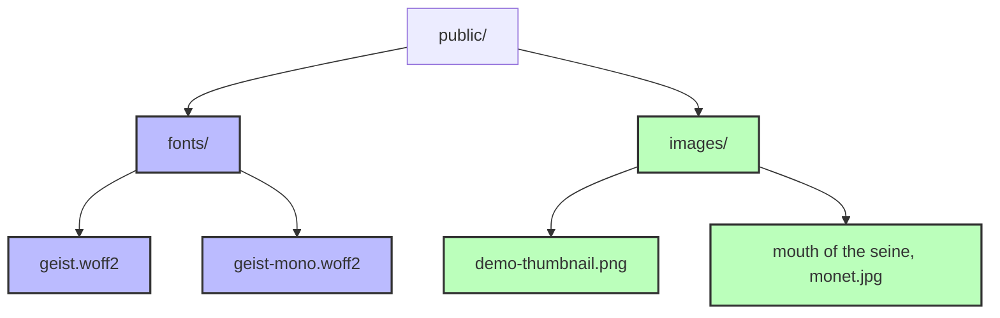
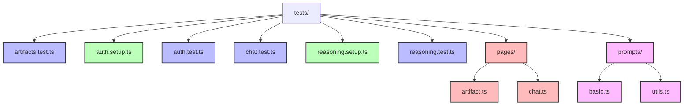
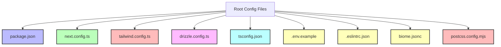
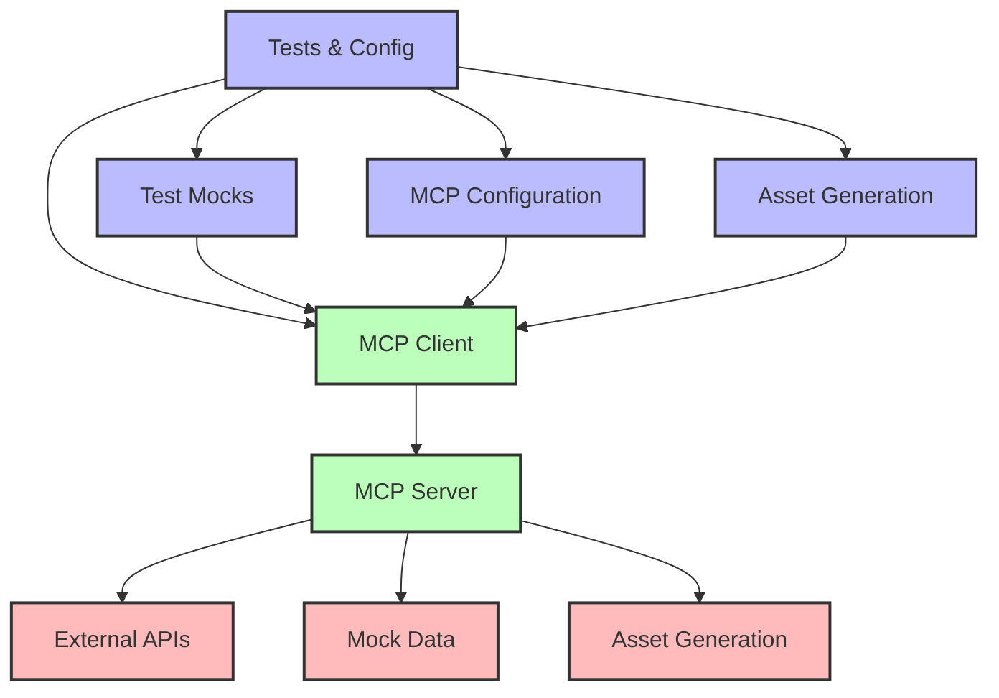

# Public, Tests, and Configuration Documentation

## Introduction

This document provides a comprehensive overview of the `public/` and `tests/` directories, as well as the root configuration files in the chat.talkverse.ai application. It includes both high-level overviews and technical implementation details to serve as a reference during the redesign process. These components provide essential assets, testing infrastructure, and configuration for the application.

## Public Directory Overview

The `public/` directory contains static assets that are served directly by the web server without processing by Next.js.



### High-Level Directory Purposes

- **`fonts/`**: Custom font files used throughout the application
- **`images/`**: Static images used for demos and testing

## Tests Directory Overview

The `tests/` directory contains end-to-end tests using Playwright to verify the application's functionality.



### High-Level Directory Purposes

- **Test Files**: End-to-end tests for different features
- **Setup Files**: Configuration for test environments
- **`pages/`**: Page object models for testing
- **`prompts/`**: Test prompts and expected responses

## Root Configuration Files Overview

The root directory contains various configuration files that define the application's behavior, dependencies, and build process.



### High-Level File Purposes

- **`package.json`**: Defines dependencies and scripts
- **`next.config.ts`**: Next.js configuration
- **`tailwind.config.ts`**: Tailwind CSS configuration
- **`drizzle.config.ts`**: Database configuration
- **Other Config Files**: TypeScript, linting, and build configuration

## Detailed Directory and File Analysis

### Public Directory

#### `fonts/`

**Purpose**: Provides custom fonts for the application.

**Contents**:
- `geist.woff2`: Geist sans-serif font for general text
- `geist-mono.woff2`: Geist monospace font for code and technical content

**Usage**:
These fonts are referenced in the global CSS file (`app/globals.css`) and applied throughout the application for consistent typography.

#### `images/`

**Purpose**: Stores static images used in the application.

**Contents**:
- `demo-thumbnail.png`: Thumbnail image for demos
- `mouth of the seine, monet.jpg`: Artwork by Monet used for testing image-related features

**Usage**:
The Monet image is specifically used in tests for image attachment functionality, as seen in the `tests/pages/chat.ts` file.

### Tests Directory

#### Test Files

##### `artifacts.test.ts`

**Purpose**: Tests the artifact functionality of the application.

**Key Tests**:
- Creating different types of artifacts
- Updating artifacts
- Interacting with artifacts

##### `auth.test.ts`

**Purpose**: Tests the authentication functionality.

**Key Tests**:
- User registration
- User login
- Authentication state management

##### `chat.test.ts`

**Purpose**: Tests the chat functionality.

**Technical Implementation**:
- Uses the ChatPage page object model
- Tests message sending and receiving
- Tests UI state changes during chat interactions
- Tests tool usage (like weather)
- Tests voting on messages

**Key Tests**:
- Sending user messages and receiving responses
- Using suggested actions
- Uploading and sending image attachments
- Testing the weather tool
- Upvoting and downvoting messages
- Editing messages

```typescript
test('send a user message and receive response', async () => {
  await chatPage.sendUserMessage('Why is grass green?');
  await chatPage.isGenerationComplete();

  const assistantMessage = await chatPage.getRecentAssistantMessage();
  expect(assistantMessage.content).toContain("It's just green duh!");
});
```

##### `reasoning.test.ts`

**Purpose**: Tests the reasoning capabilities of AI models.

**Key Tests**:
- Testing reasoning display and toggling
- Verifying reasoning content

#### Setup Files

##### `auth.setup.ts`

**Purpose**: Sets up the authentication environment for tests.

**Key Features**:
- Creates test users
- Sets up authentication state

##### `reasoning.setup.ts`

**Purpose**: Sets up the environment for reasoning tests.

**Key Features**:
- Configures models with reasoning capabilities
- Sets up test data

#### Page Objects

##### `pages/chat.ts`

**Purpose**: Provides a page object model for interacting with the chat interface in tests.

**Technical Implementation**:
- Encapsulates selectors and actions for the chat page
- Provides methods for common interactions
- Handles waiting for responses and state changes

**Key Features**:
- Methods for sending messages
- Methods for getting message content
- Methods for interacting with UI elements
- Methods for handling file uploads

```typescript
export class ChatPage {
  constructor(private page: Page) {}

  public get sendButton() {
    return this.page.getByTestId('send-button');
  }

  // ... other getters and methods ...

  async sendUserMessage(message: string) {
    await this.multimodalInput.click();
    await this.multimodalInput.fill(message);
    await this.sendButton.click();
  }

  // ... other methods ...
}
```

##### `pages/artifact.ts`

**Purpose**: Provides a page object model for interacting with artifacts in tests.

**Key Features**:
- Methods for creating artifacts
- Methods for interacting with artifacts
- Methods for verifying artifact state

#### Test Prompts

##### `prompts/basic.ts`

**Purpose**: Defines test prompts and expected responses for tests.

**Technical Implementation**:
- Exports a record of test prompts with different purposes
- Includes user messages, tool calls, and tool results

**Key Features**:
- User message prompts for different scenarios
- Tool call and result definitions for testing
- Image attachment test data

```typescript
export const TEST_PROMPTS: Record<string, CoreMessage> = {
  USER_SKY: {
    role: 'user',
    content: [{ type: 'text', text: 'Why is the sky blue?' }],
  },
  // ... other prompts ...
  GET_WEATHER_CALL: {
    role: 'user',
    content: [
      {
        type: 'text',
        text: "What's the weather in sf?",
      },
    ],
  },
  // ... other prompts ...
};
```

##### `prompts/utils.ts`

**Purpose**: Provides utility functions for working with test prompts.

**Key Features**:
- Helper functions for creating and manipulating prompts
- Utility functions for testing prompt-related functionality

### Root Configuration Files

#### `package.json`

**Purpose**: Defines the project's dependencies, scripts, and metadata.

**Technical Implementation**:
- Lists all npm dependencies
- Defines scripts for development, building, and testing
- Configures project metadata

**Key Features**:
- AI SDK dependencies for various providers (OpenAI, Anthropic, TogetherAI)
- Next.js and React dependencies
- Database tools (Drizzle ORM, Postgres)
- UI libraries (Radix UI, Tailwind CSS)
- Editor components (CodeMirror, ProseMirror)
- Testing tools (Playwright)

```json
{
  "name": "ai-chatbot",
  "version": "0.1.0",
  "private": true,
  "scripts": {
    "dev": "next dev --turbo",
    "build": "tsx lib/db/migrate && next build",
    // ... other scripts ...
  },
  "dependencies": {
    "@ai-sdk/anthropic": "^1.1.17",
    "@ai-sdk/fireworks": "0.1.16",
    // ... other dependencies ...
  },
  // ... devDependencies ...
}
```

#### `next.config.ts`

**Purpose**: Configures Next.js behavior.

**Technical Implementation**:
- Enables experimental features
- Configures image domains
- Sets up other Next.js-specific options

**Key Features**:
- Enables Partial Prerendering (PPR)
- Configures remote image patterns for avatar.vercel.sh

```typescript
const nextConfig: NextConfig = {
  experimental: {
    ppr: true,
  },
  images: {
    remotePatterns: [
      {
        hostname: 'avatar.vercel.sh',
      },
    ],
  },
};
```

#### `tailwind.config.ts`

**Purpose**: Configures Tailwind CSS for styling.

**Technical Implementation**:
- Defines theme customizations
- Configures content paths
- Sets up plugins

**Key Features**:
- Custom font family configuration
- Extended color palette with CSS variables
- Custom border radius and screen sizes
- Animation and typography plugins

```typescript
const config: Config = {
  darkMode: ['class'],
  content: [
    './pages/**/*.{js,ts,jsx,tsx,mdx}',
    './components/**/*.{js,ts,jsx,tsx,mdx}',
    './app/**/*.{js,ts,jsx,tsx,mdx}',
  ],
  theme: {
    fontFamily: {
      sans: ['geist'],
      mono: ['geist-mono']
    },
    extend: {
      // ... theme extensions ...
    }
  },
  plugins: [require('tailwindcss-animate'), require('@tailwindcss/typography')],
};
```

#### `drizzle.config.ts`

**Purpose**: Configures Drizzle ORM for database operations.

**Technical Implementation**:
- Defines the database schema location
- Configures migration output directory
- Sets up database credentials

**Key Features**:
- PostgreSQL dialect configuration
- Environment variable integration
- Migration management

```typescript
export default defineConfig({
  schema: './lib/db/schema.ts',
  out: './lib/db/migrations',
  dialect: 'postgresql',
  dbCredentials: {
    url: process.env.POSTGRES_URL!,
  },
});
```

#### Other Configuration Files

- **`tsconfig.json`**: TypeScript configuration
- **`.env.example`**: Example environment variables
- **`.eslintrc.json`**: ESLint configuration
- **`biome.jsonc`**: Biome configuration for linting and formatting
- **`postcss.config.mjs`**: PostCSS configuration for CSS processing

## Technical Implementation Details

### Testing Strategy

The application uses Playwright for end-to-end testing with a page object model pattern:

1. **Page Objects**: Encapsulate page interactions in classes like `ChatPage`
2. **Test Files**: Define test cases using the page objects
3. **Setup Files**: Configure the test environment
4. **Test Prompts**: Define test data for consistent testing

```typescript
// Example of the page object pattern
export class ChatPage {
  constructor(private page: Page) {}

  async sendUserMessage(message: string) {
    await this.multimodalInput.click();
    await this.multimodalInput.fill(message);
    await this.sendButton.click();
  }

  // ... other methods ...
}

// Example of a test using the page object
test('send a user message and receive response', async () => {
  await chatPage.sendUserMessage('Why is grass green?');
  await chatPage.isGenerationComplete();

  const assistantMessage = await chatPage.getRecentAssistantMessage();
  expect(assistantMessage.content).toContain("It's just green duh!");
});
```

### Font Strategy

The application uses custom fonts for a consistent look and feel:

1. **Font Files**: Stored in the `public/fonts` directory
2. **Font Face Declarations**: Defined in `app/globals.css`
3. **Tailwind Configuration**: Referenced in `tailwind.config.ts`

```css
@font-face {
  font-family: "geist";
  font-style: normal;
  font-weight: 100 900;
  src: url(/fonts/geist.woff2) format("woff2");
}

@font-face {
  font-family: "geist-mono";
  font-style: normal;
  font-weight: 100 900;
  src: url(/fonts/geist-mono.woff2) format("woff2");
}
```

### Database Configuration

The application uses Drizzle ORM with PostgreSQL:

1. **Schema Definition**: Located in `lib/db/schema.ts`
2. **Migrations**: Generated in `lib/db/migrations`
3. **Configuration**: Defined in `drizzle.config.ts`
4. **Environment Variables**: Database URL stored in `.env.local`

```typescript
// Example of database configuration
export default defineConfig({
  schema: './lib/db/schema.ts',
  out: './lib/db/migrations',
  dialect: 'postgresql',
  dbCredentials: {
    url: process.env.POSTGRES_URL!,
  },
});
```

## Key Components and Their Interactions

### Public Assets and Application

The public assets are used throughout the application:

- **Fonts**: Applied via CSS to all text elements
- **Images**: Used in tests and demos

### Tests and Application Code

The tests verify the application's functionality:

- **Chat Tests**: Verify the chat interface and interactions
- **Artifact Tests**: Verify artifact creation and manipulation
- **Auth Tests**: Verify authentication flows

### Configuration and Build Process

The configuration files define how the application is built and run:

- **Next.js Config**: Affects routing, rendering, and image optimization
- **Tailwind Config**: Affects styling and theme
- **Drizzle Config**: Affects database access and migrations
- **Package.json**: Defines dependencies and scripts

## Redesign Considerations

### Potential Pain Points

1. **Test Maintenance**: As the application evolves, tests may need frequent updates to match new UI elements and behaviors.

2. **Font Loading**: Custom fonts may cause layout shifts if not properly optimized.

3. **Configuration Complexity**: Multiple configuration files may make it difficult to understand the full build process.

### Scalability Considerations

1. **Test Coverage**: As new features are added, test coverage should be maintained.

2. **Asset Management**: As the application grows, more assets may need to be added to the public directory.

3. **Configuration Management**: As the application becomes more complex, configuration files may need to be split or reorganized.

### Integration Points for MCP

The Model Context Protocol (MCP) could be integrated with the testing and configuration systems:

1. **Test Mocks**: MCP could provide mock responses for tests.

2. **Configuration**: MCP servers could be configured in the application.

3. **Asset Generation**: MCP could generate assets for the public directory.

## Potential MCP Integration Architecture



### MCP Integration Points

1. **Test Mocks**: MCP could provide mock responses for tests, making tests more reliable and less dependent on external services.

2. **MCP Configuration**: The application configuration could include MCP server configuration, allowing for dynamic model selection and configuration.

3. **Asset Generation**: MCP could generate assets for the public directory, such as images or other media.

4. **External APIs**: MCP could connect to external APIs for enhanced functionality during testing.

5. **Mock Data**: MCP could provide mock data for tests, making tests more reliable and less dependent on external services.