# Provider Registry Implementation Plan

## Current System Analysis

Based on a comprehensive review of the codebase, we've identified the following issues with the current system:

1. **Inconsistent Model References**:
   - Some places use `provider.languageModel(modelId)`
   - Others manually concatenate with `provider+":"+modelId`
   - Several hardcoded model references like 'openai:gpt-4o-mini'

2. **Inefficient Category Usage**:
   - Categories don't directly represent the selected provider and model
   - The system loads models redundantly in different places
   - No direct mapping from a category like 'quick' or 'creative' to a specific provider:model

3. **Redundant Provider Loading**:
   - Multiple places in the code initialize the same providers
   - Lack of efficient caching mechanisms
   - Potential memory leaks from recreating provider instances

## Proposed Architecture

The proposed solution utilizes the Vercel AI SDK Registry pattern more effectively, with categories serving as the primary interface for model selection:

```mermaid
graph TD
    A[User Interface] --> B[Registry API]
    B --> C[Provider Registry]
    C --> D[Category-Model Mapping]
    D --> E[Cached Provider Instances]
    E --> F[AI Models]
    
    G[Components] --> H[Hooks - useModelData]
    H --> B
    
    I[Chat/Artifact Routes] --> J[registry.languageModel&#40;category&#41;]
    J --> C
```



## Implementation Plan

### 1. Enhance the Provider Registry

The core of the implementation is enhancing the provider registry to map categories directly to provider:model pairs:

```typescript
// In lib/ai/provider-registry.ts

// Category to model mapping
const categoryModelMap = new Map<string, string>();

// Initialize the map with default mappings
function initializeCategoryModelMap() {
  // Text categories
  categoryModelMap.set('quick', 'openai:o3-mini');
  categoryModelMap.set('complete', 'openai:o1');
  categoryModelMap.set('creative', 'anthropic:claude-3-opus-20240229');
  categoryModelMap.set('writing', 'anthropic:claude-3-7-sonnet-20250219');
  categoryModelMap.set('title', 'openai:gpt-3.5-turbo');
  categoryModelMap.set('artifact', 'openai:gpt-4o-mini');
  
  // Image categories
  categoryModelMap.set('image', 'openai:dall-e-3');
  categoryModelMap.set('real-time-image', 'togetherai:flux');
  
  // Embedding categories
  categoryModelMap.set('embed', 'openai:text-embedding-3-small');
  categoryModelMap.set('embed-large', 'openai:text-embedding-3-large');
}

// Enhanced languageModel function that accepts either category name or provider:model
export function languageModel(categoryOrModelId: string): LanguageModel {
  const now = Date.now();
  
  // Check if this is a category or a direct model reference
  let modelKey = categoryOrModelId;
  if (categoryModelMap.has(categoryOrModelId)) {
    modelKey = categoryModelMap.get(categoryOrModelId)!;
  }
  
  // Check cache
  const cachedEntry = languageModelCache.get(modelKey);
  if (cachedEntry && now - cachedEntry.timestamp < CACHE_TTL.registry) {
    return cachedEntry.data;
  }
  
  // Parse provider:model format
  const [providerName, modelId] = modelKey.split(':');
  
  // Get the provider
  const provider = getProvider(providerName);
  
  // Get the model from the provider
  const model = provider.languageModel(modelId);
  
  // Cache the result
  languageModelCache.set(modelKey, {
    data: model,
    timestamp: now
  });
  
  return model;
}

// Similar functions for imageModel and textEmbeddingModel
export function imageModel(categoryOrModelId: string): ImageModel {
  const now = Date.now();
  
  // Check if this is a category or a direct model reference
  let modelKey = categoryOrModelId;
  if (categoryModelMap.has(categoryOrModelId)) {
    modelKey = categoryModelMap.get(categoryOrModelId)!;
  }
  
  // Check cache
  const cachedEntry = imageModelCache.get(modelKey);
  if (cachedEntry && now - cachedEntry.timestamp < CACHE_TTL.registry) {
    return cachedEntry.data;
  }
  
  // Parse provider:model format
  const [providerName, modelId] = modelKey.split(':');
  
  // Get the provider
  const provider = getProvider(providerName);
  
  // Get the model from the provider
  const model = provider.imageModel(modelId);
  
  // Cache the result
  imageModelCache.set(modelKey, {
    data: model,
    timestamp: now
  });
  
  return model;
}

export function textEmbeddingModel(categoryOrModelId: string): EmbeddingModel<string> {
  const now = Date.now();
  
  // Check if this is a category or a direct model reference
  let modelKey = categoryOrModelId;
  if (categoryModelMap.has(categoryOrModelId)) {
    modelKey = categoryModelMap.get(categoryOrModelId)!;
  }
  
  // Check cache
  const cachedEntry = embeddingModelCache.get(modelKey);
  if (cachedEntry && now - cachedEntry.timestamp < CACHE_TTL.registry) {
    return cachedEntry.data;
  }
  
  // Parse provider:model format
  const [providerName, modelId] = modelKey.split(':');
  
  // Get the provider
  const provider = getProvider(providerName);
  
  // Get the model from the provider
  const model = provider.textEmbeddingModel(modelId);
  
  // Cache the result
  embeddingModelCache.set(modelKey, {
    data: model,
    timestamp: now
  });
  
  return model;
}
```

### 2. Update Database Schema and API

Enhance the `ModelCategory` type to include default provider and model:

```typescript
// In lib/db/model-management-types.ts
export type ModelCategory = {
  id: string;
  name: string;
  type: string;
  description?: string;
  order: number;
  defaultProviderId?: string; // New field
  defaultModelId?: string;    // New field
  createdAt: Date;
  updatedAt: Date;
};
```

Update the DEFAULT_CATEGORIES to include default provider and model information:

```typescript
export const DEFAULT_CATEGORIES: ModelCategory[] = [
  { 
    id: '550e8400-e29b-41d4-a716-446655441001', 
    name: 'chat-model-quick', 
    type: 'text', 
    description: 'Get fast responses for simple questions and tasks', 
    order: 1,
    defaultProviderId: '550e8400-e29b-41d4-a716-446655440000', // openai
    defaultModelId: 'o3-mini',
    createdAt: new Date(), 
    updatedAt: new Date() 
  },
  { 
    id: '550e8400-e29b-41d4-a716-446655441002', 
    name: 'chat-model-complete', 
    type: 'text', 
    description: 'Receive comprehensive, detailed answers with nuance', 
    order: 2,
    defaultProviderId: '550e8400-e29b-41d4-a716-446655440000', // openai
    defaultModelId: 'o1',
    createdAt: new Date(), 
    updatedAt: new Date() 
  },
  // ... other categories with default providers and models
]
```

Add a function to get the full provider:model string for a category:

```typescript
// In lib/db/model-management-client.ts

export async function getCategoryModelString(categoryId: string): Promise<string> {
  const category = await getCategoryById(categoryId);
  if (!category?.defaultProviderId || !category?.defaultModelId) {
    throw new Error(`Category ${categoryId} does not have default provider and model`);
  }
  
  const provider = await getProviderById(category.defaultProviderId);
  return `${provider.name}:${category.defaultModelId}`;
}
```

### 3. Refactor API Routes and Calls

Update all places that use the old pattern to use the new one:

```typescript
// OLD WAY
// Example from chat route.ts
const modelInfo = DEFAULT_MODELS.find((model: AIModel) => model.id === selectedChatModel);
const modelId = modelInfo ? modelInfo.modelId : selectedChatModel;
const imageModel = provider+":"+modelId;

const result = streamText({
  model: registry.languageModel((selectedChatModel)),
  // ...
});

// NEW WAY
const result = streamText({
  model: registry.languageModel(selectedChatModel), // selectedChatModel can be a category ID or provider:model
  // ...
});
```

In artifacts:

```typescript
// OLD WAY
const { image } = await experimental_generateImage({
  model: myProvider.imageModel('openai:dall-e-3'),
  prompt: title,
  n: 1,
});

// NEW WAY
const { image } = await experimental_generateImage({
  model: registry.imageModel('image'), // Using the 'image' category
  prompt: title,
  n: 1,
});
```

### 4. Update Model Selection UI

Enhance the model selector components to work with categories:

```typescript
// In components/model-selector.tsx

export function ModelSelector({
  selectedModelId,
  className,
}: {
  selectedModelId: string;
} & React.ComponentProps<typeof Button>) {
  // ...
  
  // Get categories by type
  const categoriesByType = useMemo(() => {
    if (!categories) return {};
    return categories.reduce((acc, cat) => {
      if (!acc[cat.type]) acc[cat.type] = [];
      acc[cat.type].push(cat);
      return acc;
    }, {} as Record<string, ModelCategory[]>);
  }, [categories]);
  
  // Handle model selection
  const handleModelSelect = (categoryId: string) => {
    setPreferredModel(categoryId);
    startTransition(() => {
      setOptimisticModelId(categoryId);
      saveChatModelAsCookie(categoryId);
    });
  };
  
  // ... rendering UI with categories
}
```

### 5. Centralize Model Loading

Ensure all model loading goes through the registry:

```typescript
// All artifact servers and tools should use consistent patterns

// For text generation
const { fullStream } = streamText({
  model: registry.languageModel('artifact'), // Using category
  system: prompt,
  // ...
});

// For image generation
const { image } = await experimental_generateImage({
  model: registry.imageModel('image'), // Using category
  prompt: title,
  // ...
});

// For embeddings
const { embedding } = await embed({
  model: registry.textEmbeddingModel('embed'), // Using category
  value: text,
  // ...
});
```

## Migration Strategy

### Phase 1: Core Registry Enhancement

1. Implement the enhanced provider registry functions
   - Add category to model mapping
   - Update languageModel, imageModel, and textEmbeddingModel functions

2. Update the database schema
   - Add defaultProviderId and defaultModelId to ModelCategory type
   - Create migration scripts to populate new fields

3. Implement initial tests to ensure backward compatibility

### Phase 2: Route and API Refactoring

1. Refactor Chat route first
   - Update all instances where provider:model strings are constructed
   - Implement comprehensive testing

2. Refactor Artifact servers
   - Update hardcoded model references with category references
   - Test each artifact type thoroughly

3. Refactor embedding and tool functions
   - Ensure consistent pattern usage throughout
   - Add additional test coverage

### Phase 3: UI and User Experience

1. Update UI components for model selection
   - Enhance model-selector.tsx and quick-model-selector.tsx
   - Display helpful information about the underlying models

2. Add admin interface for category management
   - Allow admins to change category-model mappings
   - Provide UI for testing different configurations

3. Complete documentation
   - Update internal docs
   - Add developer guides for the new pattern

## Key Benefits

1. **Efficiency**: 
   - Reduced redundant provider loading
   - Better memory management
   - More consistent caching

2. **Flexibility**: 
   - Easy to change the underlying model for a category without code changes
   - Simplified API for developers
   - Consistent interface for all model types

3. **Maintainability**: 
   - Single, clear pattern for model access
   - Fewer places to update when adding/changing models
   - Better separation of concerns

4. **Scalability**: 
   - Categories can be customized per user
   - New providers and models can be added easily
   - Feature flags can be integrated for progressive rollout

## Potential Future Enhancements

1. **User-specific category preferences**:
   - Allow users to set their preferred provider:model for each category
   - Store preferences in user settings

2. **Cost and performance optimization**:
   - Add usage analytics to determine optimal model selection
   - Implement automatic fallback for unavailable models

3. **A/B testing framework**:
   - Test different provider:model combinations for categories
   - Measure performance and quality metrics

4. **Multi-provider routing**:
   - Implement load balancing across multiple providers for the same category
   - Add failover capabilities for improved reliability

## Implementation Timeline

- **Week 1**: Core registry enhancements and database schema updates
- **Week 2**: Route and API refactoring, initial testing
- **Week 3**: UI updates and comprehensive testing
- **Week 4**: Documentation, final testing, and deployment

## Conclusion

This implementation plan addresses the identified issues with the current provider registry system while providing a path for future enhancements. By centralizing the model selection logic and mapping categories directly to provider:model pairs, we achieve a more efficient, flexible, and maintainable system.

The proposed changes maintain backward compatibility while opening up new possibilities for customization and optimization. This approach fully leverages the Vercel AI SDK's registry capabilities and creates a more streamlined developer experience.