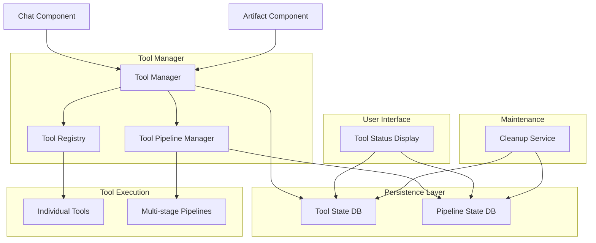

# Tool Management System Implementation Plan

## Overview

This document outlines a comprehensive plan to implement a robust tool management system that prevents duplicate tool calls and supports multi-stage tool pipelines. The system will track tool call states, prevent duplicate processing, and enable complex tool interactions while maintaining proper execution order and dependencies.

## Problem Statement

Currently, our application suffers from duplicate tool calls due to:
1. Multiple components processing the same messages independently (Chat and Artifact components)
2. Race conditions in document creation
3. Lack of coordination between tool calls
4. No mechanism to track multi-stage tool pipelines

## Implementation Goals

1. Prevent duplicate tool calls
2. Support multi-stage tool pipelines
3. Enable recovery from failed tool calls
4. Provide visibility into tool call status
5. Maintain proper execution order and dependencies
6. Clean up failed or orphaned tool calls and pipelines

## Architecture

## Implementation Plan

### 1. Database Schema and Queries

#### New Files:
- `lib/db/schema-tool-state.ts` - Database schema for tool calls and pipelines
- `lib/db/queries/tool-state.ts` - Database queries for tool state management
- `sql/tool_management_tables.sql` - SQL schema for tool management tables

#### Schema Structure:
- `ToolCall` table - Track individual tool calls, their status, and results
  - Includes a nullable UUID `userId` field to associate with specific users
  - System-initiated tools use special system user IDs (e.g., "SYSTEM01", "SYSTEM02")
- `ToolPipeline` table - Track multi-step tool pipelines and their progress
  - Includes a nullable UUID `userId` field to associate with specific users
  - System-initiated pipelines use special system user IDs

### 2. Tool Manager Implementation

#### New Files:
- `lib/tools/tool-manager.ts` - Central tool management system
- `lib/tools/pipeline-manager.ts` - Pipeline management for multi-step tool calls
- `hooks/use-tool-state.ts` - React hook for client-side tool state tracking
- `lib/tools/cleanup-service.ts` - Service for cleaning up failed or orphaned tools

#### Key Features:
- Tool call deduplication
- Tool call state tracking
- Pipeline management
- Dependency resolution
- Error recovery
- Automatic cleanup of stale tool calls and pipelines

### 3. Integration with Existing Components

#### Modified Files:
- `components/chat.tsx` - Add tool state tracking
- `components/artifact.tsx` - Prevent duplicate document requests
- `components/message.tsx` - Coordinate tool call rendering
- `components/tool-pipeline-display.tsx` - Display tool pipeline progress

#### Key Changes:
- Add tool call tracking to prevent duplicates
- Implement debounce for document requests
- Coordinate tool call processing between components
- Add user interface for pipeline progress visualization

### 4. API Routes for Tool Management

#### New Files:
- `app/api/tools/route.ts` - API endpoint for tool call processing
- `app/api/tools/status/route.ts` - API endpoint for checking tool call status
- `app/api/tools/pipeline/route.ts` - API endpoint for pipeline management
- `app/api/tools/cleanup/route.ts` - API endpoint for cleanup operations

### 5. Multi-stage Pipeline Support

#### Key Features:
- Define pipeline steps and dependencies
- Track pipeline progress
- Handle pipeline failures and retries
- Support conditional branching in pipelines
- Automatic recovery from failed steps

### 6. Logging and Monitoring

#### New Files:
- `lib/tools/tool-logger.ts` - Logging system for tool calls
- `components/tool-status-display.tsx` - UI for displaying tool status
- `components/tool-pipeline-display.tsx` - UI for displaying pipeline progress

#### Key Features:
- Detailed logging of tool call lifecycle
- Visual representation of tool call status
- Pipeline progress visualization
- User-specific tool pipeline displays

### 7. Cleanup Mechanisms

#### Key Features:
- Scheduled cleanup of stale tool calls and pipelines
- Automatic retry of failed tool calls (up to a configurable limit)
- Notification system for persistently failed tool calls
- Special handling for system-initiated tools
- Orphaned tool detection and cleanup

## Implementation Checklist

- [x] **Database Schema and Queries**
  - [x] Create tool call schema
  - [x] Create pipeline schema
  - [x] Implement database queries

- [ ] **Tool Manager**
  - [ ] Implement tool call deduplication
  - [ ] Create tool state tracking
  - [ ] Build pipeline management
  - [ ] Implement cleanup service

- [ ] **Client Integration**
  - [ ] Add tool state hook
  - [ ] Modify chat component
  - [ ] Update artifact component
  - [ ] Create tool pipeline display component

- [ ] **API Routes**
  - [ ] Create tool processing endpoint
  - [ ] Implement status checking endpoint
  - [ ] Build pipeline management endpoint
  - [ ] Create cleanup endpoint

- [ ] **Testing**
  - [ ] Test tool call deduplication
  - [ ] Verify pipeline execution
  - [ ] Ensure error recovery works
  - [ ] Test cleanup mechanisms

## Future Enhancements

1. **Tool Call Analytics** - Track tool usage patterns and performance
2. **Advanced Pipeline Visualization** - Create a visual editor for tool pipelines
3. **Tool Call Permissions** - Implement permission system for tool access
4. **Cross-Chat Tool Coordination** - Allow tool calls to span multiple chats
5. **External Tool Integration** - Support for third-party tools and services
6. **Advanced Cleanup Strategies** - Implement more sophisticated cleanup algorithms
7. **Tool Call Prioritization** - Prioritize tool calls based on user importance or system needs
