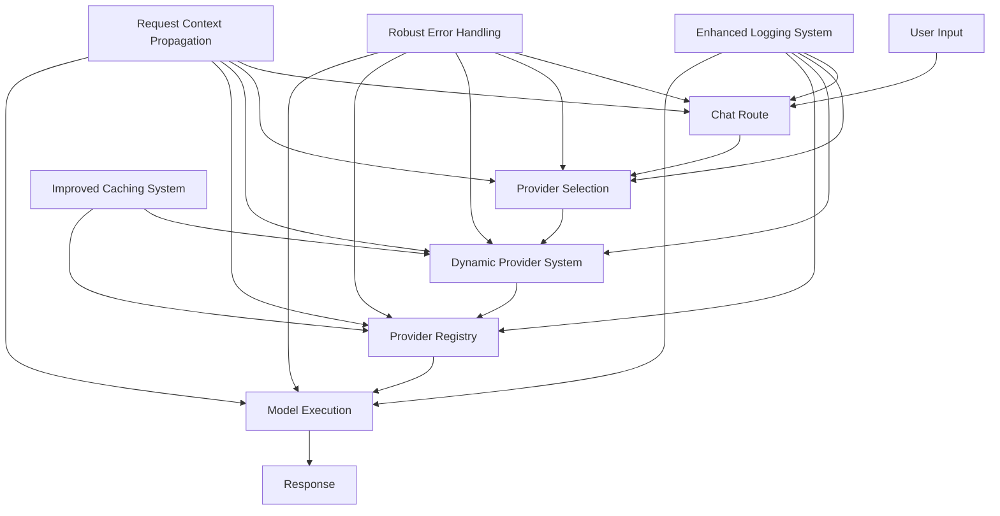
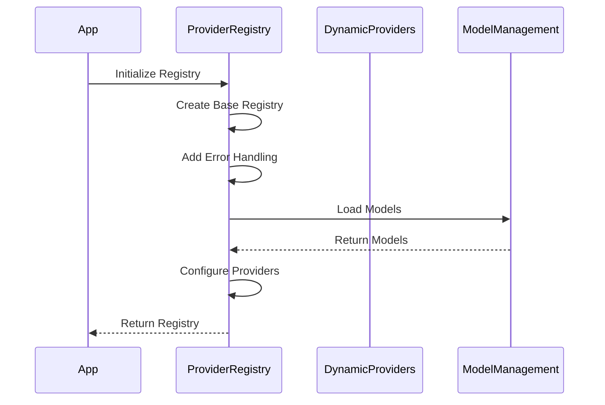
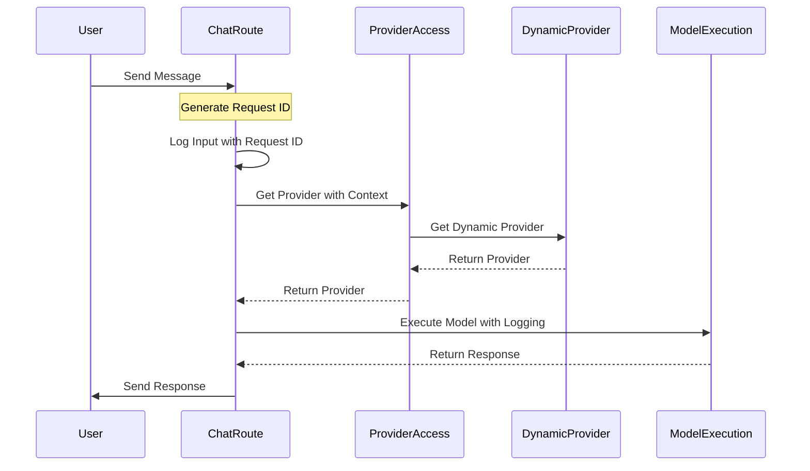
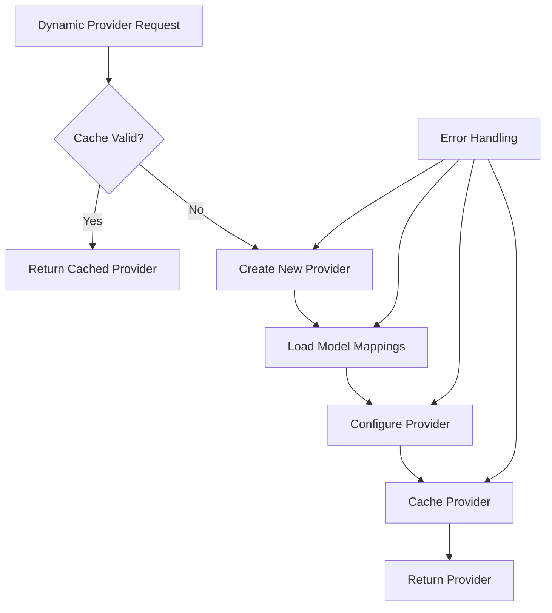

# Provider Management and Chat Flow Debugging Plan

This document outlines a comprehensive plan to fix the provider and model management loading issues and to improve debugging in the chat flow, specifically addressing the "Cannot read properties of undefined" errors related to the provider registry.

## 1. Problem Analysis

### Provider Management Issues
- **Undefined Errors**: "Cannot read properties of undefined" errors occur when sending input to the chat, indicating that the provider registry is not properly initialized or accessed.
- **Inconsistent Provider Loading**: The provider registry isn't loading correctly when processing user input.
- **Direct Provider Usage**: The chat route uses `myProvider` directly instead of the dynamic provider system.
- **Duplicate Logic**: Redundant code exists across provider-registry.ts, dynamic-providers.ts, and providers.ts.

### Chat Flow Debugging Issues
- **Limited Visibility**: Debugging information is lost when transitioning from input processing to provider execution.
- **Lack of Tracing**: No consistent request ID or trace ID to follow requests through the system.
- **Insufficient Error Handling**: Minimal error handling in critical paths.

## 2. Solution Architecture



## 3. Implementation Plan

### Phase 1: Fix Provider Registry Initialization and Error Handling

#### 1.1 Refactor Provider Registry (lib/ai/provider-registry.ts)



1. **Implement Defensive Initialization**:
   - Add null checks and default values to prevent "Cannot read properties of undefined" errors
   - Implement a safe provider access method that handles undefined providers gracefully
   - Add detailed logging for provider initialization

2. **Improve Error Handling**:
   - Add try-catch blocks around all provider operations
   - Implement fallback mechanisms for provider failures
   - Add detailed error logging with context information

3. **Enhance Provider Registry Caching**:
   - Implement a more robust caching strategy
   - Add cache validation to prevent using stale or invalid providers
   - Implement proper cache invalidation when models or preferences change

#### 1.2 Update Provider Access Methods

1. **Create Unified Provider Access**:
   - Implement a single entry point for provider access in providers.ts
   - Ensure all provider access goes through this method
   - Add proper error handling and logging

2. **Add Request Context Propagation**:
   - Implement request ID tracking throughout the provider chain
   - Pass user context consistently to ensure proper provider selection
   - Add detailed logging with request IDs for traceability

### Phase 2: Enhance Chat Flow and Debugging

#### 2.1 Update Chat Route (app/(chat)/api/chat/route.ts)



1. **Modify Chat Route to Use Dynamic Provider**:
   - Replace direct `myProvider` usage with the unified provider access method
   - Pass user context and request ID to ensure proper provider selection
   - Add detailed logging throughout the chat flow

2. **Implement Comprehensive Logging**:
   - Add logging before and after provider operations
   - Include request IDs in all log messages
   - Log provider selection and model execution details

3. **Enhance Error Handling**:
   - Add try-catch blocks around provider operations
   - Implement graceful degradation for provider failures
   - Provide meaningful error messages to users

#### 2.2 Improve Debugging Capabilities

1. **Add Debug Mode**:
   - Implement a debug mode that can be enabled for troubleshooting
   - Add detailed logging when debug mode is enabled
   - Include provider state information in debug logs

2. **Implement Provider State Inspection**:
   - Add methods to inspect the current state of providers
   - Log provider configuration and initialization details
   - Add provider health checks

### Phase 3: Refactor Dynamic Providers

#### 3.1 Update Dynamic Providers (lib/ai/dynamic-providers.ts)



1. **Refactor Provider Creation**:
   - Simplify the provider creation logic
   - Add proper error handling and logging
   - Implement defensive programming to prevent undefined errors

2. **Improve Caching Strategy**:
   - Implement a more robust caching mechanism
   - Add cache validation to prevent using stale providers
   - Implement proper cache invalidation

3. **Enhance Model Mapping**:
   - Improve the model mapping logic
   - Add fallback mechanisms for missing models
   - Implement better error handling for model mapping failures

### Phase 4: Consolidate Provider Management

#### 4.1 Eliminate Duplicate Logic

1. **Refactor Common Functionality**:
   - Move common provider functionality to shared utilities
   - Eliminate duplicate code across provider files
   - Implement a clear separation of concerns

2. **Standardize Provider Interfaces**:
   - Define clear interfaces for provider operations
   - Ensure consistent error handling across provider implementations
   - Implement proper type checking

#### 4.2 Implement Provider Lifecycle Management

1. **Add Provider Lifecycle Hooks**:
   - Implement initialization and cleanup hooks
   - Add proper error handling for lifecycle events
   - Ensure resources are properly managed

2. **Implement Provider Health Monitoring**:
   - Add health checks for providers
   - Implement automatic recovery for failed providers
   - Add detailed logging for provider health events

## 4. Detailed Implementation Tasks

### Task 1: Fix Provider Registry (lib/ai/provider-registry.ts)

```typescript
// Example implementation of safe provider access
export function getSafeProvider(name: string, userId?: string, requestId?: string): Provider {
  const logPrefix = `[${new Date().toISOString()}][RequestID: ${requestId || 'unknown'}]`;
  console.log(`${logPrefix} Getting provider ${name} for user ${userId || 'anonymous'}`);
  
  try {
    // Check if registry is initialized
    if (!registry) {
      console.error(`${logPrefix} Provider registry not initialized!`);
      return getFallbackProvider();
    }
    
    // Try to get the provider from the registry
    const provider = registry[name];
    if (!provider) {
      console.error(`${logPrefix} Provider ${name} not found in registry!`);
      return getFallbackProvider();
    }
    
    console.log(`${logPrefix} Successfully retrieved provider ${name}`);
    return provider;
  } catch (error) {
    console.error(`${logPrefix} Error getting provider ${name}:`, error);
    return getFallbackProvider();
  }
}

// Implement a fallback provider that won't throw errors
function getFallbackProvider(): Provider {
  console.log(`[${new Date().toISOString()}] Using fallback provider`);
  return {
    languageModel: (modelId: string) => {
      console.log(`[${new Date().toISOString()}] Using fallback language model for ${modelId}`);
      return openai('gpt-4o-mini');
    },
    // Implement other required methods with safe fallbacks
    // ...
  };
}
```

### Task 2: Update Chat Route (app/(chat)/api/chat/route.ts)

```typescript
// Example implementation of improved chat route
export async function POST(request: Request) {
  const requestId = generateUUID();
  const startTime = Date.now();
  console.log(`[${new Date().toISOString()}][RequestID: ${requestId}] Processing chat request`);
  
  try {
    const { id, messages, selectedChatModel } = await request.json();
    console.log(`[${new Date().toISOString()}][RequestID: ${requestId}] Chat model: ${selectedChatModel}`);
    
    const session = await auth();
    if (!session || !session.user || !session.user.id) {
      return new Response('Unauthorized', { status: 401 });
    }
    
    // Get the appropriate provider with user context and request ID
    console.log(`[${new Date().toISOString()}][RequestID: ${requestId}] Getting provider for user ${session.user.id}`);
    const provider = await getProvider(session.user.id, requestId);
    
    if (!provider) {
      console.error(`[${new Date().toISOString()}][RequestID: ${requestId}] Failed to get provider!`);
      return new Response('Failed to initialize AI provider', { status: 500 });
    }
    
    console.log(`[${new Date().toISOString()}][RequestID: ${requestId}] Provider initialized successfully`);
    
    // Rest of the implementation with proper logging and error handling
    // ...
    
    console.log(`[${new Date().toISOString()}][RequestID: ${requestId}] Chat request processed in ${Date.now() - startTime}ms`);
    
    // Return response with proper error handling
  } catch (error) {
    console.error(`[${new Date().toISOString()}][RequestID: ${requestId}] Error processing chat request:`, error);
    return new Response('An error occurred while processing your request!', {
      status: 500,
    });
  }
}
```

### Task 3: Update Dynamic Providers (lib/ai/dynamic-providers.ts)

```typescript
// Example implementation of improved dynamic provider creation
async function createDynamicProvider(userId?: string, requestId?: string): Promise<ExtendedProvider> {
  const logPrefix = `[${new Date().toISOString()}][RequestID: ${requestId || 'unknown'}]`;
  console.log(`${logPrefix} Creating dynamic provider${userId ? ` for user ${userId}` : ''}...`);
  
  try {
    // Check if provider registry is enabled
    const useProviderRegistry = isFeatureEnabled('useProviderRegistry', userId);
    console.log(`${logPrefix} Provider registry feature enabled: ${useProviderRegistry}`);
    
    if (!useProviderRegistry) {
      console.log(`${logPrefix} Provider registry is disabled, using default provider`);
      return myProvider as unknown as ExtendedProvider;
    }
    
    // Get providers from registry with user context
    console.log(`${logPrefix} Getting providers from registry`);
    const registryProviders = await getProvidersFromRegistry(userId, requestId);
    
    if (!registryProviders) {
      console.warn(`${logPrefix} No registry providers found, using default provider`);
      return myProvider as unknown as ExtendedProvider;
    }
    
    console.log(`${logPrefix} Registry providers:`, Object.keys(registryProviders || {}));
    
    // If we have registry providers, create a custom provider with them
    if (Object.keys(registryProviders).length > 0) {
      console.log(`${logPrefix} Using registry providers (${Object.keys(registryProviders).length} available)`);
      
      // Create a custom provider with models from registry
      // Implement with proper error handling and logging
      // ...
      
      return extendedProvider as ExtendedProvider;
    }
    
    // If no registry providers, use default provider
    console.log(`${logPrefix} No registry providers found, using default provider`);
    return myProvider as unknown as ExtendedProvider;
  } catch (error) {
    console.error(`${logPrefix} Error creating dynamic provider:`, error);
    console.error(`${logPrefix} Stack trace:`, error instanceof Error ? error.stack : 'No stack trace available');
    
    // Return default provider
    console.warn(`${logPrefix} Falling back to default provider due to error`);
    return myProvider as unknown as ExtendedProvider;
  }
}
```

### Task 4: Implement Unified Provider Access (lib/ai/providers.ts)

```typescript
// Example implementation of unified provider access
export async function getProvider(userId?: string, requestId?: string): Promise<ExtendedProvider> {
  const logPrefix = `[${new Date().toISOString()}][RequestID: ${requestId || 'unknown'}]`;
  console.log(`${logPrefix} Getting provider${userId ? ` for user ${userId}` : ''}...`);
  
  try {
    // Check if provider registry is enabled
    const useProviderRegistry = isFeatureEnabled('useProviderRegistry', userId);
    console.log(`${logPrefix} Provider registry feature enabled: ${useProviderRegistry}`);
    
    if (!useProviderRegistry) {
      console.log(`${logPrefix} Provider registry is disabled, using default provider`);
      return myProvider;
    }
    
    // Get dynamic provider with proper error handling
    console.log(`${logPrefix} Getting dynamic provider`);
    const provider = await getDynamicProvider(userId, requestId);
    
    if (!provider) {
      console.warn(`${logPrefix} Failed to get dynamic provider, using default provider`);
      return myProvider;
    }
    
    console.log(`${logPrefix} Provider retrieved successfully`);
    return provider;
  } catch (error) {
    console.error(`${logPrefix} Error getting provider:`, error);
    console.error(`${logPrefix} Stack trace:`, error instanceof Error ? error.stack : 'No stack trace available');
    
    // Return default provider as fallback
    console.warn(`${logPrefix} Falling back to default provider due to error`);
    return myProvider;
  }
}
```

## 5. Testing Strategy

### 5.1 Unit Tests

1. **Provider Registry Tests**:
   - Test provider initialization with various configurations
   - Test error handling for invalid providers
   - Test fallback mechanisms

2. **Dynamic Provider Tests**:
   - Test provider creation with different model configurations
   - Test caching behavior
   - Test error handling and recovery

3. **Chat Flow Tests**:
   - Test the complete chat flow with various inputs
   - Test error handling in the chat route
   - Test provider selection based on user preferences

### 5.2 Integration Tests

1. **End-to-End Tests**:
   - Test the complete chat flow from UI to response
   - Test model selection and provider initialization
   - Test error handling and recovery

2. **Performance Tests**:
   - Test provider initialization time
   - Test caching effectiveness
   - Test response time with different providers

## 6. Rollout Plan

### 6.1 Phase 1: Provider Registry Fixes

1. Implement defensive initialization and error handling in provider-registry.ts
2. Add comprehensive logging
3. Test thoroughly in development environment

### 6.2 Phase 2: Chat Route Updates

1. Update chat route to use the unified provider access
2. Add request context propagation
3. Implement comprehensive logging
4. Test in development environment

### 6.3 Phase 3: Dynamic Provider Refactoring

1. Refactor dynamic provider creation
2. Improve caching strategy
3. Enhance model mapping
4. Test in development environment

### 6.4 Phase 4: Consolidation and Cleanup

1. Eliminate duplicate logic
2. Standardize provider interfaces
3. Implement provider lifecycle management
4. Final testing and deployment

## 7. Monitoring and Maintenance

1. **Implement Monitoring**:
   - Add metrics for provider initialization
   - Monitor error rates
   - Track performance metrics

2. **Establish Maintenance Procedures**:
   - Regular code reviews
   - Performance optimization
   - Documentation updates